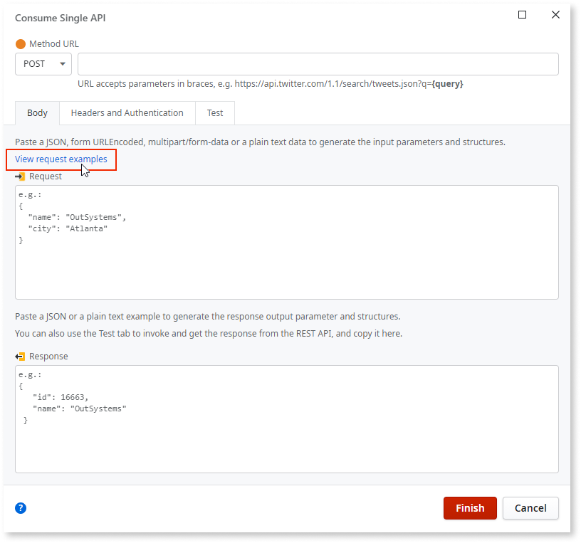
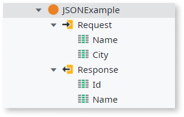
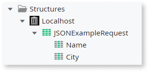
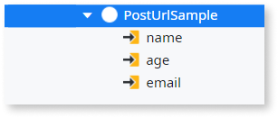
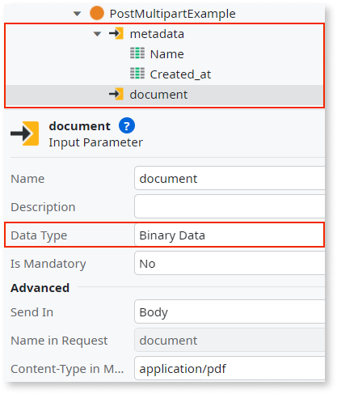
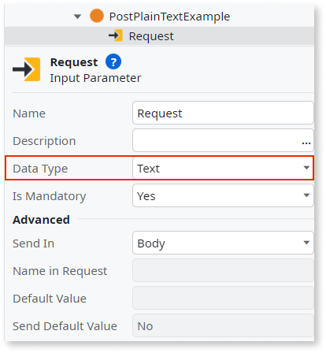

# Payload request examples when consuming a single REST method

When you consume a REST method through the **Add Single Method** option, with input parameters sent in the body, you can paste an example of the payload sent at runtime in the request. Service Studio uses this example to generate the request input parameters and structures.

Service Studio uses the text you add in the **Request** field of the **Body** tab to infer the properties, parameters, and content type of the method.

The format of the request example can be JSON, form URL Encoded, Multipart/form-data, or plain text. This article provides examples of each request format. For more information about consuming a single method API, see [Consume a single method of a REST API](consume-a-rest-api.md#single-method).

 

## JSON 

If you use the JSON request format, you must insert a JSON payload. The following request payload example shows a JSON payload that represents a structure with the fields and values.

```

{
  "name": "OutSystems",
  "city": "Atlanta"
}

```

Using this payload, the system creates the following input parameter and the corresponding structure:

  

## Form URL Encoded 

If you use the Form URL Encoded format, the payload must be in a query string format with key-value pairs. Each key and value pair is separated by an equal sign ``(name=value)`` and every pair is separated by the ampersand sign ``(name1=value1&name2=value2)``.

In addition to these standard rules, you can define your own input parameters. Special characters such as spaces and tabs must be coded following the [Uniform Resources Locators (URL)](https://www.rfc-editor.org/rfc/rfc1738) rules.

The following request payload example contains three key-value pairs, ``name``, ``age``, and ``email``, which create three input parameters that are sent in the **Body**.

```

name={name}&age={age}&email={email} 

```


## Multipart/form-data

To create a valid request with different parts, the following rules must be adhered to:

* Each part of the payload must be separated by a boundary. A boundary is a string that defines the start and end of each part. 

* Each part of the payload must include its own **Content-Disposition** header. The header  specifies the name of the part and its type.

* After every part header, an empty line must  be added. This distinguishes the real payload of every part. Otherwise, the payload is interpreted as plain/text.

* If a part of the payload is binary data (such as a file), it must also include a **Content-Type** header that specifies the type of the data (for example, image/jpeg).

* The last part of the boundary must be followed by two hyphens to indicate the end of the payload.

```

--BOUNDARY
Content-Disposition: form-data; name="metadata"
Content-Type: application/json

{
  "name": "My Document",
  "created_at": "2022-12-30T12:00:00Z"
}

--BOUNDARY
Content-Disposition: form-data; name="document"; filename="document.pdf"
Content-Type: application/pdf

[BINARY PDF CONTENT HERE]
--BOUNDARY--

```

In this example, there are two parts - the first part is a JSON payload and the second part is a pdf file. Both parts are enclosed in a boundary. The boundary must be a unique string that is not used in any other place of the payload. After every separator boundary string occurrence, there is a **Content-Disposition** header with a disposition type of **form-data** where the disposition contains a **name** parameter and the value of that parameter is the original field name in the form. In the example, the name for the first part is **metadata**. This metadata form is composed of two JSON fields, **Name** and **Created_at**.

Using this payload example, the system can infer the data structures involved. The metadata input parameter with two fields **Name** and **Created_at** and a second input parameter document of type **Binary Data**.

 

For more information about multipart/form-data structure, see the [standard specifications (RFC 2388)](https://www.ietf.org/rfc/rfc2388.txt).

## Plain text 

When systems can’t recognize the payload request format, Plain Text request is the default option used.

In the following payload request example, the payload is simply the string "Hello World!" encoded as plain text. 

**Hello World!**

The system creates an input parameter of data type Text.


