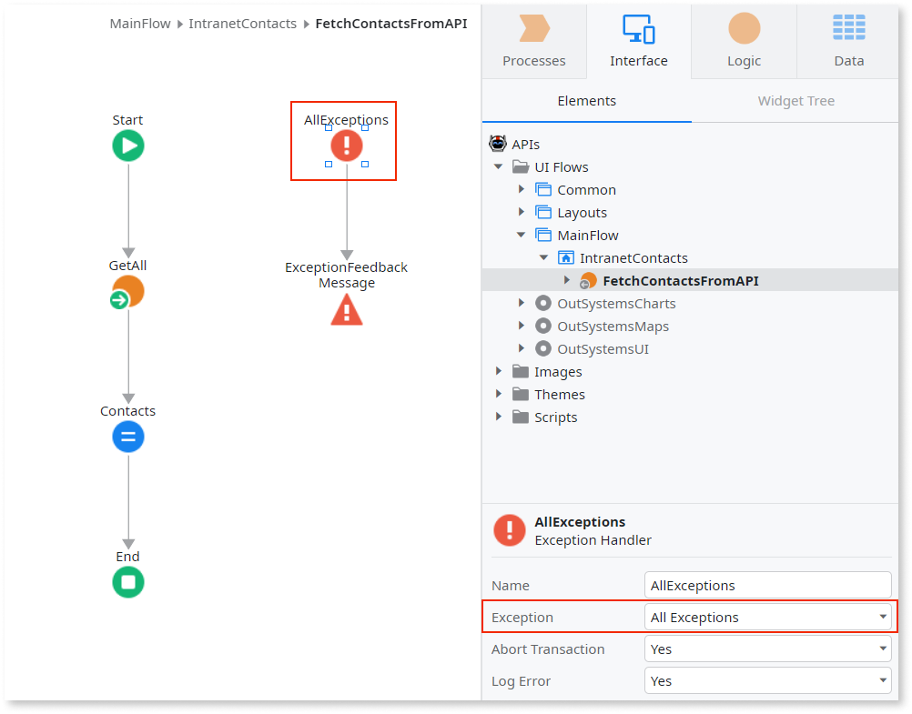
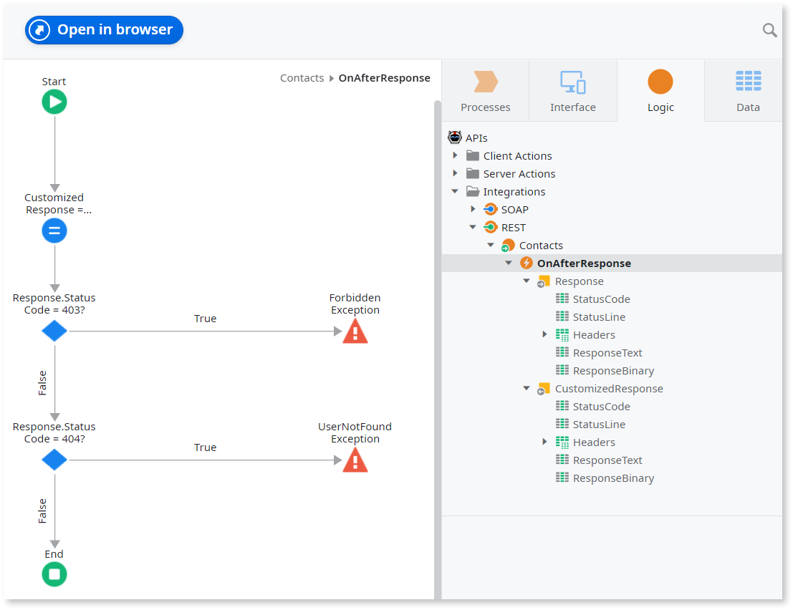

# Handling REST Errors

When consuming a REST API method, if the service returns an HTTP error status code (400 and above), OutSystems throws an exception. This allows you to handle the REST API error response by implementing your own logic.

To handle a REST API error, do the following:

1. Add an Exception Handler to the logic that uses the REST API method, and set the **Exception** property to `All Exceptions` so that the exception handler catches all exceptions. 

    

1. Implement the logic in the exception handler flow to handle the error, like displaying a message to the end-user. 

## Manipulating received error responses

In some cases you might want to manipulate a REST error response at a lower level, before OutSystems throws an exception.

You can do this by using the [OnAfterResponse](<simple-customizations.md>) callback or, in more advanced scenarios, the [OnAfterResponseAdvanced](<advanced-customizations.md>) callback. These actions run before OutSystems processes the REST response, and use can use them to manipulate the response headers, body and status code.

For example, you might want to:

* Throw specific User Exceptions based on the received error.

    

* Change the status code of a REST error response to 200 (success) so that OutSystems does not raise an exception in a specific case.
