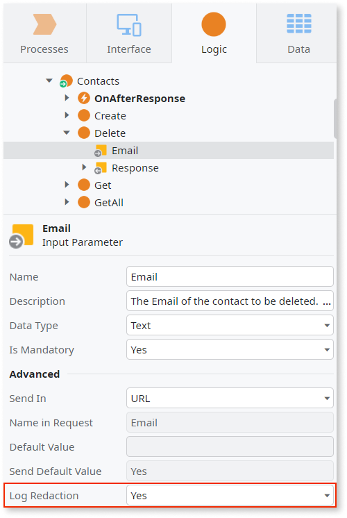

# Redacting information from REST API logs

You can redact sensitive input parameter values from the logs of a consumed
REST API, containing information like an employee's salary or health data.

To redact the values of a given Input Parameter from the logs, do the
following:

1. In Service Studio, open the module containing the consumed REST API element.

1. In the element tree, expand the consumed REST element, and then expand the
   element for REST Method with the input parameter you want to redact from the
   logs.

1. Select the input parameter you wish to redact, and set its **Log Redaction**
   property to **Yes**.

    
