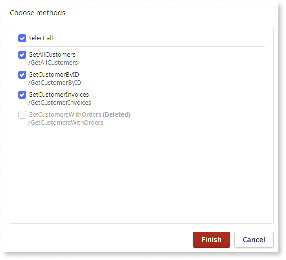
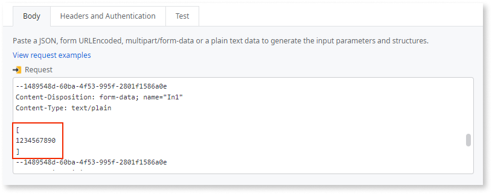
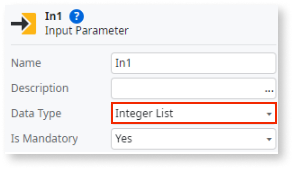
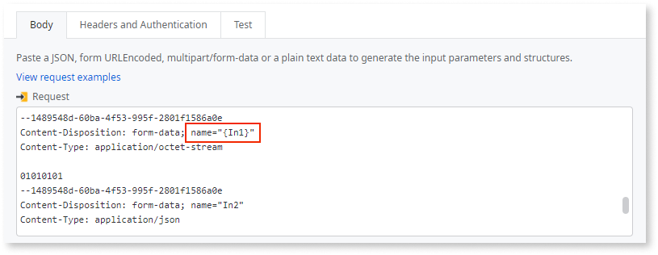
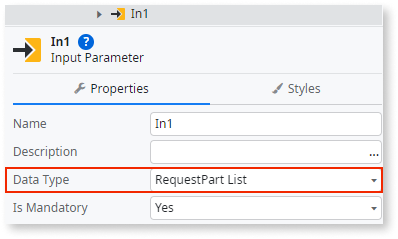
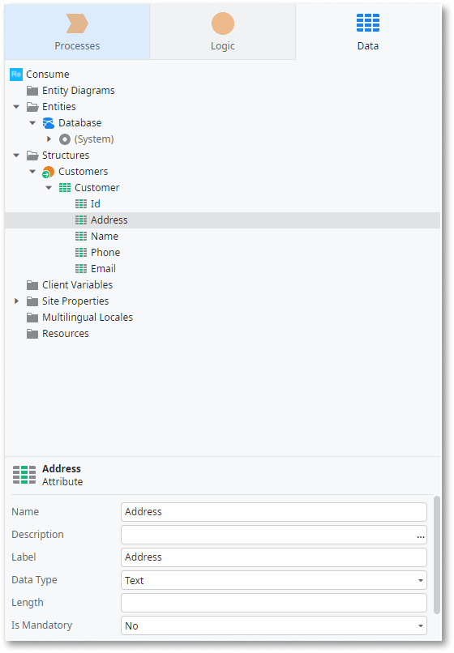

# Refresh a REST web service

To change the services consumed from a REST API or to modify the list of consumed REST API methods, you can refresh the service in Service Studio.
An earlier approach to updating a single method, described later in this article, is still valid. However, the refresh option is easier to use and the recommended approach.

To refresh a REST API service:

1. In the **Logic** tab, expand the **Integrations** folder and then expand **REST**.

1. Under **REST**, right-click the REST API and select **Refresh REST API**. In this example, the name of the REST API is **Customers**.

    

1. In the Refresh REST API popup, click **Yes**. 

    When you click **Yes**, any changes made to the previous version are lost.  

    

1. Enter the REST API URL or upload a new file, and click **Refresh Methods**. 

    In this example, the URL points to a JSON file that contains the complete list of REST methods.

    

1. Select the methods you would like to consume. 
    
    Note that:
    
    * The methods you select overwrite previously consumed methods for the service. Ensure you select all methods you want to consume, even if they haven't changed.
    * The following settings are **not** overridden when you refresh:
            
        * Basic authentication
        * Advanced settings (Date Format, On Before Request and On After Response)
        * HTTP headers

    The method format displays as **method name/relative endpoint** and, if applicable, **(Deleted)** or **(outdated)**.

    Where:
    
    * method name = the method you may select to consume or update
    *  /relative endpoint = endpoint relative to the base URL
    *  (Deleted) or (outdated) = if applicable, identifies methods that were previously imported but no longer exist in the latest specification

    This example shows all available methods selected. **GetCustomersWithOrders** shows as **Deleted**, which means you can't select it.

    

1. Click **Finish** to add the selected methods.

Next, see [Adapt your application to the changes](#adapt-your-application-to-the-changes).

## Manually update a single REST API method

Before the refresh option existed, you could update a method using the following more manual approach. This approach is still valid.

To update a method using this procedure, look at the REST API documentation to understand what needs to change when invoking the REST API method.

To manually update a REST method:

1. In the **Logic** tab, open the **Integrations** folder and expand the REST element containing the method you want to change.

1. Double-click on the REST API Method you want to change.

1. Update the REST API Method information to reflect the change you want to execute, such as adding new parameters to the request structure:

     

1. Click **Finish**. 

### Manually update a multipart/form-data REST API method

When updating a [multipart/form-data method](consume-multipart-form-data.md), consider the following regarding how parameters specified as lists are represented:

* **Non-binary lists:** since everything is sent in the same part, the **Request Sample** field has its content encapsulated with [].

    

    The data type is set to **Integer List**:

    

* **Binary lists or a dynamic number of parts:** There are as many parts as elements in the list. Therefore, the part representing a dynamic number of parts inside the **Request Sample** field has its name encapsulated in {}, since the name of each item of the part will be a variable.

    

    The data type is set to **RequestPart List**:

    

## Adapt your application to the changes

When you change the definition of the REST API method, OutSystems automatically updates the REST API Method and the associated structures according to your changes:

You can now adapt the action flows or screens of your application to reflect the updated functionality.
