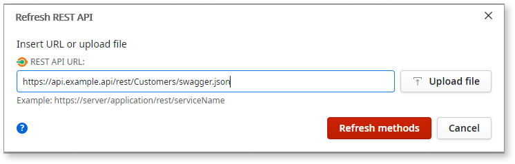

# Refresh a REST Web Service

To change the services consumed from a REST Web Service or to modify the list of consumed methods, refresh the service in Service Studio:

1. In the **Logic** tab, open the **Integrations** folder.

2. Under **REST**, right-click the REST API service and select **Refresh REST API**. In this example, the REST service is called **SoccerTeam**.

    

3. In the Refresh REST API popup, click **Yes** to proceed and select the methods to consume.

    

4. Enter the REST API URL or upload a new specification, and click **Add Methods**. In this example, the URL points to a JSON file that contains the complete list of REST methods.

    

5. Select the methods you would like to consume. Note that the list of methods you select overwrites any previously defined methods for the service. 

    The format is method name [/relative endpoint] and, where applicable, (outdated). Where:
    * method name = the method you may select to import or update
    * [/relative endpoint] = endpoint relative to the base URL
    * (outdated) = if applicable, identifies methods that were previously imported but no longer exist in the latest specification

    

6. Click **Finish** to add the selected methods.  

