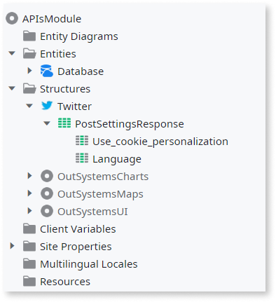
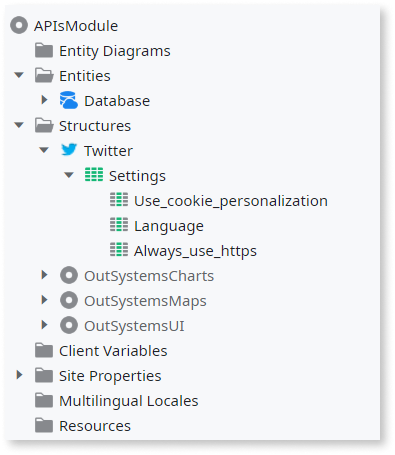
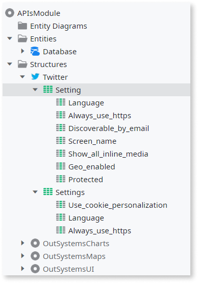

# REST API Structures

When you consume REST API methods in your module, OutSystems automatically creates the Structures that define the information held by the input and output parameters. The name of each Structure is generated from:

* The HTTP Request type 
* The method name 
* If it will hold a Request or a Response

The data type of each input or output parameter is [mapped into an OutSystems data type](<../../../ref/extensibility-and-integration/rest-apis/consumed-rest-api/mapping.md>).

For example, consider the following consumed REST API Method from Twitter:
    
HTTP Request type: `POST`  
URL: `https://api.twitter.com/1.1/account/settings.json?lang={mylanguage}`  
Response:  

```json
{
    "use_cookie_personalization": true,
    "language": "en"
}
```

The following Structure is automatically created for this method:



## Reuse of Structures

Whenever you add a new REST API method or modify an existing one, OutSystems checks for existing Structures that can be reused to define the information held by the new input and output parameters. This minimizes the number of Structures in your module.

OutSystems reuses an existing Structure when it is considered **compatible** with the requirements of the new method, according to the following rules:

* All attributes with the same name have the same or compatible type
* More than half of the new attributes are covered

When an existing Structure is reused, it may undergo some changes to comply with the different methods where the Structure is used.  
For example, the Structure name might change and get new attributes. The methods in your module already using that Structure won't be impacted by these changes.

### Reusing a Structure Example

Considering the previous Twitter's REST API example, we will now add the GetSettings method of the same REST API, keeping only some relevant response parameters:
    
HTTP Request type: `GET`  
URL: `https://api.twitter.com/1.1/account/settings.json`  
Response:

```json
{
    "use_cookie_personalization": true,
    "language": "en",
    "always_use_https": true
}
```

As the existing "PostSettingsResponse" Structure is compatible with the new method, the Structure is reused. The following changes take place:

* The Structure is renamed to "Settings" to match both methods where it is used
* An additional "Always_use_https" attribute is added to the Structure



### Creating a New Structure Example

The following example adds a larger number of parameters to the Response example of the "GetSettings" method and removes one parameter that was already there:
    
```json
{
    "language": "en",
    "always_use_https": true,
    "discoverable_by_email": true,
    "screen_name": "theSeanCook",
    "show_all_inline_media": false,   
    "geo_enabled": true,
    "protected": false
}
```

As only three of the attributes are covered by the existing Structure, which is less than half of the attributes, the existing Structure is not reused. OutSystems creates a new Structure named "Setting" to hold the response of the "GetSettings" method:



The previous "Settings" structure is not deleted since it is still used by the "PostSettings" method.
