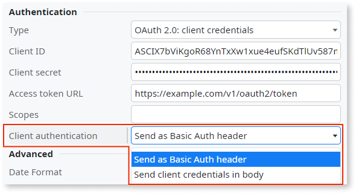
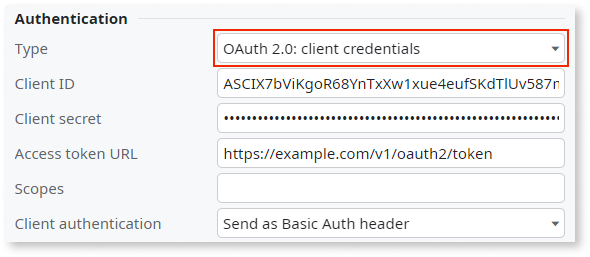
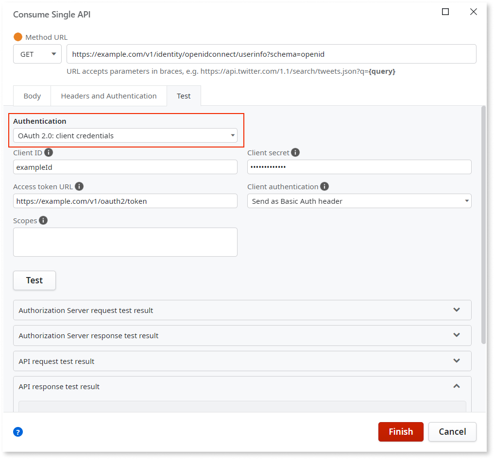

# Use OAuth 2.0 client flow authorization in consumed REST API web services

OAuth 2.0 (Open Authorization, OAuth) is a standard that lets web apps access resources in other web apps. As an authorization protocol, the purpose of OAuth is to grant access to resources, such as APIs or data. The OAuth standard uses access tokens with an expiration date.

OAuth 2.0 is available in Platform Server 11.23.1 and later.

## Authentication of the client

Regardless of whether you are consuming single or multiple methods, OutSystems lets you use an additional property called **Client authentication**. The client authentication property determines how to send the client credentials to the authorization server. The choice of how to send the client credentials depends on the authorization server specifications.

You have two options:

* **Send as a Basic Auth header**. OutSystem encodes **Client ID** and **Client secret** to obtain a token and sends it as an authorization header to the authorization server. The token is a single Base64 encoded string, after the concatenation: `<Client ID>:<Client secret>`.
* **Send client credentials in body**. OutSystem sends the client credentials in the request body using the following parameters: `client_id` (refers to the **Client ID** property) and `client_secret` (refers to the **Client secret** property).

    

## Consuming several methods

When consuming several REST API methods described in an OpenAPI specification file that require an OAuth client credentials flow authentication, OutSystems automatically sets the values of the following properties:

* **Type** to **OAuth 2.0: client credentials**
* **Access token URL**, based on the OpenAPI specification file
* **Scopes**, based on the OpenAPI specification file

If the OpenAPI specification file doesn't define the requirement for OAuth, you can always set these properties manually after consuming the REST API.

## Consuming a single method

When consuming a single method, under the **Headers and Authentication** tab of the **Consume Single API**:

* Set the **Authentication type** to **OAuth 2.0: client credentials**
* Provide the credentials to authenticate the app, **Client ID** and **Client secret**
* Set the **Access token URL** and **Scopes** properties

## Testing

When testing a REST API method using OAuth client credentials flow authentication, you can inspect the test result of:

* API request and response
* Authorization server request and response

You can test the REST API with OAuth client credentials flow authentication by:

* Consuming a single method
* Editing a method under the **Test** tab

    

If you manually add the authorization header in the model or the OnBeforeRequest callback, you override the header if authentication is either **Basic authentication** or **OAuth 2.0: client credentials**.
