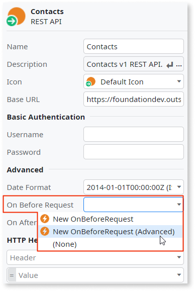
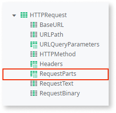
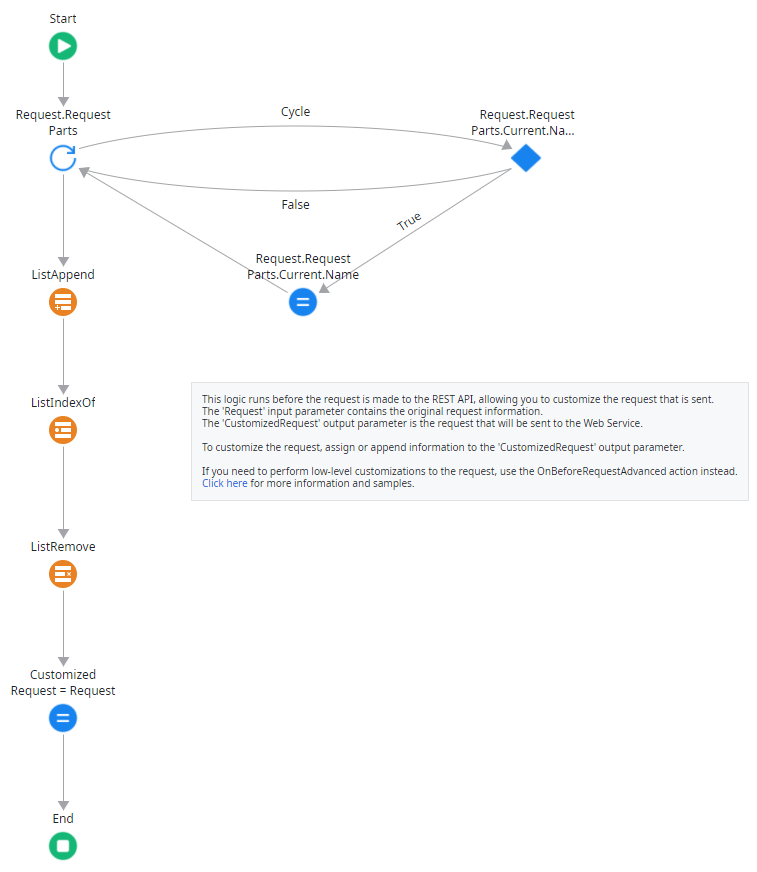
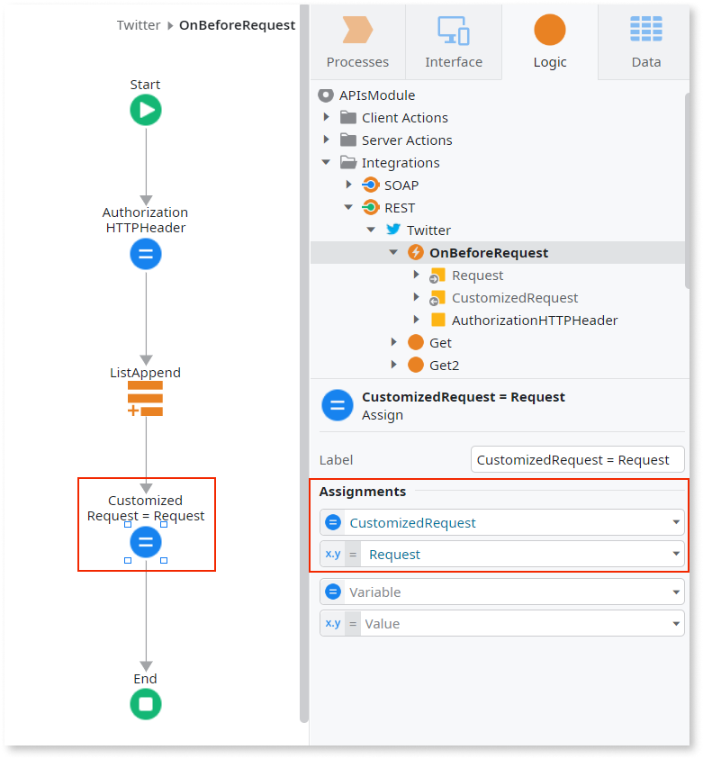
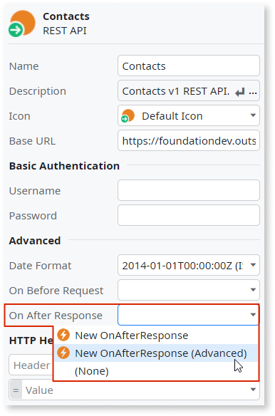

# Simple Customizations

When consuming a REST API, you can add logic to customize the information that is sent in the requests or received in the responses. Use the following callbacks for this purpose:

OnBeforeRequest
:   Use to modify the information of the original request, such as the URL, the request text or the headers. 

OnAfterResponse
:   Use to modify the information of the original response, such as the status code or the response text. 

In these callbacks you can access the information from the original request or response, manipulate it and assign a modified value to the customized request or response.

If you have an advanced integration scenario requiring .NET code to customize requests or responses, check [Advanced Customizations](advanced-customizations.md).

In the [OutSystems Forge](https://www.outsystems.com/forge/) you can find several components providing an interface to third-party services using REST integration, such as the [Box Connector](https://www.outsystems.com/forge/component/586/box-connector/) or the [JIRA Connector](https://www.outsystems.com/forge/component/936/jira-connector/), where you can see in detail how the REST requests and responses are customized.

Using this simple customization method you can add HTTP headers and/or change their values, but you cannot remove existing headers. To remove HTTP headers you must use the OutSystems REST Extensibility API. Check [Advanced Customizations](advanced-customizations.md) for more information.

## Customize the request

To customize the request before it is sent:

1. Set the **On Before Request** property of the REST API to `New OnBeforeRequest`.
  
        

    An "OnBeforeRequest" action is made available under the REST API.   

1. Double-click the newly created action to edit it. 

1. Add your own logic to customize the request. 

### Customize the parts of a multipart/form-data request { #multipart}

To customize specific parts of a [multipart/form-data request](consume-multipart-form-data.md) inside the **OnBeforeRequest** callback, such as adding, removing, or editing parts, you can use the **RequestParts** attribute that represents a **RequestPart** list.

The following example shows the logic flow of an **OnBeforeRequest** callback that appends, removes, and edits a part from the request. In this example, the **Request.RequestParts** list is edited. 

### Example use case: Adding a header for token-based authentication

Consider a REST API that uses token-based HTTP authentication, requiring consumers to include an authorization token in an HTTP header. After importing this REST API to your OutSystems application, use the "OnBeforeRequest" callback to add a new header with the token.

To build this example implementation we added the following steps in the callback logic flow:

1. Add a local variable with "HTTPHeader" data type to the OnBeforeRequest callback action.

1. Define a new HTTP header (name and value) using the local variable you created in the previous step.

    Example:  
    Name = `"Authorization"`  
    Value = `"Bearer " + AccessTokenVar`

1. Add this header to the list of request headers using the "ListAppend" action.
   The current request headers are in the "Request.Headers" attribute.

1. Set the "CustomizedRequest" output parameter to our changed "Request" using an Assign element.

## Customize the response

To customize the response after it has arrived:

1. Set the **On After Response** property of the REST API to `New OnAfterResponse` action.

    

    An "OnAfterResponse" action is made available under the REST API.

1. Double-click the newly created action to edit it.

1. Add your own logic to customize the response. 
