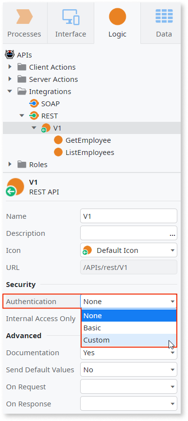
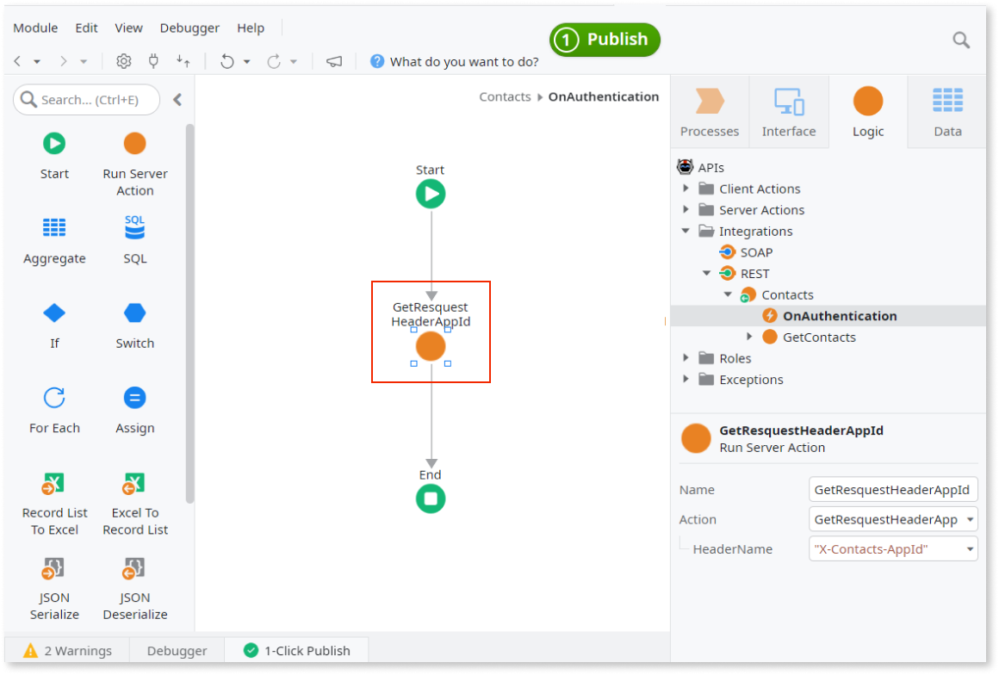

# Add Custom Authentication to an Exposed REST API


OutSystems allows you to customize the authentication logic used in your exposed REST APIs.

For that, do the following:

1. In the **Logic** tab, open the **Integrations** folder.

1. Select the exposed REST API you want to change and set its **Authentication** property to `Custom`.

    

    As a result, OutSystems creates the **OnAuthentication** callback action in your REST API and executes it for every incoming request of this REST API, before the called method's action flow.

    

1. In the **OnAuthentication** callback action, design the logic to authenticate the client. If you need to access data received in the URL, header or body of the HTTP request, you can use the [GetFormValue](../../../ref/apis/auto/httprequesthandler-api.final.md#GetFormValue), [GetRequestHeader](../../../ref/apis/auto/httprequesthandler-api.final.md#GetRequestHeader) or [GetRequestContent](../../../ref/apis/auto/httprequesthandler-api.final.md#GetRequestContent) actions of the [HTTPRequestHandler](../../../ref/apis/auto/httprequesthandler-api.final.md) extension.

## Example: REST API authentication using App ID and API Key

<div class="info" markdown="1">

For an implementation of this example, check the [How to Add Custom Authentication to a REST API](https://www.outsystems.com/forge/component-overview/927/how-to-add-custom-authentication-to-a-rest-api) module available in the OutSystems Forge.

</div>

The following example defines a custom authentication method for an Exposed REST API using two security keys: an API Key and an App ID.

To authenticate incoming requests, API clients must include two additional HTTP headers in each request:

```
X-Contacts-AppId: <app_id>
X-Contacts-Key: <api_key>
```

Where:

* `<app_id>` is an application identifier.
* `<api_key>` is a secret key associated with the app identified by `<app_id>`. You should handle this value as you would handle a password.

Consider an existing REST API called `Contacts` with one method `GetContacts`. In this example you're going to add a custom authentication method to this API.

The following sections go through the implementation of this custom authentication method.

### Add a required dependency

Add a dependency to the GetRequestHeader action of the [HTTPRequestHandler](../../../ref/apis/auto/httprequesthandler-api.final.md) extension to be able to get the HTTP headers of each API request.

1. In Service Studio, open the module that contains the exposed REST API and select **Manage Dependencies...**

1. Add a dependency on the Server Action "GetRequestHeader" of the HTTPRequestHandler extension.

### Create and bootstrap Entity holding app ID and API key pairs

Create an APIKey entity that holds pairs of AppId and Key values. All API requests must include an pair of values that exists as a record in the APIKey entity for a successful authentication.

1. Open the **Data** tab and create an entity named `APIKey` under **Database** with two attributes:

    * **AppId** (data type Text, length 50)
    * **Key** (data type Text, length 100)

1. Create an Excel file to boostrap this Entity with (at least) one record, with the following content:

    AppId | Key
    ------|-----
    ghjfxdfAvs596vcGfsvf0ef1 | 6tsdgdjl9fsKDd5zsvnwmdjosDmrufbs93susadLHDvjfhbnwtTRbsnucnrb

1. Back in the **Data** tab of Service Studio, right-click the **APIKey** Entity and select **Advanced** > **Update Action to Bootstrap Data from Excel...**

1. Select the Excel file you created before, click **Open**, and follow the bootstrap instructions.

### Create Server Action to validate received authentication keys

Create a Server Action that checks if its input parameters ApplicationId and ApplicationKey define a set of valid authentication credentials in the APIKey entity. If a record exists with this pair of values, set the authentication as valid.

1. In the **Logic** tab, create a new Server Action named **ValidateAPIKey** that validates the keys provided in HTTP headers.

1. Define the following Server Action input and output parameters:

    * Input parameter `ApplicationId` (data type Text, mandatory)
    * Input parameter `ApplicationKey` (data type Text, mandatory)
    * Output parameter `Valid` (data type Boolean)

1. Edit the Server Action flow and drag the Entity **APIKey** to the flow to create an Aggregate that uses this entity as a source.

1. Double-click the Aggregate **GetAPIKeys** and add two filter conditions:

    * `APIKey.Key = ApplicationKey`
    * `APIKey.AppId = ApplicationId`

1. Go back to the Server Action flow and add an **Assign** element before **End**.

1. Set the following assignment in the **Assign** properties:

    Variable = `Valid`  
    Value = `not GetAPIKeysByKey.List.Empty`

### Define the custom authentication logic

Set the authentication logic to get the values of the HTTP headers and then check if they provide a valid authentication, using the ValidateAPIKey server action you created previously.

1. In the **Logic** tab, select the **Contacts** REST API in the element tree.

1. Set its the **Authentication** property to `Custom`.

    Service Studio creates a new **OnAuthentication** callback action under the REST API element.

1. Double-click the **OnAuthentication** element in the tree to edit its logic flow.

1. Drag a **Run Server Action** element to the flow and select the "GetRequestHeader" Server Action.

1. Set its **HeaderName** input parameter to `"X-Contacts-AppId"` (including the quotes).

1. Rename the element to `GetRequestHeaderAppId`.

    

1. Drag another **Run Server Action** element to the flow (before the **End** element) and select the "GetRequestHeader" Server Action again.

1. Set its **HeaderName** input parameter to `"X-Contacts-Key"` to obtain the other required HTTP header value.

1. Rename the element to `GetRequestHeaderApiKey`.

1. Drag the Server Action **ValidateAPIKey** to the flow (before **End**) and set the input parameters to the following:

    * ApplicationId = `GetRequestHeaderAppId.Value`
    * ApplicationKey = `GetRequestHeaderApiKey.Value`

1. Add an **If** element before the end of the flow whose **Condition** is `ValidateAPIKey.Valid`.

1. In the **False** branch, add a **Raise Exception** element that raises a new User Exception (the sample implementation in the Forge defines a User Exception named **InvalidAPIKey** for this purpose).

1. Enter the error message that's sent back to the REST API client when the authentication fails.

<div class="info" markdown="1">

Tip: Raising an exception in the "OnAuthentication" callback action sets an HTTP 500 status code in the response sent to the client. Instead, you can use a custom HTTP status code by calling the "SetStatusCode" Server Action from the [HTTPRequestHandler](../../../ref/apis/auto/httprequesthandler-api.final.md) extension before raising the exception.

</div>

Here's a sample implementation of the complete **OnAuthentication** flow:


### Test the authentication

Test the logic of your custom authentication method using an API client like [Postman](https://www.postman.com/downloads/).

1. Create a new test request pointing to the URL of a method of your exposed REST API (in the example, the "GetContacts" method), without including any extra headers.

    

    You should get an error whose message you defined in the **Raise Exception** element.

1. In the **Headers** sub-tab, add the required headers for authentication and check that you get the expected answer.


