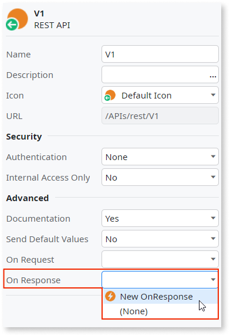
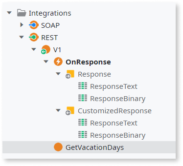

# Customize REST API Responses

OutSystems allows you to customize the information sent in responses when exposing a REST API.

For that, do the following:

1. In the **Logic** tab, open the **Integrations** folder. 

1. In the exposed REST API, set the property On Response to `New OnResponse`. 

    

1. Open the "OnResponse" callback action that is now available under the REST API.

1. Design the logic to customize the information of the response. 

    

    You can get the text of the request by accessing the "RequestText" attribute of the "Response" input parameter or its binary contents by accessing the "RequestBinary" attribute.

    Make sure to set the "CustomizedResponse" output to the request after your preprocessing.

Once defined and configured in the REST API, the "OnResponse" callback will be executed for **all methods** exposed by the REST API.
