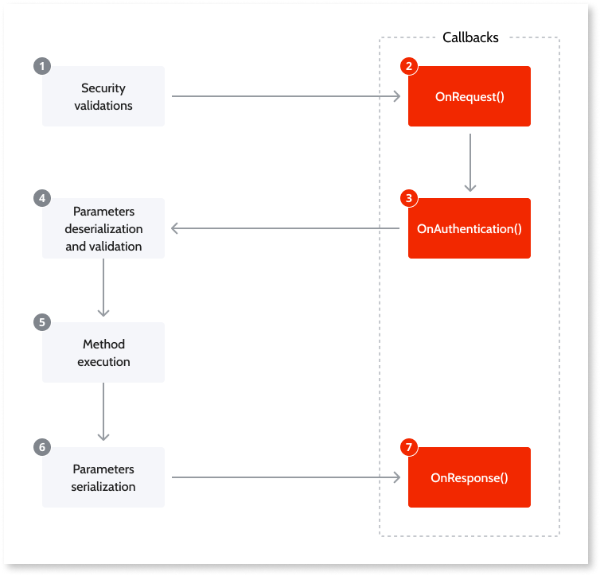

# Expose REST APIs

OutSystems allows you to [expose methods using a REST API](<expose-a-rest-api.md>). These methods can be organized under multiple REST APIs.

If you want to **consume** a REST API, check [Consume REST APIs](../consume-rest-apis/intro.md).

## REST API Method Flow

When a request to your REST API Method is received, OutSystems executes the following flow:

1. **Security Validations:** After receiving the REST API Method request, OutSystems executes the security validations according to the settings in [REST API properties](../../../ref/lang/auto/ServiceStudio.Plugin.RESTService.RestService.final.md) **HTTP Security** and **Internal Access Only**. 
1. **OnRequest():** OnRequest callback allows you to [run logic over the requests](<preprocess-rest-api-requests.md>) after receiving them. 
1. **OnAuthentication():** OnAuthentication callback allows you to add [basic authentication](<add-basic-authentication-to-an-exposed-rest-api.md>) or [custom authentication](<add-custom-authentication-to-an-exposed-rest-api.md>) to requests. 
1. **Parameters Deserialization and Validation:** Deserialization of the input parameters and validation of the data types, mandatory values, etc. 
1. **Execute Method:** Executes the action that implements the REST API Method. 
1. **Parameters Serialization:** Serialization of the output parameters to return in the response. 
1. **OnResponse():** OnResponse callback allows you to [run logic over the responses](<customize-rest-api-responses.md>) before sending them. It is always executed, even in an error situation. 
