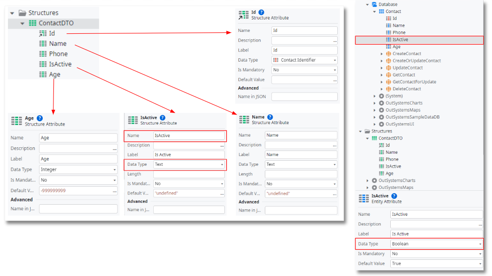
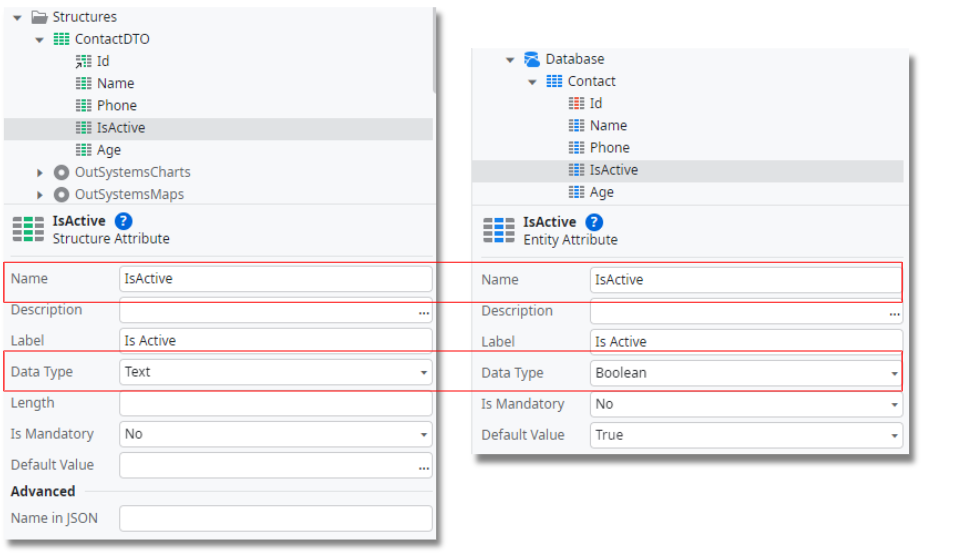

# PATCH method on exposed REST services

<div class="info" markdown="1">
This feature is in [Technical Preview](https://success.outsystems.com/Support/Enterprise_Customers/Upgrading/Technical_Preview_features).
</div>

The PATCH method is part of the HTTP protocol and contemplated in REST specifications since the start. 

Due to compliance and interoperability reasons, some APIs might require the use of PATCH in some operations. In those cases, using PUT is not an acceptable alternative.

This capability allows a new HTTP method when exposing REST APIs, adding to the already available GET, POST, PUT, and DELETE methods.

By definition, the PATCH method applies partial modifications to a resource, making it a lightweight option to PUT. Both methods are equivalent, but semantically, they are different.  

PUT inserts or updates a resource, while PATCH applies a partial update to the resource. Therefore, in terms of usage, PATCH only requires sending the fields to update without affecting or modifying the remaining ones.

## Create a PATCH Method

To create a PATCH method, do the following:

1. In the Logic tab, right-click your existing REST API and select Add REST API Method.

1. Set the name of your REST API method. Example: UpdateContact.

1. Set the HTTP Method property to PATCH.

1. Design the method as an action that retrieves or manipulates the data you are exposing

    

## Constraint with the PATCH method
Due to the simplification and abstraction provided by OutSystems to accelerate development, there's a constraint in the PATCH semantics that may result in patterns that are not supported by OutSystems language, like null values or dynamic structures. The following sections help you overcome this constraint if you need to do it.

### Ensuring PATCH semantics
If you need to ensure that your PATCH fully obeys the semantics, your Data Types need to obey the following best practices:

#### Integers, Long Integers, Text and Email data types

To implement a correct PATCH, define default values in your structure attribute that aren't commonly used. To do it: 

1. in the Data tab, open the Structures folder.

1. Go to the intended structure and define a Default Value that won't be sent in runtime to each attribute. 

1. Use, for example, -999999999 to Integer, Long Integer data types or "undefined" to Text, Email data types:

    

#### Boolean data type

Booleans are a special case, since there are only two possible values, making it difficult to distinguish between unsent and sent values. To overcome this situation do the following:

1. Map Booleans directly to Text. Set the same Default Value as used in the Text data type and set the attribute to isActive:

    

1. When checking the condition of a boolean, you need to check if the text values are “false” or “true”.

1. To ensure that the code isn’t case-sensitive, use the [ToLower](https://success.outsystems.com/Documentation/11/Reference/OutSystems_Language/Logic/Built-in_Functions/Text#ToLower) function in a condition like the following example:

    ```ToLower(Contact.isActive) = "true" or ToLower(Contact.isActive) = "false"```

### PATCH method implementation

After defining your default values correctly, and the input parameter of the PATCH method, do the following:

1. Create a local variable with the same data type of the input parameter (in this example, called Contacts_PATCH). 

1. In the PATCH method action, compare each received field value with the correspondent default value. 

1. If different, update the local variable. 

1. After going through all attributes, use the local variable for its purpose (for example, to update an entity). 

1. If the received value fulfills the condition, the local variable is updated.

Check the following example to guide you in this operation:


### Converting a Text to a Boolean

When you do a PATCH, you may need to convert a Text to Boolean. Since there is no Built-in function to perform this data conversion, it is necessary to do it manually. 

To do it, create a server action that receives a text input and returns a respective boolean value:


