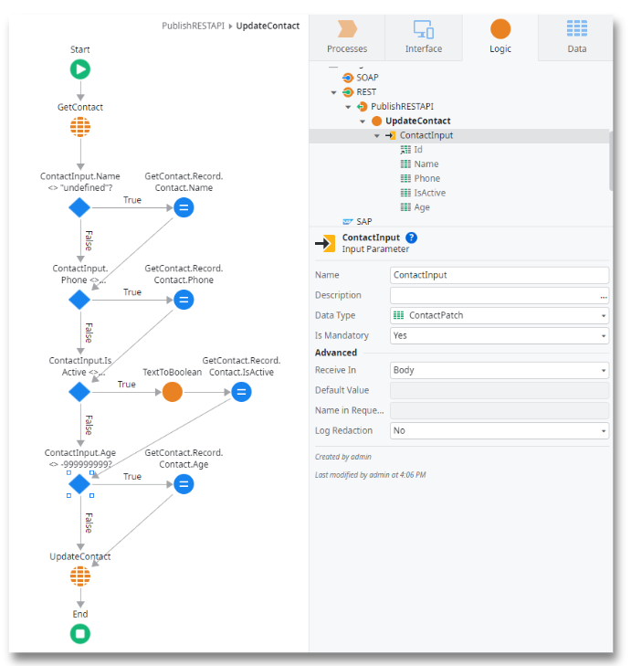
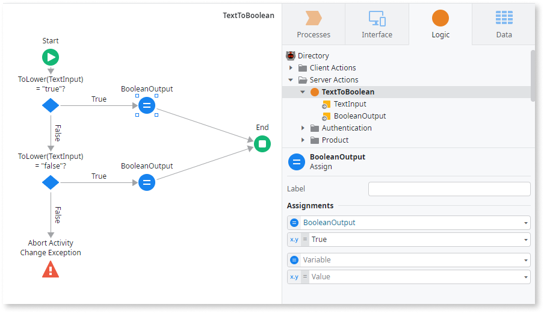

# PATCH method on exposed REST services


The PATCH method is part of the HTTP protocol and contemplated in REST specifications since the start. 

Due to compliance and interoperability reasons, some APIs might require the use of PATCH in some operations. In those cases, using PUT is not an acceptable alternative.

This capability allows a new HTTP method when exposing REST APIs, adding to the already available GET, POST, PUT, and DELETE methods.

By definition, the PATCH method applies partial modifications to a resource, making it a lightweight option to PUT. Both methods are equivalent, but semantically, they are different.  

PUT inserts or updates a resource, while PATCH applies a partial update to the resource. Therefore, in terms of usage, PATCH only requires sending the fields to update without affecting or modifying the remaining ones.

## Prerequisites

The following are the prerequisites for the PATCH method on exposed REST services:

* Platform Server 11.19.0 or later.
* Or Platform Server 11.12.0 until 11.19.0 and you've activated the technical preview PATCH method on exposed REST services in LifeTime in all environments. You need to activate this option for each new environment you add afterward. If the option is off for any of the environments in the Technical Preview settings screen, it's turned off in all deployment plans you create.

## Create a PATCH Method

To understand how to create a PATCH Method, let's use an example, where we start by creating an exposed REST API that contains a PATCH method, called "UpdateContact". This method, which is meant to update a "Contact" that is stored in the database, allows the partial update of a "Contact", by updating some entity's attributes and preserving the others. In this example "Contact" is the entity and the "ContactInput" is the structure parameter used as an input parameter of the "UpdateContact" method. This input parameter can be seen as a DTO (Data Transfer Object) of type "ContactDTO" (with the same attributes as the "Contact" entity), which will carry the data that will update the entity.

As you'll see, the "UpdateContact" action needs to identify which attributes of the "ContactDTO" were really sent to the API, in order to partially update a record of the "Contact" entity with the new values of the sent attributes.

Later, the server action checks the remainder of DTO's attributes that must have the same concepts as the "Contact"

To create a PATCH method, do the following:

1. In the Logic tab, right-click your existing REST API and select Add REST API Method.

1. Set the HTTP Method property to PATCH.

1. Set the name of your REST API method. In our example, it is called "UpdateContact"

1. Design the method as an action that receives a resource (in our case "ContactDTO") and edits a record that is stored in the database. In our example, the received structure is called "ContactDTO", which is similar to the Entity "Contact".

    

## Constraint with the PATCH method
Due to the simplification and abstraction provided by OutSystems to accelerate development, there's a constraint in the PATCH semantics that may result in patterns that are not supported by OutSystems language, like null values or dynamic structures. The following sections help you overcome this constraint if you need to do it.

### Ensuring PATCH semantics
If you need to ensure that your PATCH fully obeys the semantics, you must find a way to distinguish which attributes were indeed sent, assuming that the ones that were not sent will be received with the default values.

Thus, the suggested approach is to define uncommon default values for each attribute of the input data type structure (in our case called "ContactDTO").

#### Integers, Long Integers, Text and Email data types

To implement a correct PATCH, define default values in your structure attribute that aren't commonly used. To do it: 

1. Inside the Data tab, open the Structures folder.

1. Create a DTO structure with the same fields as the entity you want to update, but change the original boolean fields with text fields in the new structure.

1. Go to the intended structure (in our example "ContactDTO) and set Default Values highly improbable to be sent in runtime to each attribute of the structure.

    1. For Integers and Long Interger data types, use `-999999999`:

        
    
    1. For Text and Email data types:

        
    
	
#### Boolean data type

Booleans are a particular case, since there are only two possible values, making it difficult to distinguish between unsent and sent values. To overcome this situation, do the following:

1. Map Booleans directly to Text. Set the same Default Value as used in the Text data type and set the attribute to "isActive":

    

1. When checking the condition of a boolean, you need to check if the text values are “false” or “true”.

1. To ensure that the code isn’t case-sensitive, use the [ToLower](https://success.outsystems.com/Documentation/11/Reference/OutSystems_Language/Logic/Built-in_Functions/Text#ToLower) function in a condition like the following example:

    ```ToLower(Contact.isActive) = "true" or ToLower(Contact.isActive) = "false"```

### PATCH method implementation

After defining your default values correctly, and the input parameter of the PATCH method, do the following:

1. In the PATCH method action retrieves the affected record from the database based on the "Id" property of the input structure (in our case, the "Id" attribute of the "ContactInput"), by using the "GetContact" node, wich retrieves the "Contact" entity.

1. Go through all attributes of the input structure parameter and compare each received field value with the corresponding default value. With this step, we check which properties need to be updated.

1. If the received value fulfills the condition (the property needs to be updated), the recovered entity record updates that property attribute.

1. After going through all attributes, save the updated record in the database by using the "UpdateContact" node

Check the following example to guide you in this operation:



### Converting a Text to a Boolean

When you do a PATCH, you may need to convert a Text to Boolean. Since there is no Built-in function to perform this data conversion, it is necessary to do it manually. 

To do it, create a server action that receives a text input and returns a respective boolean value:


