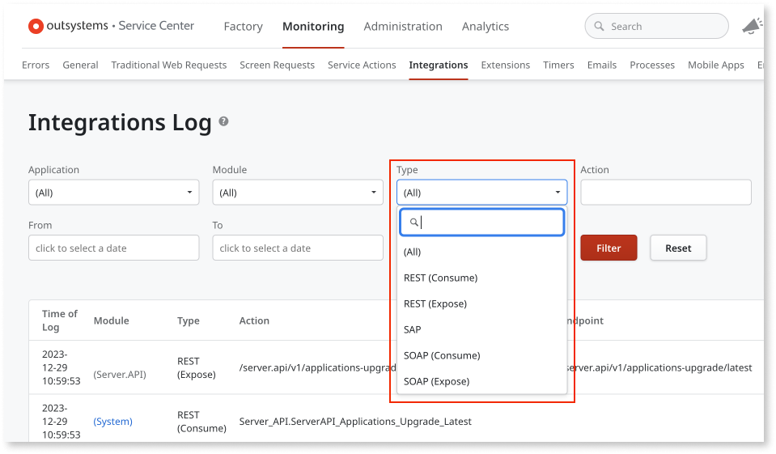
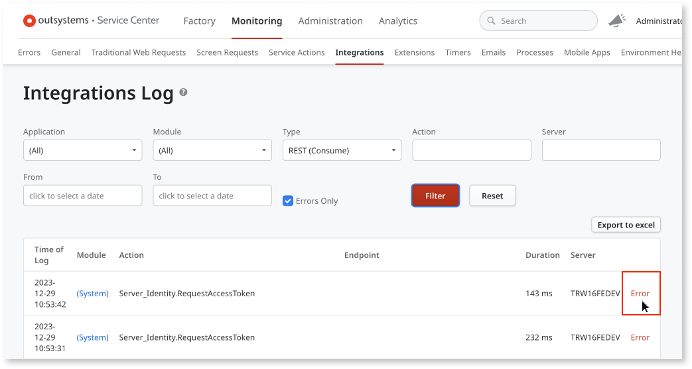
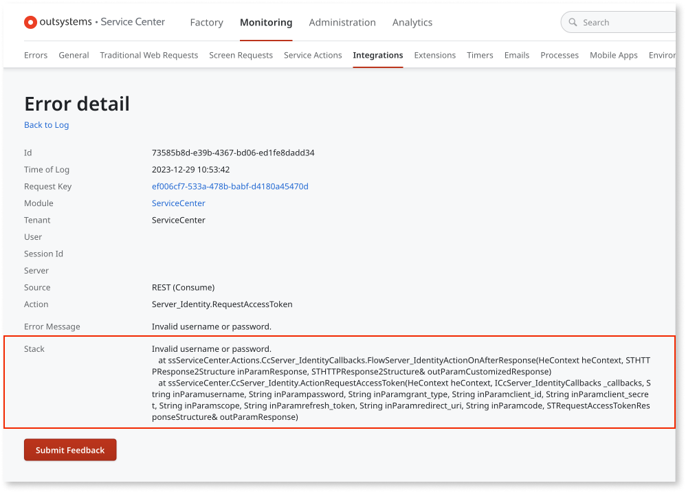
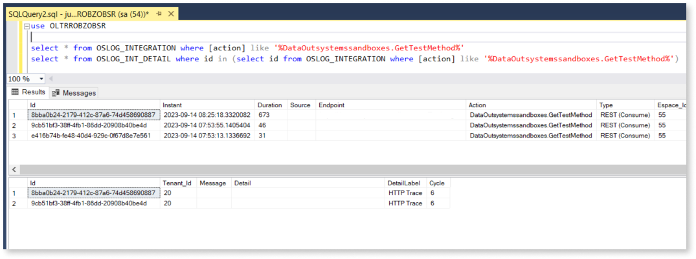

# Troubleshoot a REST API

OutSystems keeps track of all requests and responses of your REST API, namely, a time log of all request/response activity and content.

You can configure the detail level of the logs that OutSystems keeps for each REST API, for example,increasing the logging level of a given REST API while troubleshooting an issue. Check [Set the logging level of REST and SOAP integrations](../log-levels-set.md) for more information.

## View consumed and exposed REST API Logs

To access the logs of your REST API, do the following:

1. Go to the Service Center management console of your OutSystems environment.

1. Go to the **Monitoring** section and select **Integrations**.

1. In **Type**, filter the logging you want to see: `REST (Consume)` or `REST (Expose)`.

    

1. Click **Filter**.

1. To access the details of a log entry, click on the **Detail** link (or, if there is an error, on the **Error** link).

    

1. Under the error details, you will also find the stack trace.

    

## View REST API Logs directly from the database

Customers with access to the database cab also query related to an action and see all related details by doing the following:

1. Access the database on the selected environment.

1. Run the following query:

     ```
     select * from OSLOG_INT_DETAIL where id IN (select id from OSLOG_INTEGRATION where action like '%<APIaction>%')
     ```

1. Details similar to the example.

    
