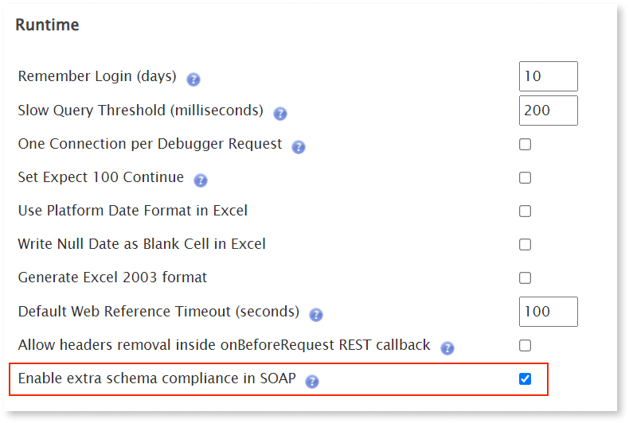
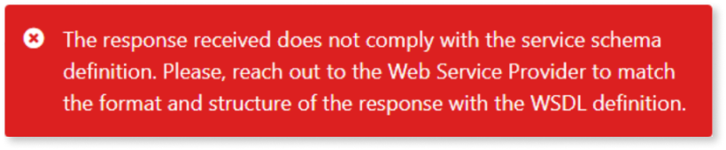

# Add extra schema compliance validations

A SOAP web service is defined by a service definition, which includes WSDL and schema files. These files define the format of the XML request and response messages to be exchanged. As a consequence, these messages must always be compliant with the format defined in the service definition.  

When you consume a SOAP web service in Service Studio, several validations are performed at runtime to verify the compliance of the exchanged SOAP messages. However, by default, some validations aren't performed on the consumer side. If you consume a SOAP web service in Service Studio, and after that the exposed service is modified (or sends a non-compliant response), then the XML responses it sends might not comply with the service definition initially used to import the SOAP web service. This might lead to unexpected runtime behavior.  

In this case, for troubleshooting purposes, you might want to enable an environment setting to perform extra schema compliance validations on all SOAP responses. 

## Prerequisites

To enable and use the extra schema compliance validations, make sure you meet the following requirements:

- You're using Platform Server 11.19.0.
- You installed the [Factory Configuration](https://www.outsystems.com/forge/component/25/factory-configuration/) from Outsystems Forge.

## How to enable extra schema compliance validations

<div class="info" markdown="1">

Enabling extra schema compliance validations impacts performance. We recommend their activation only for troubleshooting purposes (preferably, in a testing environment).

</div>

To enable these validations, follow these steps:

1. Install the [Factory Configuration](https://www.outsystems.com/forge/component/25/factory-configuration/) from Outsystems Forge.

1. Access the **Factory Configuration** application (available in **https://your-domain/FactoryConfiguration/**).

1. Go the **Platform Configurations** tab.  

1. Under the **Runtime** section, select the **Enable extra schema compliance in SOAP** checkbox and click **Apply**.   

    
    
    With this option enabled, whenever a response message is non-compliant, an exception is thrown and logged, and the following error message displays at runtime:

    

    If you want another message to be displayed to the end-user, you may choose to catch this thrown exception with an [Exception Handler](../../../develop/logic/exceptions/intro.md) on Service Studio.

1. After you change the settings using **Factory Configuration**, make sure you apply new configurations to your environment.

1. When you finish troubleshooting, clear the **Add Extra Schema Compliance Validations in SOAP** checkbox, click **Apply** and Apply the Configurations to your environment.

Note that this is an environment configuration, which will impact all applications that are published after enabling the setting.

## What to do when the response is non-compliant 

If you enabled the extra schema compliance validations and concluded that a response is non-compliant, you can do the following:  

* Refresh the SOAP web service and publish again. This can solve the issue because the exposed service might have changed in the meantime.  

* In case the problem persists, contact the web service provider. The XML responses sent by the exposed service might not be compliant with the service definition and it might impact other consumers.

## Example

As an example, consider you imported a SOAP web service with the following service definition:

```xml
<xsd:complexType name="ResponseElement">
    <xsd:sequence>
        <xsd:element name="elementNumber1_out" type="xsd:string" />
        <xsd:element name="elementNumber2_out" type="xsd:string" />
        <xsd:element name="elementNumber3_out" type="xsd:string" />
    </xsd:sequence>
</xsd:complexType>
```

Then, you receive the following response from the web service:

```xml
<soapenv:Envelope xmlns:soapenv="http://schemas.xmlsoap.org/soap/envelope/" xmlns:pat="http://HPP/CDM/Patient" xmlns:head="http://api.bpsa.pl/bpapi_esb/headers-v1_1">
    <soapenv:Header/>
    <soapenv:Body>
        <pat:WebMethodOut>
            <head:elementNumber2_out>Lorem</head:elementNumber2_out>
            <head:elementNumber1_out>ipsum</head:elementNumber1_out>
            <head:elementNumber3_out>dolor</head:elementNumber3_out>
        </pat:WebMethodOut>
    </soapenv:Body>
</soapenv:Envelope>
```

Notice that, in the response, the elements elementNumber1_out, elementNumber2_out and elementNumber3_out aren't in the same order as they appear in the service definition. This means that the response is non-compliant with the service definition.  

If the extra schema compliance validations are disabled, the runtime behavior can be unexpected. In this case, only the elementNumber2_out would be filled with the correct value, Lorem. The elementNumber1_out and elementNumber3_out elements would hold empty strings, their default value.  

When extra schema compliance validations are enabled, the response is invalid because it doesn't comply with the schema types imported in the service definition.

