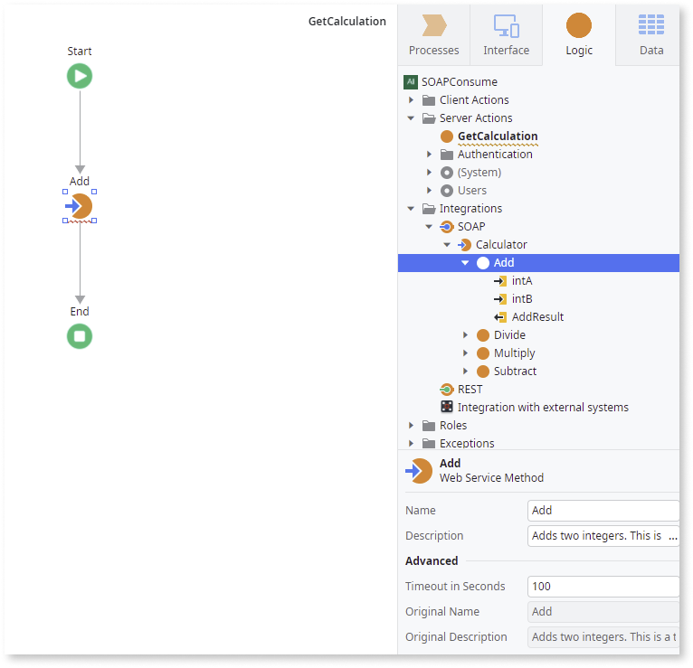

# Consume a SOAP Web Service

To consume a SOAP Web Service in your application, do the following:

1. In the **Logic** tab, open the **Integrations** folder.

1. Right-click the SOAP element and select **Consume SOAP Web Service...**.

    

1. In the displayed dialog, specify the location of the Web Service definition (WSDL) and click **Consume**.

    

    When providing a remote URL, type it exactly the same way as you would type it into your web browser. To import a WSDL from your local file system, click **Upload file** and select your WSDL.

1. If the service supports more than one binding, choose the desired binding and click **Next**.  
    Otherwise, Service Studio skips this step.

    

1. If the service supports more than one method, choose the methods you wish to consume and click **Finish**. Otherwise, Service Studio skips this step.

    

Be aware that, for all remote WSDL files, the URL address must be accessible from the machine running **Platform Server** and not directly from Service Studio.

When you consume a SOAP Web Service, OutSystems does the following for you:

* Creates the SOAP Web Service
* Creates the exposed Web Service Methods with the corresponding input and output parameters
* Creates the Structures and Static Entities to hold the complex types defined in the WSDL
* Maps the [XML data types into OutSystems data types](<../../../ref/extensibility-and-integration/soap/consumed-soap/mapping-xml-to-outsystems.md>)

OutSystems doesn't provide direct support for Web Services Enhancements (WSE). Instead, you can use the [SOAP Extensibility API](<../../../ref/apis/soap-extensibility-api.md>) to implement the functionality provided by Web Services Enhancements in your applications.

## Use a SOAP Web Service Method in an Application

OutSystems translates the methods exposed by a SOAP Web Service into OutSystems actions, with the same semantics as any action created by you in Service Studio.

You can now use the newly created method in your application the same way you use the remaining Server Actions:

1. Go to the action flow where you want to use the Web Service Method.

1. In the **Logic** tab, open the **Integrations** folder and SOAP element.

1. Open the SOAP Web Service and drag the Web Service Method into your action flow.

