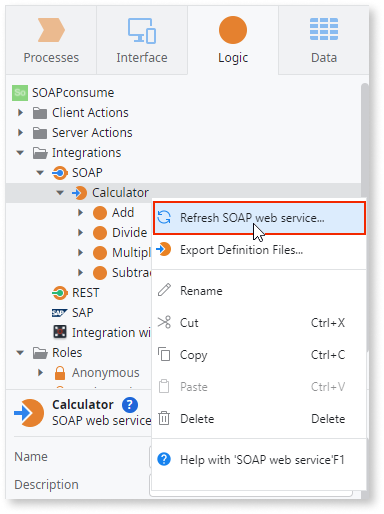

# Refresh a SOAP Web Service

To change the services consumed  from a SOAP Web Service or to modify the list of consumed methods, refresh the service in Service Studio:

1. In the **Logic** tab, open the **Integrations** folder.

1. Under **Integrations** > **SOAP**, right-click the SOAP Web Service you want to refresh and select **Refresh SOAP Web Service**. In this example, the Web Service name is **SoccerTeam**.

    

1. In the Refresh SOAP Web Service popup, click **Yes**. 

    

1. Type or confirm the URL or local file path for the WSDL, and then click **Consume**. Service Studio re-reads the WSDL and displays a selectable list of available methods to consume.

    

1. Select all methods you want to consume. Note that:

    * The list of methods you select replaces the list you consumed previously; be sure to select all methods you want to consume, even if they haven't changed. 
    * Refreshing does NOT wipe out authentication and On Before Request settings. These settings are not impacted when.       
    * Methods no longer in the WSDL have an **(outdated)** label; these will no longer exist in the service.  
    * New methods include a **(new)** label. 

    

1. Click **Finish** to consume the selected methods. In this example, only the **AllPlayersNames** method is consumed. 
