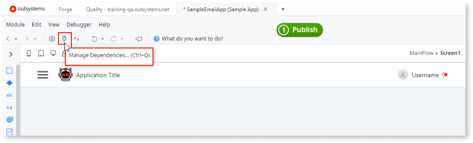

# Use a Forge Component Made by the Community

OutSystems Forge is a repository of open-source reusable components and applications that speed application delivery. They provide multiple additional features and components such as:

* String manipulation libraries
* Widgets to display maps or charts
* Connectors to integrate with external services such as Box, LinkedIn, or Twitter
* Entire business applications such as Timesheets, Expenses or Sales that you can customize to get a head start

To install a component as a dependency of your application:

1. In the Development tab in Service Studio, click on the **Install Application** button.
1. Search for the component, select the component and click **Install**. Once the component is declared to be compatible with your version of Service Studio, click on the **Install** button again.
1. After installing the component, from the detail screen of your application, click on the **Manage Dependencies** button.

    

1. On the Manage Dependencies window, find the list of installed components you can add as a dependency on left window pane. For each selected item you can see a list of its public elements on the right window pane; you can check or uncheck the elements of the component you want to use in your module.

1. Click on OK to add the component to your application and use it as required.

In the case of installing an entire application, open it and customize it to suit your needs.
