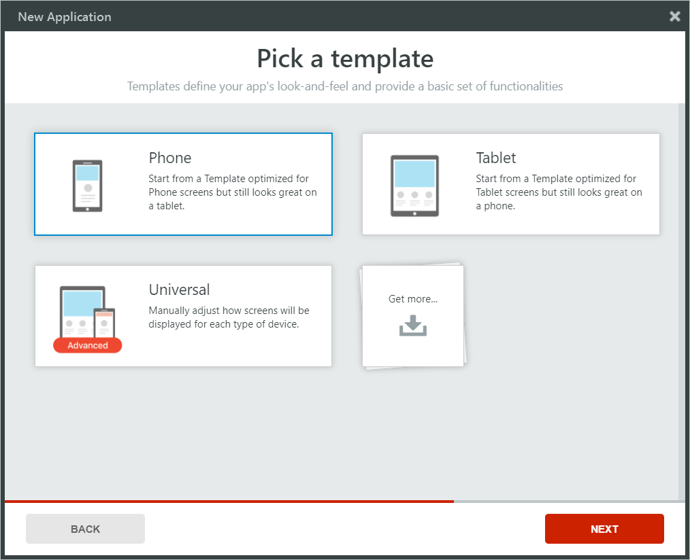

# Create Apps from Application Templates

In OutSystems, you create applications that have user interface by using [Application Templates](<../develop/application-templates/intro.md>). These templates contain elements common to many applications, such as the definitions of screen layouts, CSS, and basic logic. The Application Templates save time and enable you to develop applications that follow style guides and business rules, with a great look and feel - right from the start.

Let's say we want to develop a mobile application for finding, reviewing and rating places. We'll call it GoOutWeb. To bootstrap the app, we will use the Phone application template, one of the default templates optimized for mobile devices.

1. Open Service Studio.

2. Click **New Application**.

3. Select **Mobile App**. Service Studio presents the available Application Templates.

4. Select **Phone** and click **Next**.

    

5. Enter the application details:

    * Set the name as "GoOut".
    * Set the description as "Mobile application to review and rate places."
    * Set the icon. Use a large version with 1024x1024 pixels and maximum size of 512 KB if you intend to submit your Mobile application to an app store.

6. Click **Create App**.

7. Select **Responsive** and click **Create module**. This creates the UI module, with the definitions of the template on which it is based, including the layout blocks and the theme.
