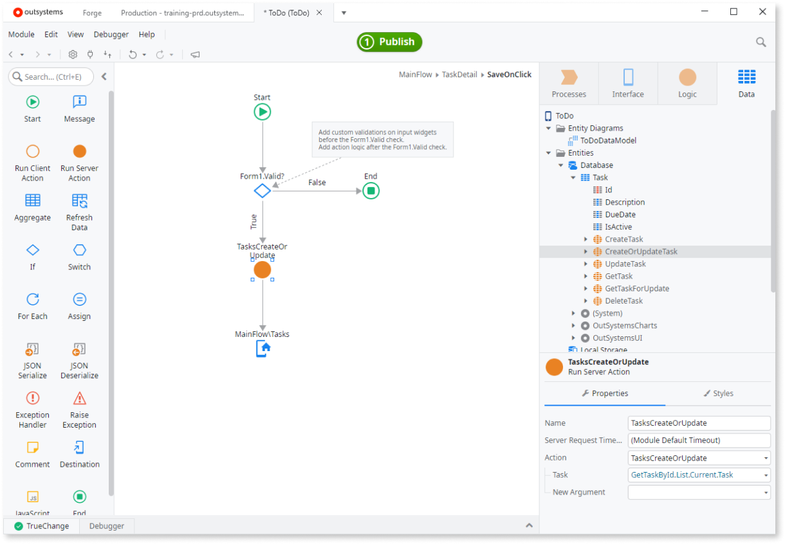
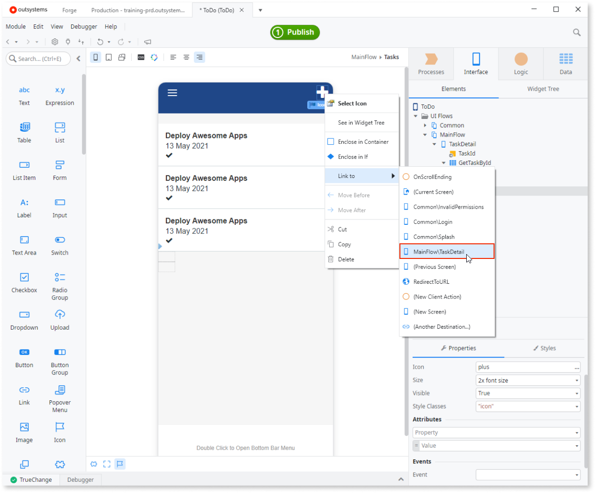
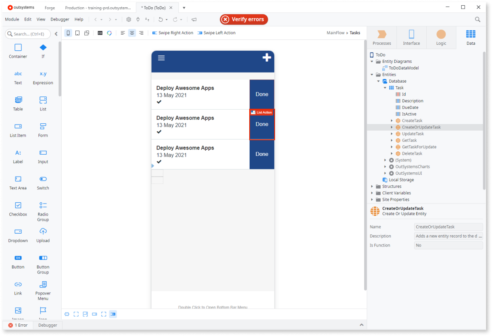
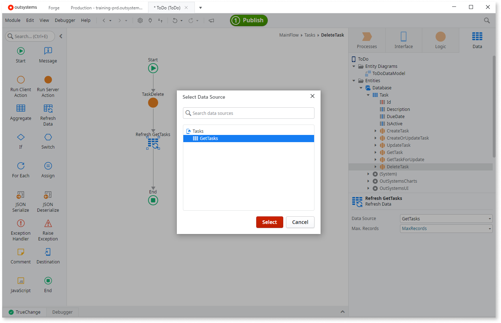

# Create Your First Mobile App

Developing mobile apps with OutSystems is easy. If you have an Excel file containing your data, you can import it into a database and quickly create a mobile app that enables you to check and manage your data on the go.

To create a mobile app with data that's imported from an Excel file, you need to:

1. Create a database model, and import the data from the Excel file into the database
2. Create a screen that lists the data from the database
3. Create a screen that enables you to create new records, and update existing ones
4. Implement functionality to delete records from the database
5. Test the application on your mobile device.

Let's do this! In this example we'll use a sample Excel file with to-do task information, and we'll create a simple task management mobile app.

## Create a Mobile App

Let's create a new task management mobile app. Do the following in Service Studio:

1. Select **New Application**.

    

1. Select **From scratch** and click **NEXT**.

    

1. Choose the **Phone App** template and click **NEXT**.

    

1. Name the app **To Do** and click **CREATE APP**. Service Studio opens app details for you to add your first module.

    

1. In the app detail screen, confirm the following and click **CREATE MODULE**:
    
    * The name of the module is `ToDo`
    * The module type is **Phone App**.

    

    An application contains one or more modules, different parts of the application can be encapsulated in a module. A module is where you design the data model, implement the logic, and design the UI of your application.

## Create a database table from an Excel file

OutSystems stores your application data in a relational database. This means that the first step in creating an application is defining the data model.

To do this, we are going to use an Excel file that already contains the following task information:

* Description
* Due Date
* Is Active

In the `ToDo` module, open the **Data** tab on the top right-hand corner, right-click the **Entities** folder, choose **Import New Entities from Excel...**, and select the sample file `Tasks.xlsx` available by default in the directory `C:\Program Files\OutSystems\Development Environment 11\Service Studio\TutorialResources`.

When importing an Excel file, OutSystems creates a database table (called an Entity in OutSystems) with the necessary columns (called Attributes in OutSystems) to store the data in the database.

Behind the scenes, OutSystems also creates logic to import each row in the Excel file into a corresponding database record. After publishing your application, the background logic populates your database with the data from the Excel file.

In this tutorial we're only storing the data in the server database, but for offline usage, it's also possible to store the data locally in mobile devices using Local Storage.

## Create a screen to list tasks

Now we can create a screen that lists all of the tasks.

Open the **Interface** tab on the top right-hand corner, and double-click **MainFlow** under **UI Flows**. Then, drag a **Screen** from the Toolbox to an empty area in the Main Editor window. Choose the **Empty** template, name your screen `Tasks` and click **Create Screen**.

Drag the **Task** entity from the **Data** tab to the Content placeholder of the mobile screen that is displayed in the Main Editor window.

This updates the **Tasks** to include a list that initially displays 20 tasks and automatically loads more tasks when the user scrolls to the end of the list.

## Create a screen to edit tasks

Creating a screen to edit the records is as fast as creating a list screen.

Right-click the title of the first task in the list, click **Link to** > **(New Screen)**, choose the **Empty** template, name your screen `TaskDetail` and click **Create Screen**.

This links the title of the tasks to a newly created screen. We will use this new screen to edit the tasks, but for that we will need a form:

1. Drag a **Form** widget from the Toolbox to the Content placeholder in the **TaskDetail** mobile screen.

    

1. Drag the **Task** entity from the **Data** tab to the previously created Form.

    

Now we will define the logic that runs when the end users press the Save button:

1. Double-click an empty area of the **Save** button to define the logic associated with the button. This will create a new screen action named **SaveOnClick**.

1. In the **Data** tab, expand the **Task** entity and drag the **CreateOrUpdateTask** entity action to the **True** branch of the **If**. Set the **Source** property to `GetTaskById.List.Current`.

1. Drag the screen **Tasks** from the **Interface** tab to the End node so that the user is redirected back to the main screen after saving a task. 

    

## Allow adding tasks

We want to enable the end users to add new tasks from the list screen by linking to the screen that is already used to edit tasks:

1. In the **Interface** tab, double-click the **Tasks** to open the list screen.  
Drag an **Icon** widget from the Toolbox to the Actions placeholder in the top right-hand corner of the screen and select the **plus** icon.

    

1. Right-click the **plus** icon and choose **Link** > **MainFlow\TaskDetail**.

    

## Allow completing tasks

Now let's add the functionality to mark tasks as complete. Let's implement that by deleting the completed tasks:

1. Click the item of the list and then, on the Toolbar, click **Swipe Left Action**.

1. In the newly created List Action, replace the text "Action" with "Done".

    

1. Double-click an empty area of the List Action to define the logic associated with the Swipe Left Action.

1. In the **Data** tab, expand the **Task** entity and drag **DeleteTask** entity action  available under the entity Task in the Data tab to the flow of the Swipe Left Action. Set the **Id** property  to `GetTasks.List.Current.Task.Id`.

    

1. Drag **Refresh Data** from the Toolbox to the action Flow, after the **DeleteTask** action, and select the aggregate **GetTasks** to refresh the available tasks in the screen.

    

## Test your Mobile App

At this stage we test the mobile app. Click the **1-Click Publish** button to publish the application to your environment.

When the application is deployed, click the **Open in Browser** button to test your application in a browser (Chrome and Safari are supported).

To try out the app on your mobile device see [Distribute as a progressive web app (PWA)](../deliver-mobile/distribute-pwa/intro.md).
