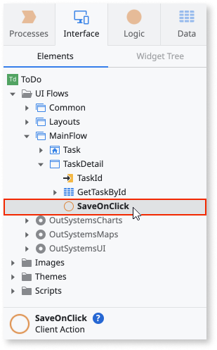

# Create Your First Reactive Web App

Check our training [Becoming a Reactive Web Developer](https://www.outsystems.com/learn/paths/18/becoming-a-reactive-web-developer/) for a guided introduction into Reactive Web App. 

Developing Reactive Web Apps with OutSystems is fast. In this example, we will use a spreadsheet to create some database entries and then add user interface and logic to connect everything - into a ToDo app.

This is the overview of what we are about to do:

1. Create a Reactive Web App, name it, and choose the primary color.
1. Automatically create a database model by importing data from Excel.
1. Create a Screen that lists the data from the database.
1. Create a Screen to add and update records.
1. Implement functionality to delete records.
1. Test the application in a browser.

## Pre-requisites

You should satisfy the following requirements to develop, run, and deploy a Reactive App.

* Service Studio 11.53.7 or later
* Platform Server 11 - Release Oct.2019.CP1 or later
* LifeTime Management Console - Release Sep.2019 version 11.0.321.0 or later 

We also recommend that you update the following components:

* OutSystems UI
* OutSystems UI Templates Reactive

## Create a Reactive Web App { #new-app }

Let's create a sample "ToDo" app.

1. In Service Studio, select **New Application**.

    

1. In the **New Application** window, choose **From scratch**, then click **Next**.

    

1. Choose **Reactive Web App**, then click **Next**.

    

1. In the properties for your new app, set up the following: 
    
    1. Name your app "ToDo".  
    
    1. Add a description.
    
    1. Change the primary color of your app by picking one of the suggested colors, or using the color picker.
    
    1. Upload an icon by clicking **Upload icon**.
    
    1. Click **Create App** to advance to the next step.

    

1. In the application properties screen, make sure **Reactive Web App** is selected in the **Choose module type** dropdown. Click **Create Module** to create the first module and open it for editing.

    

## Create a database table from an Excel file { #create-entity-from-excel }

In OutSystems, application data can be stored in a relational database. This means that the first step in creating an app is defining the data model.

To do this, we are going to use an Excel file that already contains the following task information:

* Description
* Due Date
* Is Active

Download the [tutorial Excel file](resources/TutorialResource.xlsx) to your computer.

In the **ToDo** module, open the **Data** tab on the top right-hand corner, right-click the **Database** folder, choose **Import New Entities from Excel**, and select the `TutorialResource.xlsx` Excel file. Click **Import** in the dialog to confirm.

When importing an Excel file, OutSystems creates a database table (called an Entity in OutSystems) with the necessary columns (called Attributes in OutSystems) to store the data in the database.

Behind the scenes, OutSystems also creates logic to import each row in the Excel file into a corresponding database record. After publishing your application, the background logic populates (bootstraps) your database with the data from the Excel file. In this tutorial, we're only storing the data in the server database.

## Create a Screen to show tasks

Now we can create a Screen that shows all of the tasks.

1. Switch to the **Interface** tab on the top right-hand corner, and double-click **MainFlow** under **UI Flows**. 

    

1. Drag a **Screen** from the Toolbox to an empty area in the Main Editor window. 

    

1. Choose the **Empty** template (1), name your screen `Task` (2) and click **Create Screen** (3).

    

1. Drag the **Task** Entity from the **Data** tab to the Content placeholder of the screen.

    

    This automatically creates a Table with pagination support.

    

## Create a Screen to edit tasks

Creating a Screen to edit the records is as fast as creating a Table. Follow these steps:

1. Right-click the title of the first task in the row and select **Link to** > **(New Screen)**.

    

1. Choose the **Empty** template, name your screen `TaskDetail` and click **Create Screen**.

    This links the title of the tasks to a newly created screen. We will use this new screen to edit the tasks. For that, we will need a form.

1. Drag a **Form** widget from the Toolbox to the Content placeholder in the **TaskDetail** screen.

    

1. Drag the **Task** entity from the **Data** tab to the previously created Form.

    

    Now we will define the logic that runs when the end users press the **Save** button:

1. Double-click an empty area of the **Save** button to define the logic associated with the button. This will create a new screen action named **SaveOnClick**.

    

1. In the **Logic** tab, right-click **Server Actions** and select **Add Server Action**. Set its name to **TaskCreateOrUpdate**. 

    
    
1. Right-click the newly created action and select **Add Input Parameter**. Set its name to **Task**.

    

1. In the Input Parameter properties, set the Data Type to **Task**.

    

1. Right-click the **TaskCreateOrUpdate** action and select **Add Output Parameter**. Set its name to **TaskId**.

1. In the Output Parameter properties, set the Data Type to **Task Identifier**. 

    

1. In the **Data** tab, expand the **Task** entity and drag the **CreateOrUpdateTask** entity action to the flow of the **TaskCreateOrUpdate** server action. 

    

1. Set the **Source** to the Input Parameter **Task**.

    

1. Next, we'll need to assign the value of the Output Parameter **TaskId** to the **CreateOrUpdateTask**. Drag an **Assign** node from the toolbox to the flow (1) and set the **Variable** to **TaskId**, and the **Value** to `CreateOrUpdateTask.Id` (2).

    

1. In the **Interface** tab, double-click the **SaveOnClick** action.

     

1. Navigate to the **Logic** tab and drag the **TaskCreateOrUpdate** server action to the **True** branch of the **If** (1). Set the **Task** property to `GetTaskById.List.Current.task` (2).

    

1. Drag the **Task** Screen from the **Interface** tab to the **End** node so that the user is redirected back to the main screen after saving a task. 

    

## Allow completing tasks

Now let's add the functionality to mark tasks as complete. We can implement that by adding a feature to delete the completed task:

1. In the **Interface** tab, double-click the **Task** Screen. 

1. Right-click the Checkbox in the **Is Active** column and select **Delete**.

    

1. Drag a **Button** widget to the same Container where the Checkbox was, and enter `Done` in the Text property of the button.

    

1. Double-click an empty area of the button to define the logic associated with the click.

    

1. In the **Logic** tab, right-click the **Server Actions** and select **Add Server Action**. Name it **TaskDelete**. 

1. Add an Input Parameter to the **TaskDelete** to receive the Task identifier. Set its name to **TaskId** and the Data Type to **Task Identifier**.

    

1. In the **Data** tab, expand the **Task** Entity. Drag the **DeleteTask** Entity Action to the flow. 

    

1. Set the **Id** property to the Input Parameter **TaskId**.

    

1. Go back to the **Interface** tab and double-click the **DoneOnClick** action under the **Task** screen. 

    

1. Select the **Logic** tab and drag the **TaskDelete** server action to the flow of the **DoneOnClick** action. Set the **TaskId** property to `GetTasks.List.Current.Task.Id`.

    

1. Drag **Refresh Data** from the Toolbox to the action flow, after the **TaskDelete** action, and select the aggregate **GetTasks** to refresh the available tasks on the screen.

    

## Allow adding tasks

We also want to enable the end users to add new tasks from the screen with all tasks by linking to the screen that is already used to edit tasks:

1. Go to the **Interface** tab > **UI Flows** > **MainFlow**, and double-click the "Task" Screen to open the screen with all tasks in the main editor.  

1. Drag a **Button** widget from the toolbox to the Actions placeholder in the top right-hand corner of the screen. Change the label of the button to **Add Task**.

    

1. Right-click an empty area of the button and choose **Link** > **MainFlow\TaskDetail**.

    

## Test your Reactive Web App

At this stage, you can test your Reactive Web App. Click the **1-Click Publish** button to publish the application to your environment. When the application is deployed, click the **Open in Browser** button to test your application in a browser.

