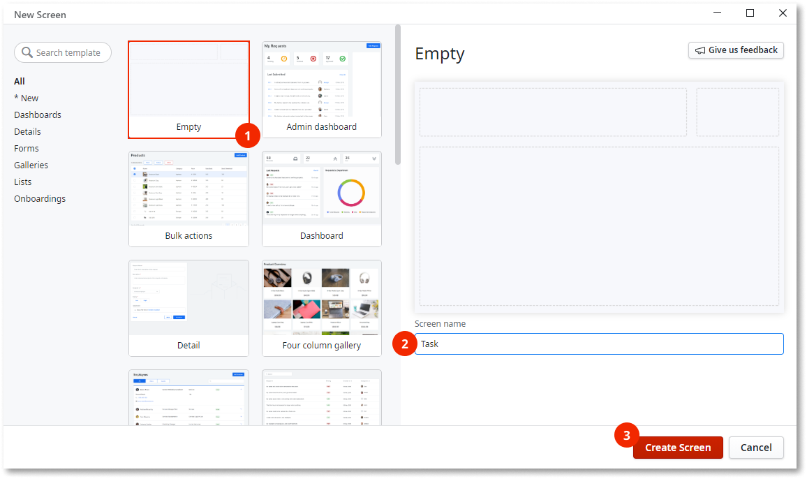
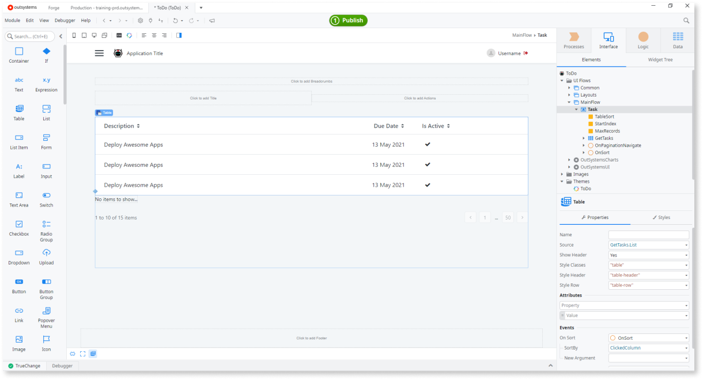
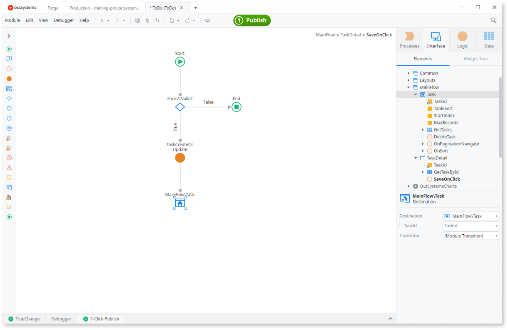
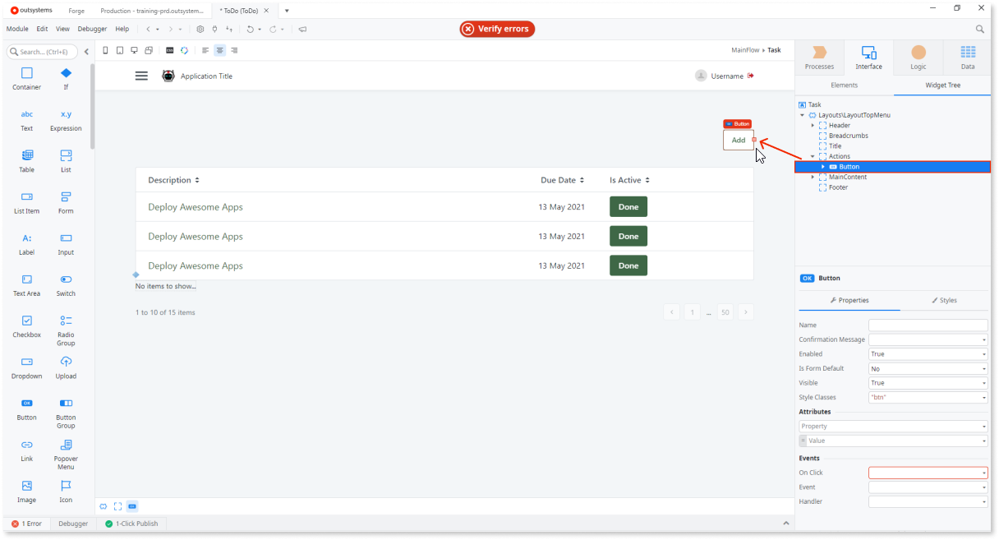
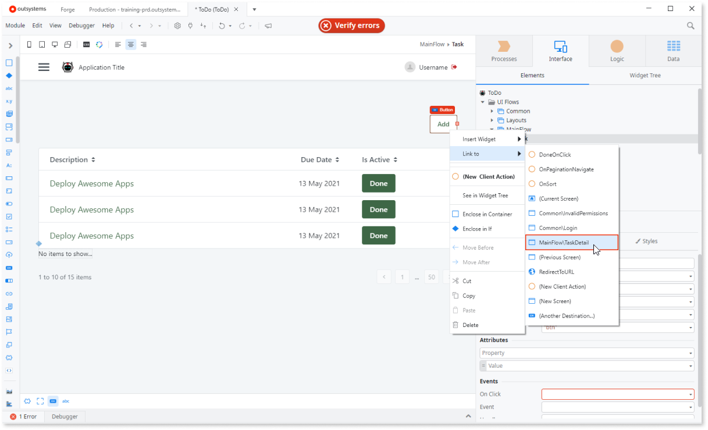

# Create Your First Reactive Web App

Check our training [Becoming a Reactive Web Developer](https://www.outsystems.com/learn/paths/18/becoming-a-reactive-web-developer/) for a guided introduction into Reactive Web App. To read more about this type of app in OutSystems, we invite you to read the forum post <a href="https://www.outsystems.com/forums/discussion/52761/reactive-web-the-next-generation-of-web-apps/">The Next Generation of Web Apps</a>.

Developing Reactive Web Apps with OutSystems is fast. In this example, we will use a spreadsheet you got with OutSystems installation to create some database entries and then add user interface and logic to connect everything - into a ToDo app.

This is the overview of what we are about to do:

1. Create a Reactive Web App, name it, and choose the primary color.
2. Automatically create a database model by importing data from Excel.
3. Create a Screen that lists the data from the database.
4. Create a Screen to add and update records.
5. Implement functionality to delete records.
6. Test the application in a browser.

## Create a Reactive Web App { #new-app }

You should satisfy the following requirements to develop, run, and deploy a Reactive App.

* Service Studio* 11.6.1 or later
* Platform Server 11 - Release Oct.2019.CP1 or later
* LifeTime Management Console - Release Sep.2019 version 11.0.321.0 or later 

We also recommend that you update the following components:

* OutSystems UI
* OutSystems UI Templates Reactive

(*) Service Studio comes with the installation of Development Environment.

Let's create a sample "todo" app.

1. In Service Studio, click **New Application** and choose **Reactive Web App**. Click **Next**.
    
    

2. In the properties for your new app, we will set up quite a few interesting things. Upload an icon (1) by clicking **Upload icon**. Then, name your app (2) "ToDo", add some description (3) and change the primary color (4) by selecting one of the colors. Click **Create app** to advance to the next step.

    

3. In the application properties screen, make sure **Reactive Web App** is selected in **Choose module type**. Click **Create module** to create the module and open it for editing.

    

## Create a database table from an Excel file { #create-entity-from-excel }

OutSystems stores your application data in a relational database. This means that the first step in creating an app is defining the data model.

To do this, we are going to use an Excel file that already contains the following task information:

* Description
* Due Date
* Is Active

In the `ToDo` module, open the **Data** tab on the top right-hand corner, right-click the **Entities** folder, choose **Import New Entities from Excel**, and select the sample file `Tasks.xlsx` available by default in the directory `C:\Program Files\OutSystems\Development Environment 11\Service Studio\TutorialResources`. Click **Import** in the dialog to confirm.

When importing an Excel file, OutSystems creates a database table (called an Entity in OutSystems) with the necessary columns (called Attributes in OutSystems) to store the data in the database.

Behind the scenes, OutSystems also creates logic to import each row in the Excel file into a corresponding database record. After publishing your application, the background logic populates your database with the data from the Excel file. In this tutorial we're only storing the data in the server database.

## Create a screen to show tasks

Now we can create a screen that shows all of the tasks.

Open the **Interface** tab on the top right-hand corner, and double-click **MainFlow** under **UI Flows**. Then, drag a **Screen** from the Toolbox to an empty area in the Main Editor window. Choose the **Empty** template, name your screen `Tasks` and click **Create Screen**.

Drag the **Task** entity from the **Data** tab to the Content placeholder of the screen in the Main Editor window.

This automatically creates a table with the pagination support.

## Create a screen to edit tasks

Creating a screen to edit the records is as fast as creating a table.

Right-click the title of the first task in the row, click **Link to** > **(New Screen)**, choose the **Empty** template, name your screen `TaskDetail` and click **Create Screen**.

This links the title of the tasks to a newly created screen. We will use this new screen to edit the tasks, but for that we will need a form:

1. Drag a **Form** widget from the Toolbox to the Content placeholder in the **TaskDetail** screen.

    

2. Drag the **Task** entity from the **Data** tab to the previously created Form.

    

Now we will define the logic that runs when the end users press the Save button:

1. Double-click an empty area of the **Save** button to define the logic associated with the button. This will create a new screen action named **SaveOnClick**.

1. In the Logic tab create a server action named **TaskCreateOrUpdate**.

1. Add an input parameter and set it's name to **Task**. Set the data type to **Task**.

1. Add an output parameter and set it's name to **TaskId**. Set the data type to **Task Identifier**. This will be the task id returned by the CreateOrUpdateTask that we'll need to pass on to the **SaveOnClick** action.

1. In the **Data** tab, expand the **Task** entity and drag the **CreateOrUpdateTask** entity action to the flow of the **TaskCreateOrUpdate** server action. Set the **Source** to the input parameter **Task**.

1. Next, we'll need to assign value of the output parameter **TaskId** to the **CreateOrUpdateTask**. Drag an **Assign** node to the flow and set the **Variable** to **TaskId**, and the **Value** to `CreateOrUpdateTask.Id`.

    

1. Navigate to the **Interface** tab and double click the **SaveOnClick** action.

1. In the **Logic** tab and drag the **TaskCreateOrUpdate** server action to the **True** branch of the **If**. Set the **Task** property to `GetTaskById.List.Current.task`.

1. Drag the screen **Tasks** from the **Interface** tab to the End node so that the user is redirected back to the main screen after saving a task. 

    

## Allow completing tasks

Now let's add the functionality to mark tasks as complete. We can implement that by adding a feature to delete the completed task:

1. In the **Interface** tab, click on the "Task" screen. Right click on the checkbox in the **Is Active** column and select **Delete**.

    

1. Drag a Button Widget and enter "Done" in the Text property of the button.

1. Double-click an empty area of the button to define the logic associated with the click.

1. Click the **Logic** tab and add a a Server Action. Name it *TaskDelete*. 

1. Add an input parameter to the *TaskDelete* to receive the Task identifier. Set it's name to *TaskId* and the Data Type to *Task Identifier*.

1. Go to the **Data** tab and expand the **Task** Entity and drag the **DeleteTask** entity action to the flow. Set the property *Id* to the input parameter *TaskId*.

    

1. Go back to the **Interface** tab and double click the action **DeleteTask**. Drag the **TaskDelete** server action to the flow. and set the TaskId to the input parameter *TaskId*.

1. Drag **Refresh Data** from the Toolbox to the action Flow, after the **TaskDelete** action, and select the aggregate **GetTasks** to refresh the available tasks in the screen.

    

## Allow adding tasks

We also want to enable the end users to add new tasks from the screen with all tasks by linking to the screen that is already used to edit tasks:

1. Go the **Interface** tab > **UI Flows** > **MainFlow**, and double-click the "Tasks" Screen to open the screen with all tasks in the main editor.  

1. Drag a Button Widget from the Toolbox to the Actions placeholder in the top right-hand corner of the screen. Change the label of the button to "Add".

    

1. Right-click the button selector and choose **Link** > **MainFlow\TaskDetail**.

    

## Test your Reactive Web App

At this stage we test our Reactive Web App. Click the ** 1-Click Publish** button to publish the application to your environment. When the application is deployed, click the ** Open in Browser** button to test your application in a browser.
