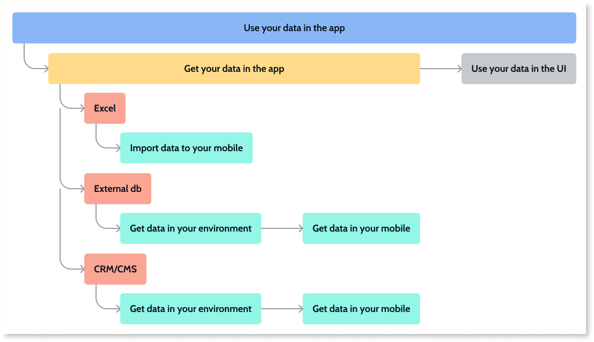

# Get external data in your app

Only applies to Windows-only Service Studio.

OutSystems provides a number of ways to access external data and use it in your apps. It provides native support for integrations with standard databases and systems of record (SoRs). You can also import data from Excel. 

Connecting to an external database or System of Record (SoR) allows you to leverage your investment in existing systems and to avoid data migration.

## Connect to an external database

You can connect OutSystems to external databases, including SQL Server, Azure SQL, Oracle, MySQL, and DB2 iSeries. Once you establish a database connection, you can develop apps in Service Studio that query and aggregate data that resides in the external database. Your app can extract, load, transform, and update data from the external database.

See [Integrate with an External Database](../../extensibility-and-integration/external-database/connect-external-db.md) for detailed steps.

## Connect to an external system of record (SoR)

OutSystems allows you to connect your apps to external SoRs, such as SAP ODATA, Salesforce, SharePoint Online, Microsoft Dataverse, and Microsoft Dynamics 365.  An OutSystems tool called Integration Builder walks you through the process of securely connecting apps to external SoRs. Integration Builder also simplifies the process of calling an external system by handling the authentication flow, encoding, and parsing. 

See [How to use Integration Builder ](../../extensibility-and-integration/integration-builder/use.md) for detailed steps.

## Import data from Excel

You can import data from an Excel file, which allows you to import both an entity structure and the data to populate that structure. For example, if you have a product name column in your spreadsheet, product name becomes an entity in OutSystems, and the data in that column (the product names themselves) become the data associated with that entity. When developing an app, importing sample data from Excel allows you to test your app's behavior with data similar to what you expect in production. 

See [Bootstrap an entity using an Excel file](../../develop/data/excel-bootstrap.md) for detailed steps.

## Advanced options

You can also build custom integrations using REST or SOAP webservices, or use connectors built by the OutSystems community and shared on [Forge](https://www.outsystems.com/forge/).

## Next step

Now that you have your data available in your app, use your data in the screens of the app. Check [this article to learn how to use your data in the UI of your app](replace-data-sauce.md)
