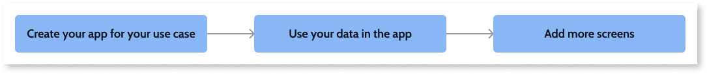

# Getting started with your own app use case

Learn more about how OutSystems enables you to deliver value right from the start.
Use tutorials and development accelerators tailored to several application use cases to create your first app that fulfills your business initiatives.

OutSystems has tutorials and app development accelerators for the following application use case categories:

* Customer self-service apps:
    * Digital banking web portal
    * Insurance web portal
    * Retail catalog web portal and mobile app
    * Energy digital services web portal and mobile app
* Field inspections and safety apps:
    * City inspections web portal and mobile app
* Work order management apps:
    * Field services web portal and mobile app
* Field sales apps:
    * Sales CRM web portal and mobile app
* Inventory management, supplier management and sourcing, PO management, warehouse management, returns management, driver and fleet management apps:
    * Order management web portal and mobile app
* Internal apps:
    * Employee directory web portal and mobile app

In this article, you're guided through the process of creating your first app and then customizing it to your own data and needs.

## Prerequisites

Before you get started make sure that:

* You have a personal environment or a free trial. If you don't have either, [sign up for free](https://www.outsystems.com/home/GetStartedForFree.aspx).

* You installed the [latest windows-only version of the Development Environment](https://www.outsystems.com/downloads/). For now, you can't use use-case specific tutorials and accelerators with the macOS Service Studio.

## Creating and customizing your app

The key steps for creating a working use-case app that uses your data are the following:

1. Create and test the first version of your app by following the Service Studio tutorial for your use case. The first version of your app is functional and includes sample data. Check [this article to learn more about the first version of your app and about relevant OutSystems concepts](understand-create-app.md).

1. Next, make the app your own, by using your own data from an Excel file, an external database, or an external system of record (SoR). Check [this article describes the main external data sources you can use in your app](use-own-data.md).

1. Evolve your app by adding more screens using development accelerators specific to your app's use case.
