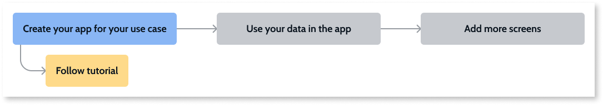

# Understanding how to create an app

## Overview

No prior OutSystems knowledge is needed to get started. But, you must have:

* A personal environment or a free trial. If you don't have either, [sign up for free](https://www.outsystems.com/home/GetStartedForFree.aspx).

* Installed the [latest windows-only version of the Development Environment](https://www.outsystems.com/downloads/).

For now, use-case specific tutorials and accelerators are available only for the windows version of Service Studio.

This article explains concepts to help you understand the application use case tutorials and how you create your own app.

The tutorials use accelerators, Screen Templates, and UI patterns. Completing a tutorial helps familiarize you with the UI and you learn how different OutSystems features work together to create an app.

OutSystems provides sample data so you can see how your screens look once instantiated. When you publish your app, it's available from your personal environment.

Each application use case has a tutorial. As you progress through this journey you’ll learn how to make changes and add functionality to automate your business solution. At the end of each tutorial, you can open your app in a browser.    

The tutorials use the following common features to speed up the development of your app:

* **Accelerators** - are building blocks that can combine widgets, OutSystems UI patterns, sample data, and logic. Accelerators help you quickly build an app. You can use these accelerators in other apps. Kep in mind that most accelerators are application use case specific.
  
* **Screen Templates** - OutSystems provides built-in Screen Templates and sample data that enables you to view what your users see when using the app. he screens show you one way of solving a business problem using the sample data and logic. As you progress in this journey OutSystems teaches you how to create your own templates. To learn more about Screen Templates, click [here](../../develop/ui/screen-templates-create/intro.md).

* **UI Patterns** - OutSystems has pre-built patterns you can use to implement common UI components. Patterns help you create a consistent look. To preview all the OutSystems UI Patterns, click [here](https://outsystemsui.outsystems.com/OutSystemsUIWebsite/PatternOverview). Widgets are also used in the UI and have a variety of uses such as input fields, radio buttons, and check boxes.

To learn more about screen templates and widgets, watch this [training video](https://www.outsystems.com/training/lesson/1923/ui-development?LearningPathId=18).

To get started open a business use case tutorial from Service Studio. As you progress on this journey, you’ll learn how to make changes to your app. When you publish your app, the system stores a version of your app in your Personal Environment, compiles the code and generates the SQL scripts, updates the database, and deploys the current version of your app. In the second phase, you'll also have a functional app.

Following is a list of application use cases including a short description of the accelerators and the information that displays for users.

* **Online Banking Portal**
    * **Check Balance** and **Account Overview** - displays on the same screen. The check balance information displays at the top and shows the current balance for your credit card, checking and savings accounts. The account information shows the transactions for the selected account by posting date and includes the transaction date, description, amount, and current balance. Users can search by description, posting to and from date, and amount.  
* **Employee directory**
    * **Employees** - displays employee information including name, role, department, email address and phone number.
    * **Employee Detail** - displays information about an individual employee, and includes their title, an about paragraph, email address, phone number, department, office location, manager, and hire date.
* **Insurance**
    * **Car Insurance Calculator** - displays several forms to gather information about the vehicle and the driver. Then the app calculates the cost and displays three choices (basic, standard, and premium) showing what the policy includes and the cost.  
* **Field services**
    * **Work Orders** - displays information about the work order including the order title and type, the name of the customer, expected during, current status, name of the technician, and the schedule date for the work. Users can search by order or customer name, status, technician name or all, and the from and to dates.
    * **Work Order detail** - displays information that includes the company name, the date you expect the service to complete, the amount, the name of the person who created the work order, and the date the work order was received. In addition, the work order shows the products, unit price and number of units, any discounts, and the amount.
* **Retail catalog**
    * **Product Gallery** - displays a picture of the product, along with a short description and the price. When users click on the image, another page opens with a larger image and more detail. 
    * **Product Details** - displays more information about the product including additional image views, consumer ratings, specifications,and features.
* **Sales CRM**
    * **Opportunities** - displays information about the opportunity. Users can search by opportunity or account, to whom the opportunity is assigned, the current stage, and the amount of money this opportunity might be worth.
    * **Opportunities Detail** - displays information that includes opportunity number and status, the opportunity name, account, the person assigned, the amount, the probability of closing, the close date, expected revenue and a description. In addition, it shows  a list of current orders.
* **Order management**
    * **Orders** - displays information that includes the order number, company name, amount of the order, order date,the date on which the order is required, the name of the person who created the order, and the current status of the order. Users can search by order number or company name, the person who created the order, the status, and the amount using a slider.
    * **Order Detail** - displays information that includes the order number and current status. In addition it displays the company name, amount of the order, order date, date required, and who created the order. In addition, it shows the products in this order.
* **City Inspection**
    * **Inspections** - displays information that includes the inspection date, reason for the inspection, the establishment, the current status and the final score. Users can also search by reason or establishment, status, and from and to date.
    * **Inspection Detail** - displays the current status of the inspection, the name of the establishment, date, reason, inspector time period, and final score. Also available is a report that users can produce by category and then sort alphabetically.

## Next step

After creating your app by following the tutorial, make the app your own, by using your own data from an Excel file, an external database, or an external system of record (SoR). Check [this article describes the main external data sources you can use in your app](use-own-data.md).
