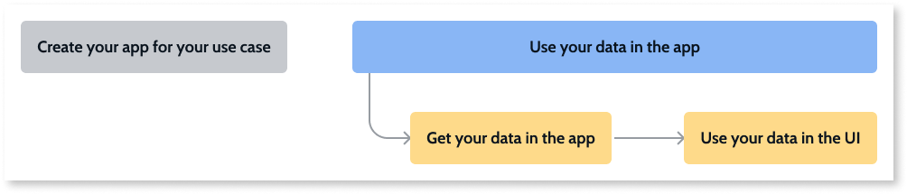

# Using your own data in your app

Only applies to Windows-only Service Studio.

Learn more about how you can customize your app by replacing the sample data in your use-case app with your own data.

## Prerequisites

Before you get started make sure that:

* You have created the first version of your use-case app by following one of the tutorials. Check [Understanding how to create an app](understand-create-app.md) for more details.

## Replacing sample data with your own data

The key steps for replacing the sample data in your use-case app with your own external data are the following:

1. Get external data from an external database, a System of Record (SoR), or an Excel file in your app. Check [this article to learn about the external data sources you can use in your app and how you to get the data in your app](get-external-data.md).

1. Use your data in the screens of the app. Check [this article to learn how to use your data in the UI of your app](replace-data-sauce.md)

