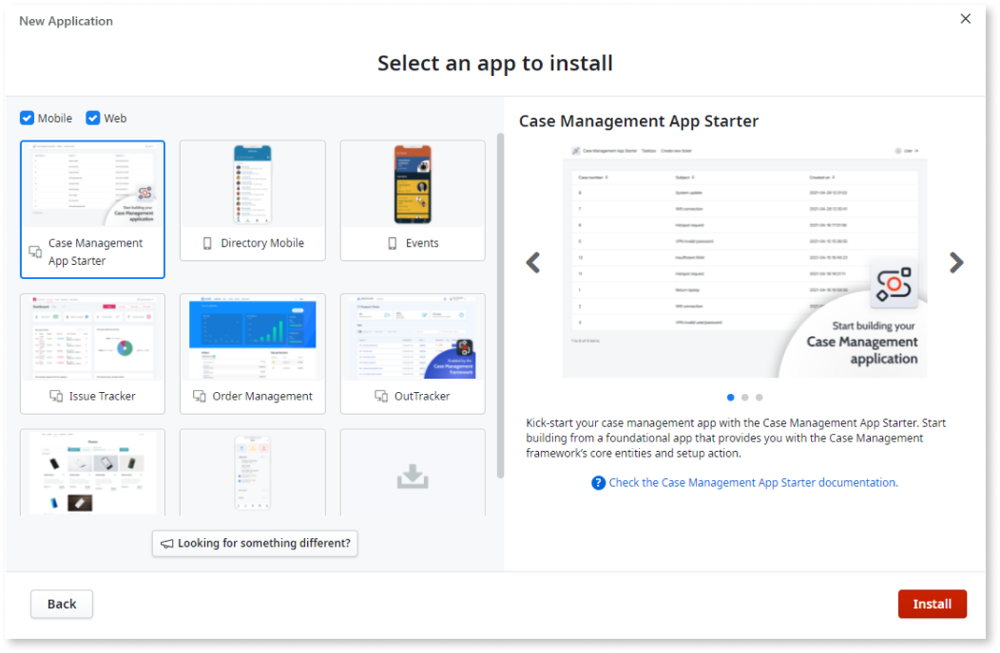
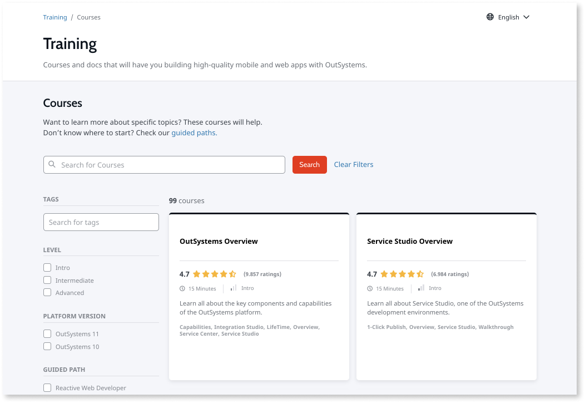

# Getting started

OutSystems lets you build great and secure web and mobile apps. This is what you need to get started:

1. Create a [free account](https://www.outsystems.com/home/GetStartedForFree.aspx).
2. Install [Development Environment](https://www.outsystems.com/home/downloads).
3. Start **Service Studio** and see the section about [your first app](#your-first-app).

## Your first app 

To create your first app in Service Studio you can: 

* Run a **built-in interactive tutorial**. In Service Studio, open the **Help** menu and select **Build an App in 5 minutes tutorial** to start and interactive tutorial. 
* Follow **step-by-steps tutorials**. Check out the tutorials about [how to create a mobile app](create-mobile.md) or [how to create a web app](create-reactive-web.md).
* Start from an **existing sample app**. Create a new app in Service Studio and choose **Start from an app** to see the collection of the prebuilt apps.

## Creating apps

You build, edit, and debug your apps in Service Studio, using OutSystems visual language. Once you're happy with how your app looks and works, publish it as a web app, progressive web app, or native mobile app. For an overview, see [Choose the right app for your project](right-app.md).

There are several prebuilt elements that you can use to build your apps faster. For example, screen templates come with user interface and logic, and components from Forge significantly increase your app's functionality. You can also build your screens and components and share them with other developers.

* [Forge](https://www.outsystems.com/forge/)
* [Screen templates](https://www.outsystems.com/OutSystemsUIWebsite/ScreenOverview?RuntimeId=2)
* [User interface patterns](https://www.outsystems.com/OutSystemsUIWebsite/PatternOverview)
* [Choose the right app for your project](right-app.md)

You can also use OutSystems builder to prototype the front end of mobile apps or create workflows, if your product license includes these tools. With the builders you can start creating your apps without Service Studio.

* [Workflow Builder](https://success.outsystems.com/Documentation/Workflow_Builder) lets you create fully functional web apps to automate and manage simple workflows.
* [Experience Builder](https://success.outsystems.com/Documentation/Experience_Builder) lets you create the front end of mobile apps, that you can test right away, and then continue developing in Service Studio.

## Extensions

With Integration Studio you can write extensions in C#. This lets you expand the functionality of your apps and to work with any existing systems you may have.

* [Integration Studio](../ref/integration-studio/workspace.md)
* [Writing extensions](../extensibility-and-integration/integration-studio/getting-started/intro.md)

## Documentation

OutSystems documentation is here to help you build, publish, maintain, and troubleshoot your apps. The section you're reading now is a good starting point — check out the links in the table of contents, or use the search to find something specific.

## Training

There are free online courses that teach how to use OutSystems. There are official workshops as well. If you decide, like many, to pursue a career in OutSystems low-code development, there's a certification program to help you with that.

* [OutSystems overview](https://www.outsystems.com/training/courses/173/outsystems-overview/)
* [All OutSystems training courses](https://www.outsystems.com/training/courses/)
* [Service Studio Overview](https://www.outsystems.com/training/courses/174/service-studio-overview/)

## Community

The OutSystems community welcomes all. Join the community in the Forum, to share tips about working with OutSystems, get fresh ideas for your projects, or talk about the platform with other developers.

* [OutSystems Forums](https://www.outsystems.com/forums/)

