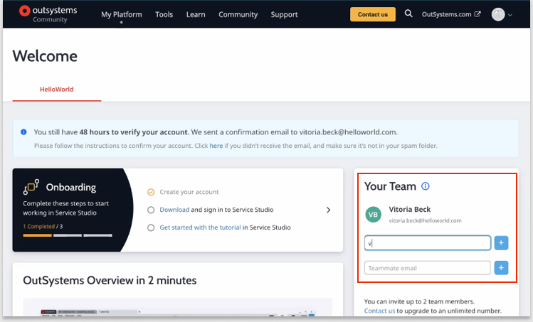

# OutSystems free version

OutSystems offers a free trial version that includes the following features:

* Two environments (development and production)
* Ability to collaborate with up to three developers and to share apps
* Access for end-users who can test apps and provide feedback
* Ability to transition your apps from the free to a paid version
* Templates and components aligned with common use cases

## Sign up and get started
To get started with the new free version:

1. Go to https://outsystems.com/home/GetStarted_FreeEdition.aspx. 
2. Type your information in the required fields or sign in with your LinkedIn or Google account. Follow the instructions and click Continue.
3. On the **Welcome** screen, click **Download Service Studio**. 
4. Click the **.exe** file to install Service Studio.
5. Follow the online prompts to complete the setup of your environment. 

## Collaborate with other developers
From the **Welcome** screen, you can invite other developers to access the trial environment. Up to three collaborators can work together in the free version.

* Under **Your Team**, type the name and email address of the person you want to invite, and then click the plus sign.

    

