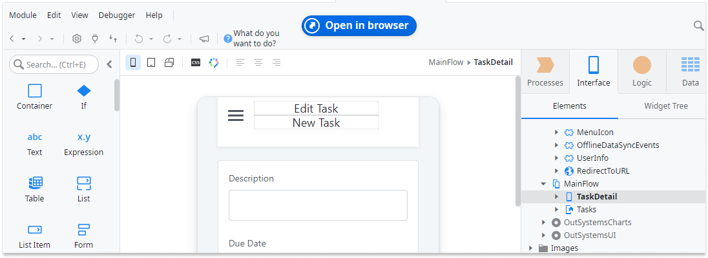
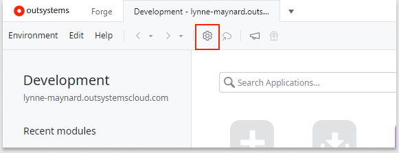
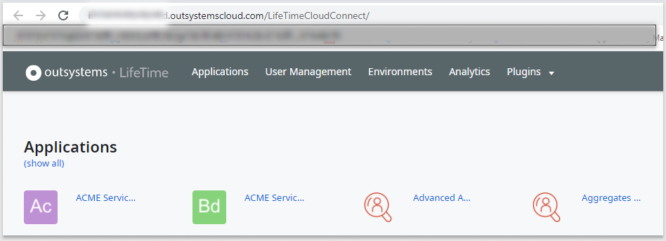

# OutSystems components

OutSystems provides several components that allow you to develop, manage, and administer your applications. The following graphic shows a sample OutSystems setup. On the right, you see three environments, Development, Quality, and Production. On the left, the graphic zooms in on one environment to show more detail. 

In an OutSystems Cloud setup, the Platform Server, Service Center, and LifeTime reside in the OutSystems Cloud. Service Studio resides on your local Windows or Mac system. Integration Studio also resides on a local system, but it's supported on Windows only at this time. 

 ## Component overview
 

* **Service Studio:** The visual development tool where you create, change, and deploy your applications. You install Service Studio on your local Windows or Mac system. To download Service Studio, go to https://www.outsystems.com/downloads/. 

    

* **Service Center:** The administration console that allows you to access and manage all settings in your OutSystems environment. It allows you to manage application versioning, runtime auditing, logging, and monitoring. 

    After you install Service Studio, click the gear icon or go to **Environment** > **Environment Management** to access Service Center. The Service Center URL has the format: https://*environment-name*.outsystemscloud.com/ServiceCenter.
 
  

* **LifeTime:** The centralized console for managing the infrastructure, environments, applications, IT users, and security. After you install Service Studio, click the gear icon to go to Service Center. In **Service Center**, in the upper right corner, click **Manage all environments in LifeTime** to access LifeTime.

    

* **Integration Studio:** The development tool to create connectors to integrate OutSystems applications with other enterprise systems. You install this tool on a developer's system. Integration Studio is only supported on Windows at this time. 

### Platform Server
The Platform Server resides in the OutSystems Cloud. This component takes care of the steps to generate, build, package and deploy your applications. In an OutSystems Cloud environment, you don't need to install or manage your Platform Server, as OutSystems takes care of that for you.

## Typical environments

OutSystems covers the full application lifecycle, from development to deployment. A typical OutSystems setup includes the following environments:

* **Development Environment**: Where you develop and test your applications.

* **Quality Environment**: Where testers and business users experiment with applications to perform quality assurance. This environment usually has few scalability and redundancy requirements.

* **Production Environment**: Application version that end users interact with. Access to this environment is usually restricted to the operations team.

## More information

See [Getting Started](intro.md) for more information.

For help troubleshooting, check the [OutSystems Community](http://www.outsystems.com/forums/) for help, or reach out to the [OutSystems technical support](https://success.outsystems.com/Support/Enterprise_Customers/OutSystems_Support/01_Contact_OutSystems_technical_support).
