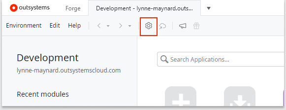
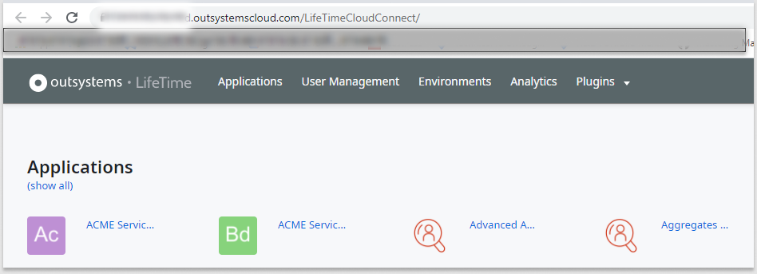

# OutSystems overview

OutSystems allows you to develop, manage, and administer your applications across platforms and throughout the application lifecycle. This article provides an overview of the OutSystems environment and its consoles. 

The following graphic shows a sample setup. On the right, you see a typical configuration with three environments, Development, Quality, and Production. On the left, you see one environment, which could be a Development or Quality envionvionment, in more detail. 

In an OutSystems Cloud environment, Service Studio resides on a developer's local Windows or Mac system. Integration Studio also resides on a local system, but it's supported on Windows only at this time. The Platform Server, Service Center, and LifeTime reside in the OutSystems Cloud.  

## Consoles

* **Service Studio:** The visual development tool where you create, change, and deploy your applications. You install Service Studio on your local Windows or Mac system. See [Service Studio overview](service-studio.md) for more information.

    

* **Integration Studio:** The development tool where you can create connectors to integrate OutSystems applications with other enterprise systems. You install this tool on a developer's local system. Integration Studio is only supported on Windows at this time. See [Getting Started](intro.md) for more information.

* **Service Center:** The administration console that allows you to access and manage all settings in your OutSystems environment. It allows you to manage application versioning, runtime auditing, logging, and monitoring. Service Center resides in the OutSystems Cloud.

    After you install Service Studio, click the gear icon or go to **Environment** > **Environment Management** to access Service Center. The Service Center URL has the format: https://*environment-name*.outsystemscloud.com/ServiceCenter.
 
  

* **LifeTime:** The centralized console for managing the infrastructure, environments, applications, IT users, and security. LifeTime resides in the OutSystems Cloud.

    After you install Service Studio, click the gear icon to go to Service Center. In **Service Center**, in the upper right corner, click **Manage all environments in LifeTime** to access LifeTime.

    

## Platform Server
The Platform Server takes care of the steps to generate, build, package and deploy your applications. In an OutSystems Cloud environment, the Platform Server resides in the OutSystems Cloud, so you don't need to install or manage it.

## Typical environments

A typical OutSystems setup includes the following environments:

* **Development Environment**: Where you develop and test your applications.

* **Quality Environment**: Where testers and business users experiment with applications to perform quality assurance. This environment usually has few scalability and redundancy requirements.

* **Production Environment**: Application version that end users interact with. Access to this environment is usually restricted to the operations team.

## More information

See [Getting Started](intro.md) to start building apps with OutSystems.
