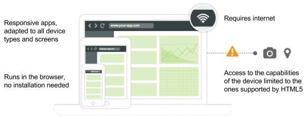
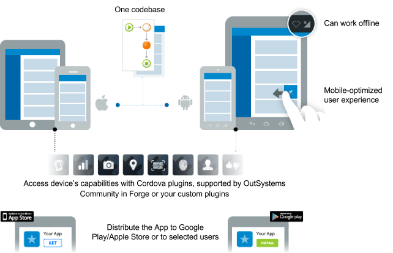
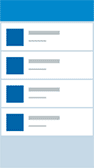

# Choose the Right App for Your Project

When creating a new app in OutSystems and according to your project's requirements, you need to select the type of application you want to develop. For each development scenario, different tools and features are available.

## What is a Reactive Web App?

Check our blog post <a href="https://www.outsystems.com/forums/discussion/52761/reactive-web-the-next-generation-of-web-apps/">The Next Generation of Web Apps</a> to read more about Reactive Web Apps!

In OutSystems, a Reactive Web App is an application with a responsive interface that runs in the browser, displaying a user experience adapted to all kinds of devices and screen sizes. It is developed using the OutSystems visual language. You can interact with the device's features and capabilities by extending the application code using HTML5 and JavaScript. You need only a browser to run it. This type of app is mostly used for displaying a high volume of data, like dashboards and tables, and it's crucial when targeting web desktops and responsive apps.

Reactive Web App is based on new Reactive Modules that helps unify development experience. Use Reactive Web App to develop with a single language, and to create and promote components that work across apps.

This means that with a Reactive Web App application:

* You have one development paradigm for web and mobile.
* You can build apps using the client-side runtime and create responsive UX.
* Your apps run on a modern stack.

If you haven't developed OutSystems apps that focus on the client-side development paradigm, you can check the explanation about [Screen and Block lifecycle Events](<../develop/logic/screen-block-lifecycle-events.md>) and these notes about [best practices](<https://success.outsystems.com/Documentation/Best_Practices/OutSystems_Mobile_Best_Practices>).

## What is a Mobile App?

In OutSystems, a Mobile App is a native app shell, developed using Apache Cordova, that wraps a web app developed using the OutSystems visual language. The app has user experience that is mobile-optimized and can access the device's capabilities and features using plugins. It can work offline and have data-caching features thanks to access to the device's local storage. The developed code is cross-platform, this means that you only have to develop one project and the application works on all the supported mobile platforms (iOS and Android). You can generate application packages and distribute them in the stores or you can distribute them to a set of users.

## Comparison Between Reactive Web App and Mobile App  

<table border="1" cellpadding="1" cellspacing="1" markdown="1" class="mt-responsive-table" style="border:none;">
<thead>
<tr>
<th class="mt-bgcolor-ffffff" scope="col" style="border-bottom:1px solid #E7ECED;text-align:center;vertical-align:middle;">

<strong>Reactive Web</strong>

</th>
<th class="mt-bgcolor-ffffff" scope="col" style="border-bottom:1px solid #E7ECED;text-align:center;vertical-align:middle;"><strong>vs</strong></th>
<th class="mt-bgcolor-ffffff" scope="col" style="border-bottom:1px solid #E7ECED;text-align:center;">

<strong>Mobile</strong>

</th>
</tr>
</thead>
<tbody>
<tr>
<td class="mt-bgcolor-ffffff" data-th="Web" style="border:none;border-bottom:1px solid #E7ECED;text-align:center;">

 

One codebase for all devices and screen sizes.

 

</td>
<td class="mt-bgcolor-ffffff" data-th="vs" style="border:none;border-bottom:1px solid #E7ECED;text-align:center;vertical-align:middle;"><strong>Code Reusability</strong></td>
<td class="mt-bgcolor-ffffff" data-th="Mobile" style="border:none;border-bottom:1px solid #E7ECED;text-align:center;">

 

One codebase for all supported mobile platforms.

 

</td>
</tr>
<tr>
<td data-th="Web" style="border:none;border-bottom:1px solid #E7ECED;background:#fff;text-align:center;">

 

A browser. 
No installation is needed.

 

</td>
<td data-th="vs" style="border:none;border-bottom:1px solid #E7ECED;background:#fff;text-align:center;vertical-align:middle;"><strong>Runs in</strong></td>
<td data-th="Mobile" style="border:none;border-bottom:1px solid #E7ECED;background:#fff;text-align:center;">

 

Mobile devices. Needs to be installed and is not supported in the browser.

 

</td>
</tr>
<tr>
<td class="mt-bgcolor-ffffff" data-th="Web" style="border:none;border-bottom:1px solid #E7ECED;text-align:center;">

 

Responsive layout for all screen sizes and types.

 

</td>
<td class="mt-bgcolor-ffffff" data-th="vs" style="border:none;border-bottom:1px solid #E7ECED;text-align:center;vertical-align:middle;"><strong>User Experience</strong></td>
<td class="mt-bgcolor-ffffff" data-th="Mobile" style="border:none;border-bottom:1px solid #E7ECED;text-align:center;">

 

Dedicated mobile UI patterns and experiences, such as animations and screen transitions.

 

</td>
</tr>
<tr>
<td data-th="Web" style="border:none;border-bottom:1px solid #E7ECED;background:#fff;text-align:center;">

 

Performance optimized for the client side. App logic can run on the device and the data exchange with the server is reduced.

 

</td>
<td data-th="vs" style="border:none;border-bottom:1px solid #E7ECED;background:#fff;text-align:center;vertical-align:middle;"><strong>Performance</strong></td>
<td data-th="Mobile" style="border:none;border-bottom:1px solid #E7ECED;background:#fff;text-align:center;">

 

Performance optimized for the client side. App logic can run on the device and the data exchange with the server is reduced.

 

</td>
</tr>
<tr>
<td data-th="Web" style="border:none;border-bottom:1px solid #E7ECED;background:#fff;text-align:center;">

 

HTML5 supported device capabilities.

 

</td>
<td data-th="vs" style="border:none;border-bottom:1px solid #E7ECED;background:#fff;text-align:center;vertical-align:middle;">

<strong>Access to Device Capabilities</strong>

</td>
<td data-th="Mobile" style="border:none;border-bottom:1px solid #E7ECED;background:#fff;text-align:center;">

 

Access to full range of device capabilities (using Cordova plugins).

 

</td>
</tr>
<tr>
<td data-th="Web" style="border:none;border-bottom:1px solid #E7ECED;background:#fff;text-align:center;">

 

No offline capabilities*

 

</td>
<td data-th="vs" style="border:none;border-bottom:1px solid #E7ECED;background:#fff;text-align:center;vertical-align:middle;"><strong>Offline capabilities</strong></td>
<td data-th="Mobile" style="border:none;border-bottom:1px solid #E7ECED;background:#fff;text-align:center;">

 

Using local storage for storing offline data. Client logic running on the device.

 

</td>
</tr>
<tr>
<td data-th="Web" style="border:none;border-bottom:1px solid #E7ECED;background:#fff;text-align:center;">

 

Automatic update on browser page refresh.

 

</td>
<td data-th="vs" style="border:none;border-bottom:1px solid #E7ECED;background:#fff;text-align:center;vertical-align:middle;"><strong>Deployments/Updates</strong></td>
<td data-th="Mobile" style="border:none;border-bottom:1px solid #E7ECED;background:#fff;text-align:center;">

 

Most updates are made automatically on screen change. New installation required only when changing the native shell.

 

</td>
</tr>
<tr>
<td data-th="Web" style="border:none;background:#fff;text-align:center;">

 

Share the app’s link with users.

 

</td>
<td data-th="vs" style="border:none;background:#fff;text-align:center;vertical-align:middle;"><strong>Distribution</strong></td>
<td data-th="Mobile" style="border:none;background:#fff;text-align:center;">

 

In-House or via Mobile app stores.

 

</td>
</tr>
</tbody>
</table>

(*) Currently not available.

## What is Traditional Web?

Traditional Web is an earlier type of OutSystems app that is focused on the server-side development. You may know this app under names such as Top Menu or Lisbon.

## What is a Service?

As your application grows, you can use [Services](../develop/reuse-and-refactor/services.md) to abstract specific core concepts and expose functionality to other applications, following a service-oriented architecture.
