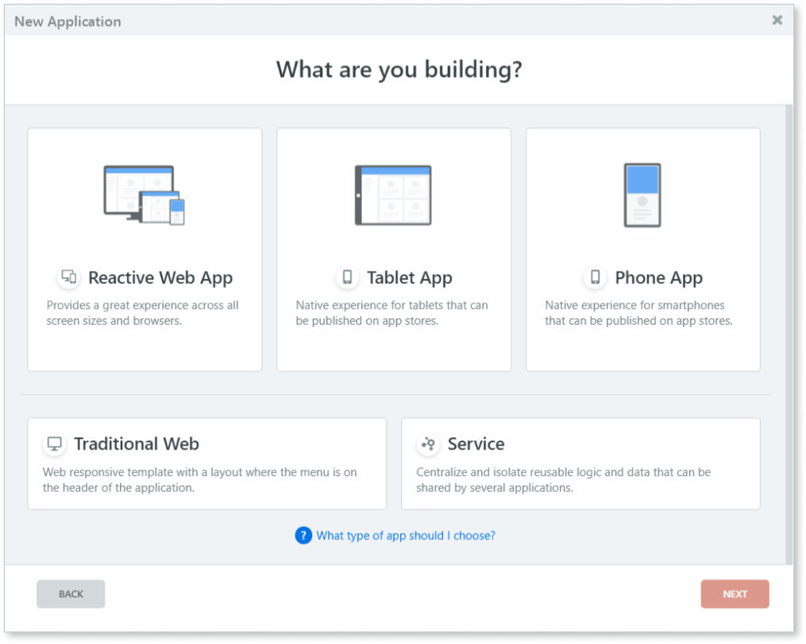
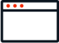

# Choose the right app for your project

You can create several types of apps in OutSystems. Here's an overview to help you choose a new app in the **New Application** window:

* To create an app that users run mostly in a desktop browser, select **Reactive Web App**.
* To create an app and submit it to the Apple App Store or Google Play, as a mobile app for users to download, select **Phone App** or **Tablet App**.
* To create a lightweight app and share it as a progressive web app (PWA) from your website and let users put the app icon on their mobile home screens, select **Phone App** or **Tablet App**.

## What's a Reactive Web App?

In OutSystems, a Reactive Web App is an app with a responsive interface that runs in the browser. The user experience is excellent across many types of devices and screen sizes. You develop with the OutSystems visual language and interact with the device hardware by extending the app logic with HTML5 and JavaScript.

Reactive Web App helps you unify development experience. Develop with a single language, and create and promote components that work across apps.

When you develop a Reactive Web App:

* You have one development paradigm for web and mobile.
* You can build apps using the client-side runtime and create responsive UX.
* Your apps run on a modern stack.

If you haven't developed OutSystems apps that focus on the client-side development paradigm, you can check the explanation about [Screen and Block lifecycle Events](<../develop/logic/screen-block-lifecycle-events.md>) and these notes about [best practices](<https://success.outsystems.com/Documentation/Best_Practices/OutSystems_Mobile_Best_Practices>).

Check the blog post <a href="https://www.outsystems.com/forums/discussion/52761/reactive-web-the-next-generation-of-web-apps/">The Next Generation of Web Apps</a> to read more about Reactive Web Apps.

## What's a Mobile App?

In OutSystems, a Mobile App is an app that compiles to a native mobile Android/iOS app. The app uses Apache Cordova and wraps a web app that you develop with the OutSystems visual language. The user experience focuses on mobile and the app logic can access the device hardware, such as sensors, by using plugins. The app works offline because it caches data in the local storage. You can develop for iOS and Android at the same time, as the underlying code is cross-platform. The default app templates of this type are **Phone App** and **Tablet App**.

There are two ways you can distribute a Mobile App, as:

* **Native app package**. A dedicated OutSystems cloud service generates native mobile builds for you, to distribute your app in the app stores or internally to a group of users.

* **Progressive web app (PWA)**. PWAs are lightweight apps that have a look and feel of native mobile apps. They're quick to distribute and install directly from your website, as they don't depend on the app stores.

## Comparison Between Reactive Web App and Mobile App

Here is a table with a comparison of features between Reactive Web App and Mobile App. In a default OutSystems installation, you can create a Reactive Web App by selecting **Reactive Web App** in the **New Application** window. For Mobile App choose **Phone App** or **Tablet App**.

|**Reactive Web App**   |vs|**Mobile App**  |
|:-:|:-:|:-:|
| Common logic for all devices and screen sizes.|**Code Reusability**| Common logic for all supported native mobile platforms, and supported browsers for PWAs.|
| A browser. No installation is needed.|**Runs in**| Native mobile apps run in Android and iOS devices. PWAs run in any device with a supported browser.|
| Responsive layout for all screen sizes and types.|**User Experience**| Dedicated mobile UI patterns and experiences.|
| Performance designed for the client side, with smart mechanisms to optimize the data transfer.|**Performance**| Performance designed for the client side, with smart mechanisms to optimize the data transfer.|
| HTML5 supported device capabilities.|**Access to device hardware**| Native mobile apps access a range of device capabilities through Cordova plugins. PWAs use dedicated plugins, which by design can access only hardware that the browser running the PWA is allowed to access.|
| No offline capabilities.*|**Offline capabilities**| For storing offline data, native mobile apps use local storage and PWAs use browser storage.|
| Updates are automatic when users refresh the browser page.|**Deployment and updates**| Native mobile apps can update automatically, and users need to install a new version only when you change the native shell. PWAs update automatically when the app detects a new version.|
| Share the app link with users.|**Distribution**|  You can distribute native mobile apps in-house or through the app stores. Users can run a PWA directly from your website, and add the app icon to the device home screen.|

(*) Currently not available.

## What's a Traditional Web App?

Traditional Web App is an earlier type of OutSystems app with a focus on server-side development. You may know this app as app templates **Top Menu** or **Lisbon**.

## What's a Service?

As your app grows, you can use [Services](../develop/reuse-and-refactor/services.md) to abstract specific core concepts and expose functionality to other applications, following a service-oriented architecture.
