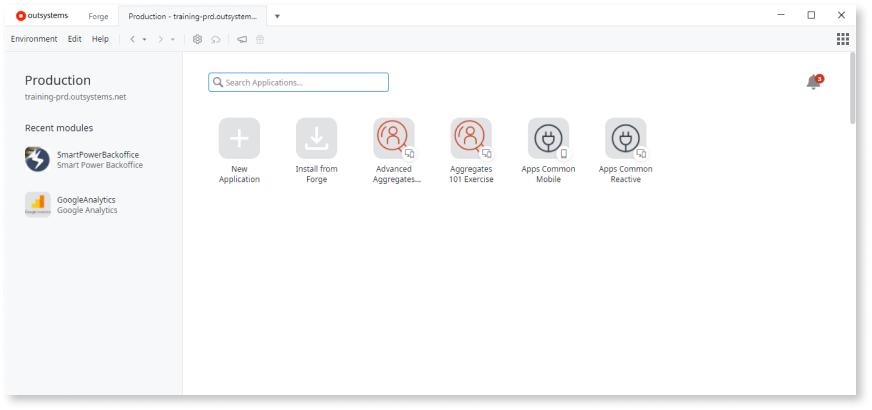

# Service Studio overview

Before you start using Service Studio, you need to have an OutSystems environment. See the available OutSystems Editions on the [Pricing and Editions](https://www.outsystems.com/pricing-and-editions/) document. 

Service Studio is the OutSystems low-code and visual development environment that allows you to:

* Create applications and Modules on the server
* Create the user interfaces for Traditional Web, Reactive Web, and Mobile Applications
* Define the data model
* Define business processes and timers (batch processes)
* Debug your apps

When you open Service Studio to start developing your app, you must connect to an OutSystems environment in the cloud or an on-premise server in your data center. You need to add the server address, your username, and your password.

After you successfully connect, you see the list of applications that are on the server. In the Environment tab where you can:

* Create a new application.
* Install applications and components from the [OutSystems Forge](https://www.outsystems.com/forge/).
* View and access your existing applications.
* Install applications or components from the OutSystems Forge.

You can use the Search box in the Environment tab to find your application and modules, and also, to perform a search in the OutSystems Community. The Search box is available also on other screens, and the search scope depends on the currently opened screen.

Once you create a new application or access an existing one, you navigate to the app detail screen:

In the app detail screen you have the following areas:

## App details

Edit button
:   Click to edit the name, description, icon, and bootstrap color of your application.

Delete button
:   Click to delete the app from your environment.

Download button
:   Click to download your app as an OutSystems Application Pack `.oap` file)

Test In Browser button
:   Click to open your application quickly in a browser for testing.

## App tabs

Develop tab
:   This is where you manage the modules of your application. You can also view the application's dependencies - other applications or components used by your application.

Distribute tab
:   In this area, you can generate your mobile app for iOS or Android. This is also where you turn on the PWA distribution of your app.

## The workspace

The workspace of Service Studio is where you design, deploy, and debug the modules of your applications.

The following areas organize the workspace:

### Main editor

Here is where you design the interface and logic of your application.

### Toolbar

Contains shortcuts to the most common operations.

### Toolbox

Contains the tools and widgets to develop the screens and logic of your application.

### Development tabs

This area displays the following tabs:
    
* TrueChange tab: displays the existing errors and warnings of your module. Double-clicking a specific error or warning takes you directly to that occurrence.

* Debugger tab: use this tab to debug your application. Here you can start the debugger and see the content of your variables step by step.

* 1-Click Publish tab: when you deploy your module, this area shows the progress and result of the deployment process.

* Search Results tab: lists the results of a search performed in the module. Double-clicking a specific result takes you directly to that occurrence.

### Status bar

Displays information about the user and the current environment, and when the application was last published.

### Application layer tabs

Each tab contains the elements of a specific application layer - processes, user interface, logic, and data model.

### Properties editor

Here you can view and set the properties of the selected element.

### 1-Click Publish button

Starts the deployment of your application module to the current environment. If your module has errors, this operation isn't available.

## Related information

Enroll in the [Service Studio Overview](https://www.outsystems.com/learn/courses/174/service-studio-overview/) course to learn more about developing OutSystems applications in Service Studio.
