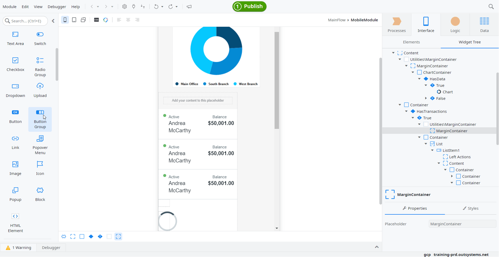
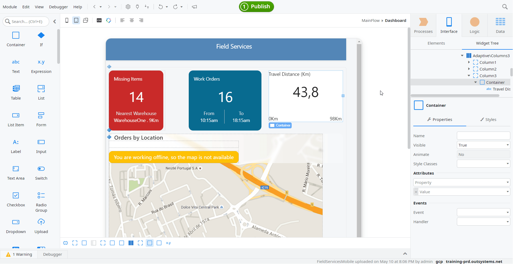
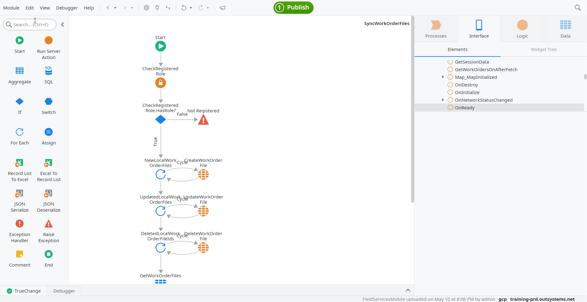
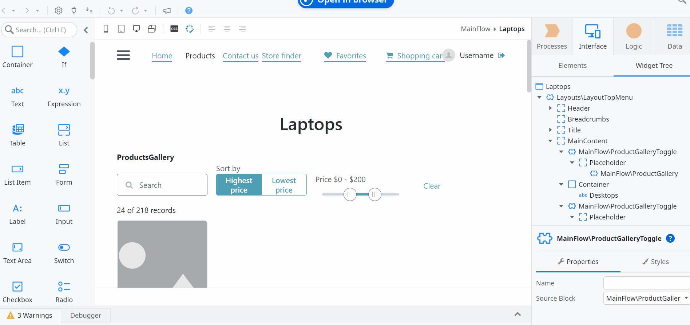
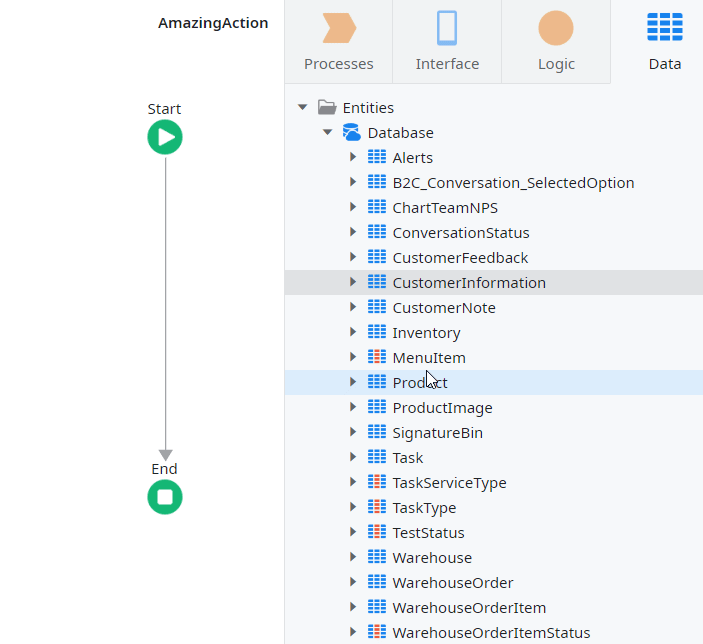
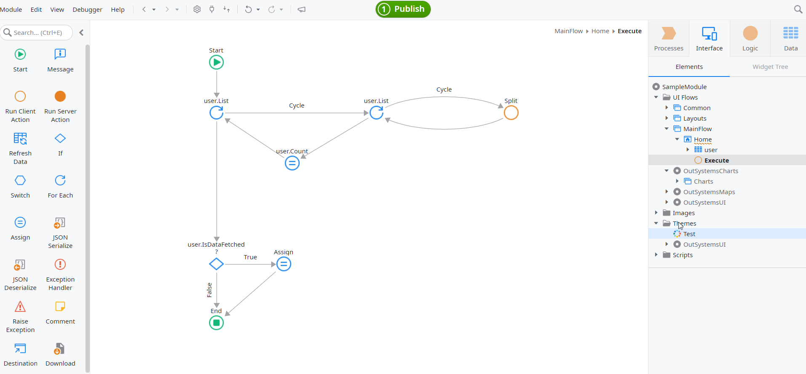

# Service Studio Tips and Tricks

## Basics

### Dark theme

Only applies to cross-platform Service Studio.

You can switch Service Studio to the dark theme (or dark mode). On the **Edit** menu, chose **Preferences...** then, under **Theme** switch on **Dark theme**.

### Would you like to know more? Hit F1

You can always access relevant documentation and find more about any element/flow/tab by selecting it and pressing  F1  from within Service Studio.

### Keyboard shortcuts

You can consult the list of keyboard shortcuts in two ways:

* Use a shortcut for shortcuts:
    * In Windows use  Ctrl + Shift + K 
    * In macOS use  Cmd + Shift + K 

* Check [the shortcuts list](../../ref/lang/auto/shortcutkeys.md) in the documentation

### Open multiple files simultaneously

Whether you are opening files from your Environment or from a local source, you can always do it faster by selecting and opening them all at once in one of three different ways:

* In Windows:
    * Use  Ctrl +Left-Click to add the clicked file to your selection
    * Use  Shift +Left-Click to select all files between the last file you previously selected and the clicked file
    * Use  Ctrl + Shift +Left-Click to add to your previous selection all files from the last file you previously selected to the clicked file

* In macOS:
    * Use  Cmd +Left-Click to add the clicked file to your selection
    * Use  Shift +Left-Click to select all files between the last file you previously selected and the clicked file
    * Use  Cmd + Shift +Left-Click to add to your previous selection all files from the last file you previously selected to the clicked file

### Edit the Properties of several elements in one go

Do you want to make every Screen of a Module accessible to anonymous users? Or maybe it's changing the Data Type of several Variables that you need? You'll be happy to know that you won't have to go through them one by one!

Start by selecting the elements for which you want to change the Properties and see where they share common values.

Then, you'll be able to see where their Properties differ and where they share common values. All you have to do now is adjust them according to your needs. Any change made within your current selection will be applied to all selected elements.

### Closing and moving Modules

Do you have way too many Modules open? Quickly close any number of them by right-clicking a Module tab and selecting **Close**, **Close other modules**, **Close modules to the right**, or **Close all modules**.

If closing modules is not an option, you can rearrange them by clicking and dragging the module left or right in your list of open modules. Additionally, you can drag a module off the current Service Studio window which opens a new Service Studio window.

### Open a Screen in browser

To open a Screen in a browser open the **Interface** tab, right-click that Screen and choose **Open in Browser**. There is no need to create additional Entry Points.

### Expanding and collapsing trees

With just a few clicks, you can keep your development environment neat and tidy at all times.
In any tree, collapse or expand all items and subitems:

* In Windows, click  Ctrl +Left-Click in the arrow next to the item you want to expand or collapse.
* In macOS, click  Cmd +Left-Click in the arrow next to the item you want to expand or collapse.

### Use the Widget Tree when designing UI

Are you having trouble placing a Widget exactly where you want it? Make your life easier by using the Widget Tree!

With it you can confidently place or move widgets around through a hierarchical view of every widget present in a Screen or Block.
 

The Widget Tree automatically appears whenever you drag a Widget to a Screen or Block, but you can also access it by clicking the **Widget Tree** button.

### Edit basic CSS properties with Styles Editor

No more CSS stress! Use **Styles Editor** to edit basic visual properties of widgets with the aid of a visual interface. Leave all complexity behind and use it in one of two ways:

* Select a widget and click the **Styles Editor** toggle button in the **Properties Pane**

    

* Use it directly in the **Style Sheet Editor**

    

## Boost Performance

### Easily create Entity Diagrams

Select the target Entities and then either drag them to an open Entity Diagram canvas or right-click and select **Add to New Entity Diagram**.

When added, the **Entity Diagram** is automatically arranged. However, if an Entity is already present in the target diagram, it will not be added again.

### Guess my Attribute/Variable Data Type

Speed up your Entity/Structure creation by helping Service Studio automatically choose the correct Data Type of each Attribute or Variable.

Name your Attribute/Variable according to the following rules and Service Studio will set the Data Type for you.

Attribute/Variable Data Type | Attribute/Variable Name | Example
---|---|---
Integer|`x`, `y`, `z`, `*Count`, `*Number`| `HeadCount`, `Number`
Date|`*Date`|`BirthDate`
DateTime|`*DateTime`, `*On`, `*Instant`|`ExitDateTime`, `CreatedOn`, `LogInstant`
Time|`*Time`|`ExitTime`
Boolean|`Is*`, `Has*`| `IsCompleted`, `HasDocument`
Email|`*Email`|`UserEmail`
PhoneNumber|`*Phone`, `*Mobile`|`HomePhone`, `WorkMobile`
Currency|`*Price`, `*Amount`|`Price`, `DollarAmount`
User Identifier|`*By`|`CreatedBy`
Entity Identifier|`<Entity>Id`|`CustomerId`
Entity Record|`<Entity>`|`Customer`
Entity Record List|`<Entity>s`,`<Entity>es`,`<Entity>ies`|`Customers`

### Quickly add a dependency in any module

Cut the search time to a minimum and quickly add dependencies by searching across all modules with no need to go through **Manage Dependencies** to check one by one.

* In Windows, use  Ctrl + F  to search for the desired element in the **Search** bar.
* In macOS, use  Cmd + F  to search for the desired element in the **Search** bar.

Click **Search in other Modules** in the dropdown menu to open a window that'll list all elements that match your search query across every module of the environment.

Just select the element you're looking for and click **Add Dependency**.

### Make sure you Remove Unused Dependencies

Having more dependencies increases the size of your Module and increases the duration of 1-Click Publish.

Through the **Remove Unused Dependencies**, Service Studio will automatically remove from a Module all unnecessary dependencies.

### Work on complex screens with less effort

Complex screens present lots of information at design time. Many times, blocks are used to build such screens in a modular way.

Did you know that it’s possible to show or hide all the block’s content with a single toggle? You can use a visibility toggle for blocks that have a placeholder inside a False branch of an If widget.

Follow these steps:

1. At the root of the **Block**, add an **If** with a False condition.

1. In the **False** branch, add a **Placeholder**.

1. Put the **Block** inside a **Screen** (Service Studio automatically presents a visibility toggle).

1. Add content to the **Placeholder**.

1. To hide the content in the **Placeholder**, select **Show visible placeholders**.

    

## Create new elements

### Create an Aggregate from an Entity

Drag an Entity to an Action Flow to create an aggregate.

If you set the `Is Active Attribute` of the Entity - choose **More...** in the Entity properties, then expand **More options** - the new Aggregate is created with the filter `<Entity>.<Is Active Attribute> = True`. Otherwise, the new aggregate is created without filters.

### Create a Button from an Action

Drag an Action and drop it to the Screen. This creates a Button and a binding to the Action.

### Create a filtered Aggregate from an Identifier

Drag a Variable of the Identifier data type to an Action Flow to create an Aggregate filtered by that variable.

### Create an If from a Boolean

Drag a Boolean Variable to a Flow to create an If condition.

### Create an Assignment from a Variable

In a Flow, drag a Variable to an Assign element to create an `Assignment` for that Variable.
 

## Reuse elements

### Reuse logic with Extract to Action 

When you want to Extract the logic inside an Action to a different one, you can select the target flow elements, right-click and choose **Extract to Action** to create a new Action with that logic.

A new action will be created with the selected logic and with all the necessary Input and Output Parameters.

## Convert Elements

### Convert Variables

You can easily change the type of a Variable. Right-click the target Variable and select **Convert to Local Variable/Input Parameter/Output Parameter**.

Keep in mind that not all Actions may use Output Parameters.

### Convert a Text Widget to an Expression Widget

Right-click the target Text Widget and select **Convert to Expression**.

The original text from the Text widget will be automatically included as the example of the new Expression widget.

### Convert Entities/Static Entities

Just right-click the target Entity/Static Entity and under **Advanced** select **Convert to Static Entity/Entity**.

### Convert an Entity to a Structure

Converting an Entity to a Structure is as easy as opening  the Data tab and dragging the target Entity to the Structure Folder.

### Swap If Connectors

When you need to change a True branch to a False branch or a False branch to a True branch, right-click the target If and select **Swap Connectors** to swap the True/False condition branches.

