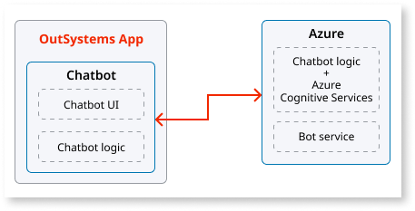
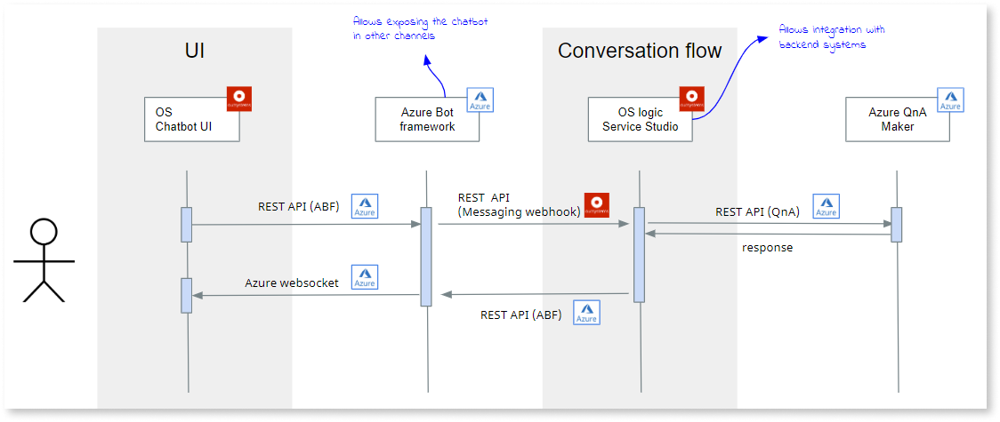

# The chatbot architecture

A chatbot is a feature that you add to an existing app. The architecture of a chatbot depends on the functionalities you implement. You need Azure Bot Service for a chatbot to work. For advanced use cases you also need to add the OutSystems webhook chat module to your app and implement logic for your use cases. 

## Bot service

Just like any other bot, a chatbot needs a service that monitors for user interaction. OutSystems uses Azure [**Bot Service**](https://azure.microsoft.com/en-us/services/bot-services/) and [**Bot Framework**](https://docs.microsoft.com/en-us/azure/bot-service/index-bf-sdk?view=azure-bot-service-4.0) to provide the bot service.

## Chatbot logic

A chatbot, as a feature you add to your app, consists of the user interface and the logic. For a chatbot with basic functionality, such as responding to predefined questions or sending files, you can use OutSystems to build logic.

For more sophisticated functions of a chatbot, for example, ability to understand natural language, awareness of spelling errors, or recognizing speech and intent of a user message, you should focus on using Azure Bot Framework.

## The OutSystems.AI Chatbot component

The OutSystems.AI Chatbot component consists of the user interface Blocks, a webhook module, and sample logic. When you install the component, you can:

* Create a **user interface** for the chatbot with the Chatbot Block. This is a drag-and-drop solution that should fit most use cases.
* Create a module that handles the chatbot **response logic**. The module comes with Chatbot Webhook template app that's part of the OutSystems.AI Chatbot component. Use it to combine responses from Azure services and access your OutSystems resources. You need this module if you want to use UI elements like thumbnail cards or send file links.
* Create your user interface while using existing data structures and logic. This is useful when you want a full control over the user **interface design**.
* Access the **Chatbot Configurator** to edit Azure settings and add chatbots to your app.

The component is available as:

* [Chatbot component for Reactive Web App](https://www.outsystems.com/forge/component-overview/7315/outsystems-ai-chatbot-reactive). We recommend this version for all new and existing apps.
* [Chatbot component for Traditional Web App](https://www.outsystems.com/forge/component-overview/5886/).

## Communication sequence

This is an example of the communication flow between the OutSystems chatbot modules and the Azure services.

In a typical chatbot conversation there are:

* Question messages, the messages that the users write in the chatbot user interface.
* Answer messages, the replies from the chatbot app to the user.

Here is an overview of the communication flow:

This sequence shows an advanced chatbot logic, where OutSystems developers have a flexibility to decide how the app responds to the user messages. However, for a simple FAQ chatbot, you can use only the UI part of the chatbot component and let Azure services handle the knowledge base responses.

1. User writes a question in the chatbot.
2. The question message goes, via a REST API, to Azure Bot Framework.
3. From the Azure Bot Framework, the question message goes to OutSystems via the webhook REST API.
4. The OutSystems app receives the message and the message is then handled by the logic defined by the developers in Service Studio.

In this example, the developers use the Azure QnA Maker Service to get responses from the Azure knowledge base. This is also a REST API service. Synchronously, the Azure QnA Maker service replies back to OutSystems the answer message via the same REST API response.

Back in the OutSystems app, the answer message from the Azure service is processed and can be sent as a reply to the user. The answer message goes to Azure Bot Framework and from there it's sent back to the chatbot UI via the Azure Websocket service, a persistent, bidirectional channel between the client and the server.

## Azure resources

Here is the overview of Azure resources you may need to implement a chatbot. Depending on the features you include, you may add additional features for the resources.

* Bot Service + Web App
* QnA Maker Service
* QnA Maker knowledge base
