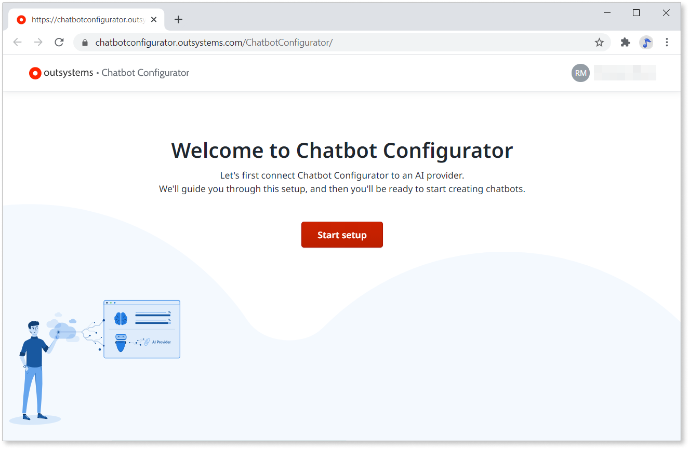

# Chatbot configuration wizard

Chatbot configuration wizard, or **Chatbot Configurator**, is available as a cloud service at [https://chatbotconfigurator.outsystems.com/ChatbotConfigurator/](https://chatbotconfigurator.outsystems.com/ChatbotConfigurator/). Use the wizard to:

* Set up and manage connection between the AI provider and OutSystems environment.
* Add QnA chatbots.

## Accessing the chatbot configuration wizard

There are two ways you can use **Chatbot Configurator**. You can:

* Add [the chatbot UI block](guide-outsystems-add-chatbot.md) first, publish the app, and then click the link in the chat preview to open the wizard.
  
    

* Go to the [Chatbot Configurator](https://chatbotconfigurator.outsystems.com/ChatbotConfigurator/), configure the chatbot, and then add the UI block.

Sign in to **Chatbot Configurator** with the OutSystems account credentials, the same you use for Community or Forge.

