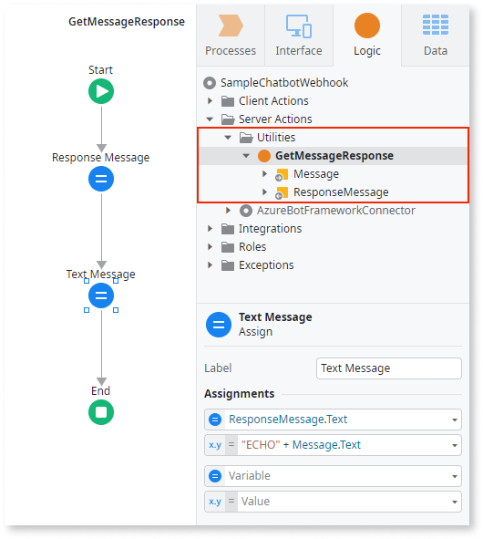

# Create advanced logic for more AI functionalities

Create advanced logic and combine the power of the Azure AI provider with your existing OutSystems app and services. This document shows examples of advanced logic where the chatbot logic doesn't communicate directly with the Azure back end. Instead, you use the chatbot webhook module to handle and modify responses from Azure before the reply message shows in the UI.

To add logic that interacts with both Azure Bot Service and OutSystems, you need to [add and configure the chatbot webhook module](guide-outsystems-webhook.md).

## Reply with an echo message

After you create a new webhook module, it contains a logic for an echo chatbot. The logic accepts the message from the chatbot, appends "ECHO:" to it, and then sends it back as a chat reply.

Open your webhook module and go to **Logic** > **Server Actions** > **Utilities** > **GetMessageResponse**. Examine the logic in this Server Action.

## Reply with an answer from a knowledge base

You can query the knowledge base in Azure directly from the webhook module. This is useful when you're building a more complex logic, and you want to combine several chatbot features. For example, you may send user questions to the knowledge base first, and if there is no valid answer, you can show static options. 

See [Use the Azure QnA Maker Connector in OutSystems apps](../qna-connector.md) for instructions on how to configure, reference, and use the connector.

Note that you don't need the QnA Maker connector for a chatbot that only works as an FAQ chatbot. This is because the chatbot UI block can communicate directly with the Azure chatbot service.

## Detect what users want to do

The chatbot webhook module is also a place where you can detect what users want to do, and then act upon that. You first detect the intents and entities with Azure services, and then call your corresponding OutSystems logic. For example, in a sentence "Send me the report at 9 AM.", the intent is `SendReport` and entities `Recipient = CurrentUser` and `Time = 9AM`.

You can detect intents with the LUIS service. For more information check [Use the Azure LUIS Connector in OutSystems apps](../luis-connector.md).

## Analyze and process user input

A handy feature of [AI Language Analysis](../text-analysis.md) is detecting the sentiment in user messages, registering the tone of the message to tell if a user is happy, neutral, or not so happy. AI Language Analysis can also translate, detect language, and spellcheck, amongst other things.
