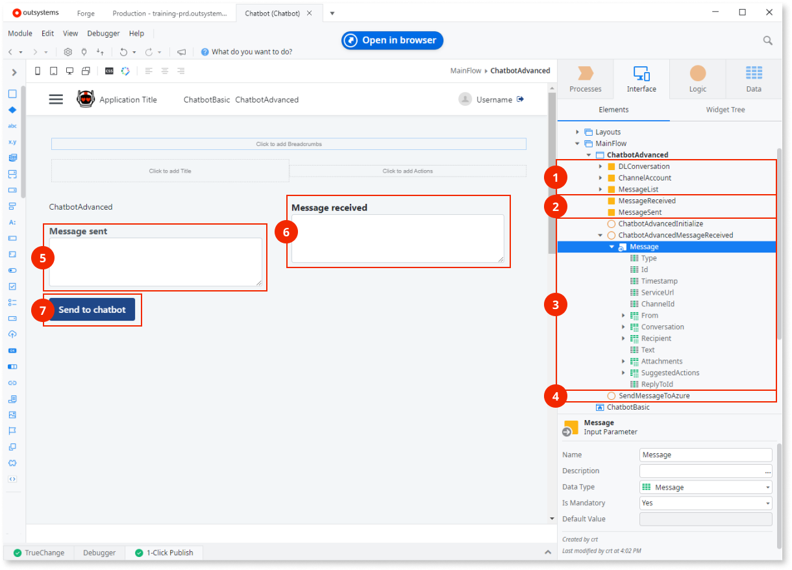
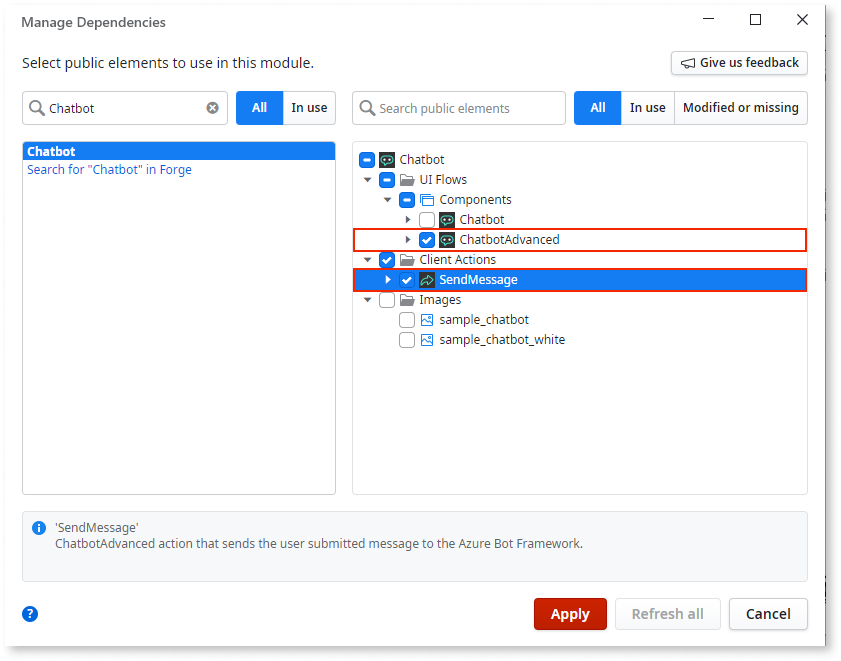
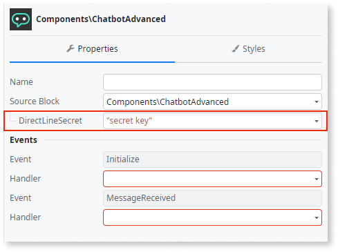
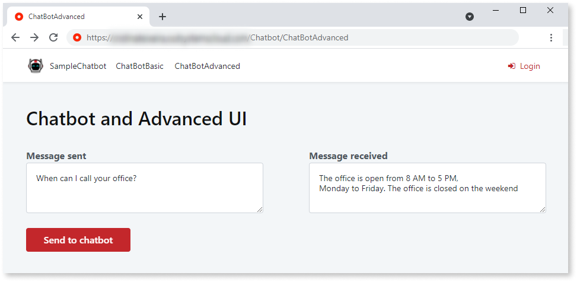

# Create custom chatbot UI

The OutSystems.AI Chatbot component comes with ChatbotAdvanced block that lets you create a custom user interface, if the pre-built UI in Chatbot Block and cards don't fit your use case. 

The ChatbotAdvanced integrates data structures and actions from the OutSystems.AI Chatbot component, but you need to create local variables, actions, and logic to handle the UI interactions and requests to Azure. Here is an example:

The data structures of the variables **DLConversation**, **ChannelAccount**, and **MessageList** (1), with the data types names the same, come from the component. You need the variables (1) to configure the communication with Azure and keep track of the conversation. The **MessageReceived** and **MessageSent** local variables (2) are the textual variables bound to the user interface (5, 6), and when they update, the interface updates as well. **ChatbotAdvancedInitialize** and **ChatbotAdvancedMessageReceived** (3) are actions that handle the configuration of the Azure connection and the replies from the Azure Bot Service. The **ChatbotAdvancedMessageReceived** action has the **Message** input parameter. When the Azure bot service replies with a message, you can show the message or store it in **MessageList**. Finally, you need an action to send the message to Azure bot service. In this example, the **SendMessageToAzure** action (4) sends the value of **MessageSent** to the Azure bot service by using **SendMessage** action from the component. You trigger the **SendMessageToAzure** action when you click the button (7) in the user interface.

Here is a step-by-step example guide to create a custom user interface for a chatbot.

1. In Service Studio, open the manage dependencies window (**Ctrl+Q**), search for Chatbot, and add the **ChatbotAdvanced** Block and **SendMessage** Action as dependencies.

    

2. Go to **Interface** > **UI Flows** > **Chatbot** > **Components** and drag the **ChatbotAdvanced** Block to the Screen. Then, go to the Block properties and enter your secret key in the **DirectLineSecret**. If you're having difficulties locating the bloc, use the widget three to navigate to **Components\ChatbotAdvanced**.

    

    

    Direct line secret is a value from the Azure bot service. Check [how to get a direct line secret from Azure](guide-azure-services.md#get-direct-line-key).

    

4. Create two new Screen Actions, one to handle the **Initialize** event and another to handle the **MessageReceive** event. Do this by going to the ChatBotAdvanced Block properties, and selecting **Events** > **Handler** > **New Client Action** for both **Initialize** and **MessageReceived**. You now have actions **ChatbotAdvancedInitialize** and **ChatbotAdvancedMessageReceived**.

5. Add the following local variables to the Screen:

    * **DLConversation** of the DLConversation data type.
    * **ChannelAccount** of the ChannelAccount data type.
    * **MessageList** of the Message List data type.
    * **MessageSent** of the text data type.
    * **MessageReceived** of the text data type.

5. In the Screen Action handling Initialize, add an **Assign** tool. Assign **DLConversation = Conversation** and **ChannelAccount = User**. 

    

6. In the **ChatbotAdvancedMessageReceived** action, use a **ListAppend** to append the received message (the input parameter **Message**) to the list of messages. Also, add an Assign tool to the flow and assign **MessageReceived = Message.Text**, as **Message.Text** is the latest reply from the chatbot you want to show in the user interface.

7. Create logic to send the message to the Azure bot service. Start by adding a new Client Action to the Screen. In the example this Client Action is **SendMessageToAzure**. Then, navigate to **Logic** > **Client Actions** > **Chatbot** and drag the **SendMessage** Client Action to the flow. In the properties of the **SendMessage** action, set the values for:

    * **ConversationId**. Use the **ConversationId** from previously created local variable **DLConversation** and assign **ConversationId = DLConversation.ConversationId**.
    * **DirectLineSecret**. Use the same value as for the **DirectLineSecret** in **ChatbotAdvanced** Block properties.
    * **From**. Use previously created local variable **ChannelAccount**.
    * **TextMessage**. Use previously created local variable **MessageSent**.

    

8. Add the user interface. In the example there are the following elements:
    
    * A text area field to enter a message that you send to the bot service, with the variable set to **MessageSent**.
    * A text area field to show the reply, with the variable set to **MessageReceived**.
    * A button to send the message to the bot service by triggering the **SendMessageToAzure** action.

    When you run the app with the chatbot logic from this guide, you get:

    
