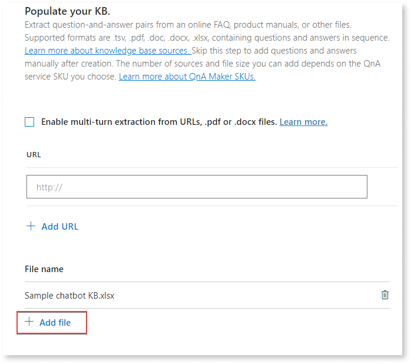
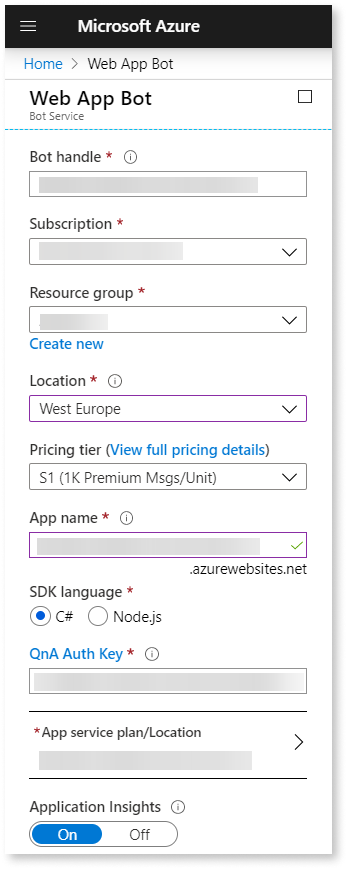

# Create and deploy a knowledge base in Azure

This is a step by step guide to create and deploy a QnA Maker knowledge base in Azure. QnA Maker knowledge base is part of the FAQ chatbot in OutSystems. To create a QnA knowledge base in Azure, you need Microsoft Azure account and permissions.

## Prepare data for knowledge base { #prepare-data-kb }

This section explains the format of data for Azure QnA Maker service.

1. Open your spreadsheet software and create two columns with the following headings:

    * **Question**
    * **Answer**
  
1. Fill in the questions and answers. Use full sentences.
1. Export your spreadsheet in Excel XLSX format.

### Sample questions and answers

Here is a table with sample questions and answers.

|1|Question|Answer|
|---|---|---|
|**2**|What are your opening and closing times?|The office is open from 8 AM to 5 PM, Monday to Friday. The office is closed on the weekend.|
|**3**|Do you work during the weekend?|Our office does not work during the weekend.|
|**4**|Where can I send my request?|Our Procurement accepts all your requests 24h a day, at <orders@example.com>.|
|**5**|What is your phone number?|Our phone is 111-222-333.|
|**6**|What is your email?|Our email is <office@example.com>|
|**7**|What's the minimum order?|The minimum order quantity (MOQ) is 1000 pieces.|
|**8**|How do I file a complaint?|We're sorry to hear there might be issues with your order. Please contact us at <support@example.com> or call 111-222-333.|
|**9**|Can I cancel my order?|You can cancel our order within 30 days.|
|**10**|How do I contact you?|For general questions send us an email at <office@example.com>. For support send an email to <support@example.com>|
|**11**|I have a faulty product.|If you have issues with the order you received, contact us at <support@example.com>.|
|**12**|I want to return a product.|You can return the product within 90 days from the date of purchase. Contact us at <returns@example.com>.|
|**13**|I have a discount code.|You can enter your discount code during the order checkout.|

## Create a knowledge base { #create-kb }

Follow these steps to create a knowledge base in Azure QnA Maker.

You can also use the [chatbot configuration wizard](configuration-wizard.md) to set up this part of chatbot.

1. Go to the [QnA Maker portal](https://www.qnamaker.ai/) and log in with your Azure credentials.
1. Click **Create a knowledge base** in the top menu.

    

1. You can skip **STEP 1: Create a QnA service in Microsoft Azure** if you already have a QnA service in Azure. If you don't have a QnA service in Azure check [Create QnA Maker for instructions](guide-azure-services.md#create-qna-service).

    

    The availability of the settings in Azure depends on your Azure account permissions. You may have to ask your administrators to create resources if your account doesn't have permissions to create them.

    

1. In **STEP 2: Connect your QnA service to your KB** click **Refresh** and select the values for each of the settings. If you have an existing QnA service these options should be already set for you.
1. In **STEP 3: Name your KB** enter the knowledge base name in the field.
1. In **STEP 4: Populate your KB** use the following options:

    * **File name**. Click **Add file** and select the XLSX file with your [sample questions and answers](#sample-questions-and-answers).
    * **Chit-chat**. The chit-chat knowledge base contains light social conversation. Select a knowledge base that's appropriate for your brand voice. Skip this option if you want to add the chit-chat later.

    

1. In **STEP 5: Create your KB** click **Create your KB**. After a few moments, your knowledge base opens.

## Test your knowledge base { #test-kb }

Follow these steps to test your knowledge base.

1. Go to the [QnA Maker portal](https://www.qnamaker.ai/) and sign in.
1. Click **My knowledge bases** in the top menu and then select your knowledge base.
1. The knowledge base editor opens. Click **TEST** to open a chat interface and start entering some questions.

If you're not happy with how your knowledge base performs, you can edit it. Click **EDIT** to add, edit or remove the question-answer pairs. Make sure you click **Save and train** after you edit your knowledge base.  

## Publish your knowledge base and create a chatbot service { #publish-kb }

Once you're satisfied with how the knowledge base performs, publish it to make it available for the chatbot. The publishing is the step that pushes the knowledge base to production.

You can also use the [chatbot configuration wizard](configuration-wizard.md) to set up this part of chatbot.

1. Go to the [QnA Maker portal](https://www.qnamaker.ai/) and sign in.
1. Click **My knowledge bases** in the top menu. Then, select your knowledge base.
1. Once the knowledge base opens, click **PUBLISH**.
1. Note the name of the QnA Maker service in "This knowledge base will be published to the **qna-service-name** QnA Maker service." Click **PUBLISH** and wait until you see the confirmation screen.
1. In the conformation screen click **Create bot**. A new Web App Bot screen opens.

    

1. In the new Web App Bot, most of the field values are already populated with the settings from the QnA Maker service. Pay attention, however, to the following:

    * **Location**. The location of the datacenter from which the bot service runs.
    * **App service plan / location**. Click to open and select your QnA Maker service. This is a set of the compute resources which the bot uses.
    * **Application Insights**. Optional. If you want to track your app performance and collect telemetry information, activate this option.

    

    

    The availability of the settings in Azure depends on your Azure account permissions. You may have to ask your administrators to create resources if your account doesn't have permissions to create them.

    

1. Click **Create**.
