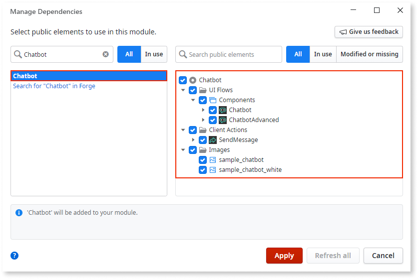
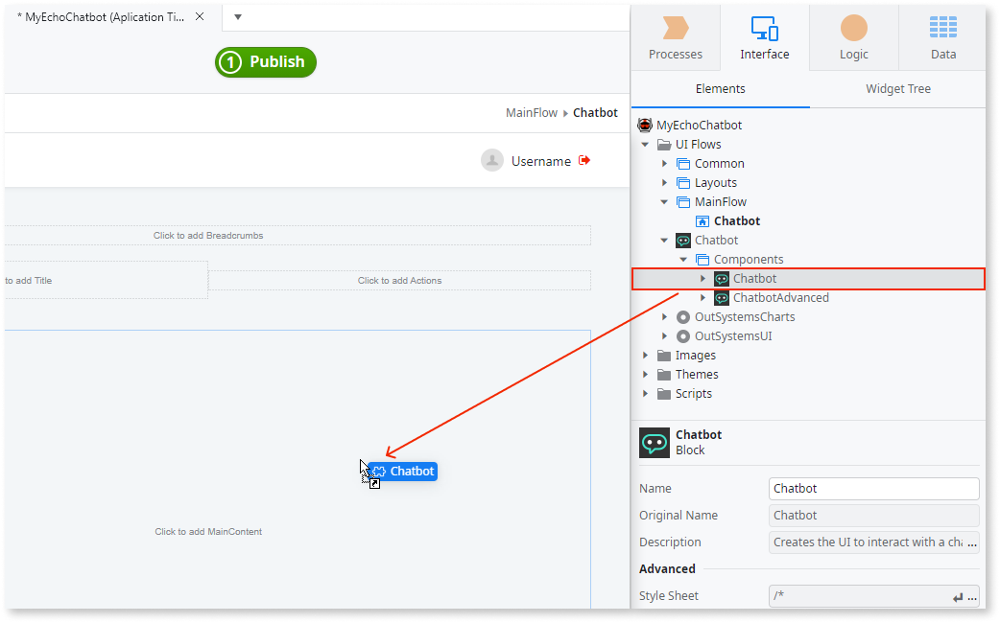

# Add a chatbot UI block to your app

This is a step-by-step guide to add the chatbot UI block to an OutSystems app. This adds a chat window to your app. 

Just starting? Check the [chatbot configuration wizard](configuration-wizard.md) to speed up the setup of your chatbot.

1. Create a new Reactive Web App and add a module of the same type to it. You can also use an existing Reactive Web App.

1. Open the **Manage Dependencies** dialog (press **Ctrl+Q**). Search for `Chatbot`. Select **Chatbot** in the producers pane, and then select all elements in the elements pane. Click **Apply**.
       
    

    With this you add elements from the Chatbot component to create UI and configure the chatbot.

1. Add a Screen to the module. Alternatively, if you're using an existing app, open a Screen.

1. Add the chatbot block to the Screen. Navigate to **Interface** > **(you app)** > **UI Flows** > **Chatbot** > **Components**. Drag the **Chatbot** Block to the Screen. The Chatbot preview now shows in the Screen.
   
    

1. Select the Chatbot component Block. In the properties, locate **DirectLineSecret**. Paste the direct line key from Azure, surrounded by the quotation marks.

    

    

    Direct line secret is a value from the Azure bot service. Do one of the following:

    * If you're just starting, check the [chatbot configuration wizard](configuration-wizard.md) to speed up the setup of your chatbot.
    * If you already created a chatbot service and related resources, and you're setting up the chatbot on your own, check [how to get a direct line secret from Azure](guide-azure-services.md#get-direct-line-key).
    * If you haven't created a chatbot service and related resources, see [Get started: create an FAQ chatbot for your app](get-started-faq-chatbot.md) for instructions.

    

1. Publish your app and test the chatbot. Enter a message in the chat window. If you get replies from the chatbot, then your chatbot is working correctly.

    

    You can now start developing a more complex chatbot.

    

    For information on how to configure other parameters, including the welcome message, check the [chatbot reference](reference.md#chatbot-settings).

    

To have a functional chatbot, you also need a logic to handle the responses. [Create an FAQ chatbot for your app](get-started-faq-chatbot.md) provides detailed instructions for an FAQ bot. If you're implementing advanced use cases, check 
[Create advanced logic for more AI functionalities](get-started-advanced-chatbot.md).

## Troubleshooting

This section contains issues you may run into while developing your chat, and information how to fix those issues.

### Bad argument: invalid token or secret

If you get an error with the message "Bad argument: invalid token or secret message" after you run the app with the chatbot, [check if the direct line value is valid](guide-azure-services.md#get-direct-line-key).