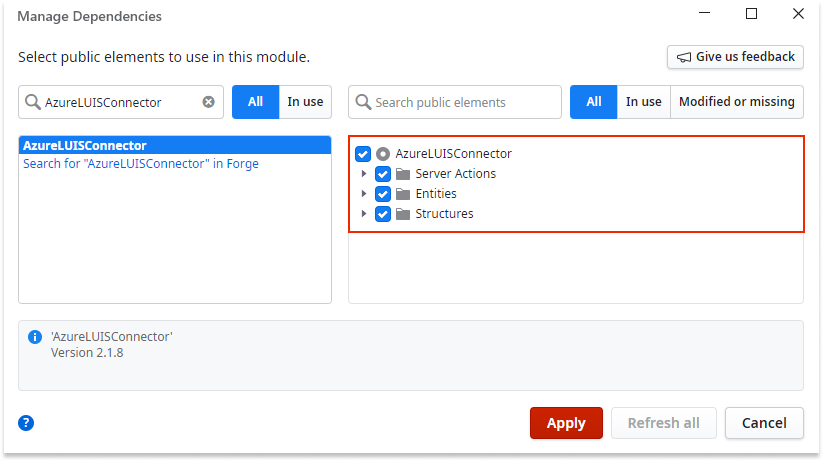
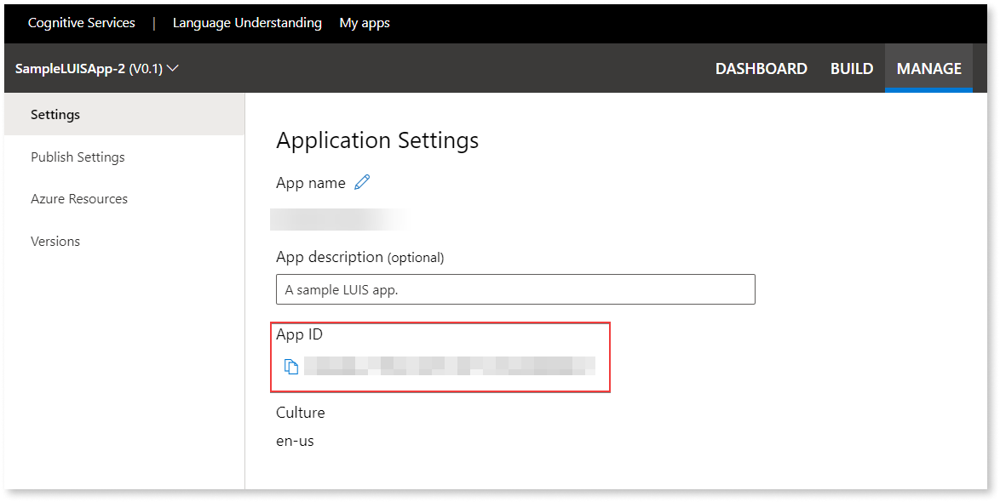
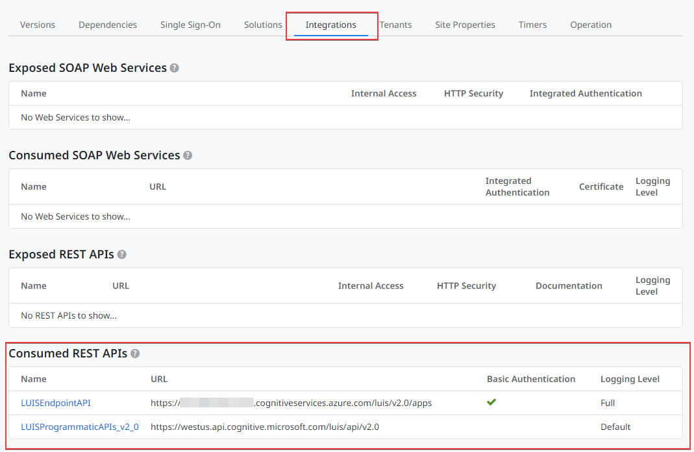
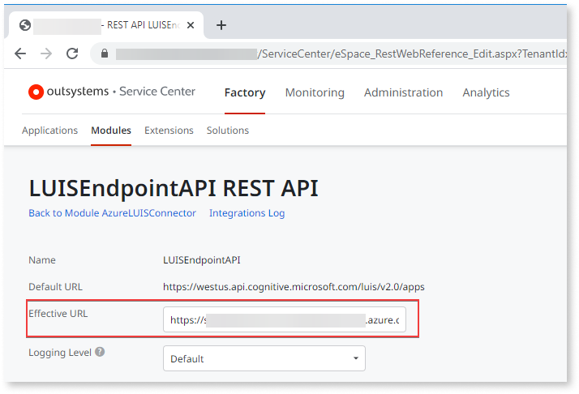
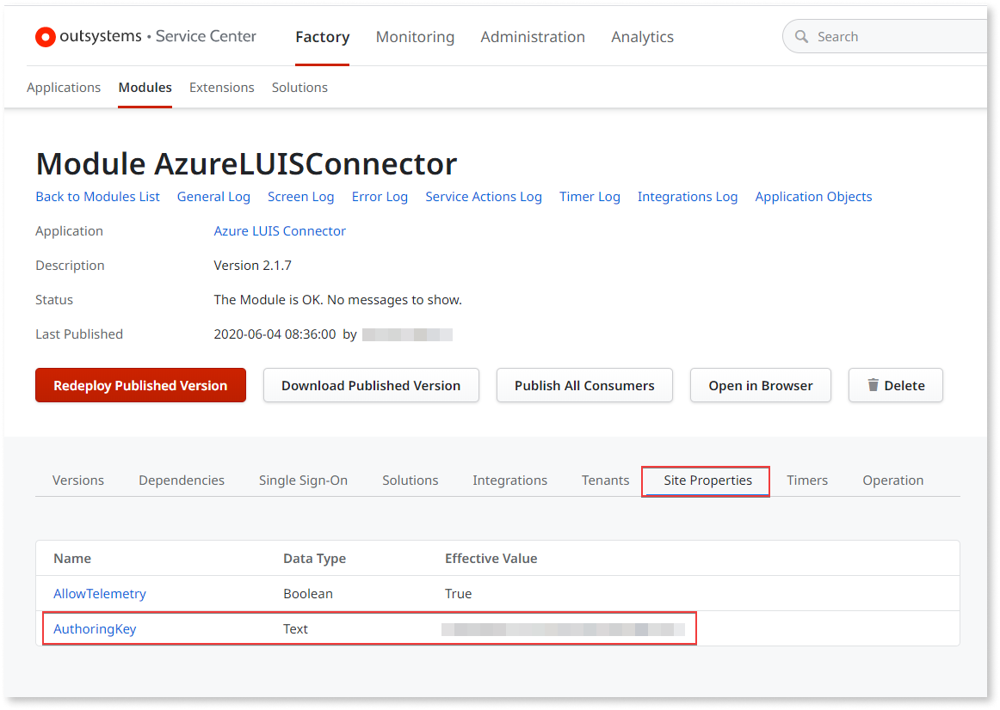
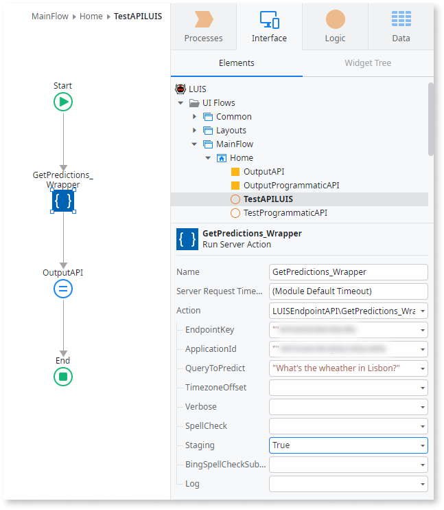

# Use the Azure LUIS Connector in OutSystems apps

LUIS is a Microsoft Azure service that lets your apps "understand" users by extracting information from text in a smart way. Use it in textual interfaces, like a chatbot, to create interactions based on everyday language.

For example, a LUIS app with domain knowledge of calendar can understand the following sentence from a chatbot conversation: "Book a meeting with Jeff from 2 PM to 3 PM". LUIS identifies that the purpose of the sentence is to add a meeting in the calendar, with Jeff, from 2 to 3 PM. In the LUIS jargon, the top-scoring **intent** is `CreateCalendarEntry`, and the related **entities** are `StartTime = 2 pm`, `EndTime = 3 pm`, and `personName = jeff`. As a developer, you can now run logic that adds a meeting in the user's calendar, as your user asked.

Create your knowledge domain in the LUIS app, with intents and entities tailored to your use case and business. You can also just experiment, as LUIS has several prebuilt domains that you can explore. Then, let the actions in your OutSystems apps handle the intents LUIS recognizes in the interactions with your users.  

The phrase "LUIS app" in this document refers to the LUIS app you create in the Language Understanding (LUIS) portal, which is a part of Microsoft Azure. The term "connector" refers to the OutSystems app that connects to the LUIS app through the LUIS API.

## Before you start

Before you can use the functionalities of the LUIS app in your OutSystems app, you need to set up your Azure resources and create a LUIS app.

### Create and deploy a LUIS app 

Check [Quickstart: Create a new app in the LUIS portal](https://docs.microsoft.com/en-us/azure/cognitive-services/luis/get-started-portal-build-app) and after that [Quickstart: Deploy an app in the LUIS portal](https://docs.microsoft.com/en-us/azure/cognitive-services/luis/get-started-portal-deploy-app). To continue with the instructions with the setup in OutSystems, make sure you have **a working and deployed LUIS app in Azure**.

If you're new to LUIS see [a quickstart with a prebuilt domain](https://docs.microsoft.com/en-us/azure/cognitive-services/luis/luis-get-started-create-app). This tutorial guides you through the LUIS basics, from creating a new app, to selecting a domain, and editing what the app can recognize.  

### Install and reference the LUIS connector

Here is how you can install the connector and reference it in your app.

1. Install the [Azure LUIS connector](https://www.outsystems.com/forge/component-overview/5737/azure-luis-connector) from Forge.
2. In Service Studio, press **Crtl+Q** and find the **AzureLUISConnector** in the **Manage Dependencies** window. Select all public elements and click **Apply**. 

    

3. Use the server actions in **Logic** > **Server Actions** > **AzureLUISConnector** > **LUISEndpointAPI** to build your logic.

## Get the LUIS apps settings 

Follow these instructions to get the settings from the LUIS app that you need to configure the OutSystems LUIS connector. 

1. Go to **your LUIS app** in Azure > **Manage** > **Settings**. Copy the value of the **App ID**. 

    

1. Still in **your LUIS app**, go to **Manage** > **Azure Resources** > **Prediction Resources**. Note that you may have more than one service in the **Prediction Resources** tab. Copy the setting from the service you want to use in your OutSystems app. Copy the following values:

    * **Primary Key**
    * **Endpoint URL**

1. If you want to use LUIS Programmatic API, you also need to copy the following values from **your LUIS app**, go to **Manage** > **Azure Resources** > **Authoring Resource**:

    * **Primary Key**
    * **Location**

## Configure the LUIS connector

To use the LUIS connector in your app, you need to configure the connector in Service Center.

1. Go to **Service Center** > **Factory** > **Modules**. Enter **AzureLUISConnector** in the **Name** field and press **Filter**.

    

1. Click **AzureLUISConnector** in the results list to open the module settings. Go to the **Integrations** tab and locate the **Consumed REST APIs** section.
    
    

1. In the **Consumed REST APIs** section click the **LUISEndpointAPI** link. A screen to edit the endpoint opens.

1. In the **Effective URL** field, enter the following value: `(Endpoint URL)/luis/v2.0/apps`. **Endpoint URL** is the LUIS App value you obtained earlier. For example, if your **Endpoint URL** is `https://example.cognitiveservices.azure.com/`, the value you enter in **Effective URL** is `https://example.cognitiveservices.azure.com/luis/v2.0/apps`. Click **Apply** and then confirm by clicking **OK**.

    

    

    The LUIS connector supports the API v2.0 of the LUIS app.

    

1. If you want to use LUIS authoring (programmatic) API, go to the **Site Properties** of the AzureLUISConnector module. Edit **AuthoringKey** value and enter the **Primary Key** you got from the **Authoring Resource** tab.

    

1. You can now test the connection with the LUIS service in Service Studio. 

## Test the LUIS connector

This section shows examples of how to ensure your connector and LUIS app work as intended.

### Test LUIS predictions API 

Here is how you can test the LUIS API configuration by creating a sample flow in Service Studio.

1. In Service Studio, navigate to **Logic** > **Server Actions** > **AzureLUISConnector** > **LUISEndpointAPI** and drag **GetPredictions_Wrapper** action in a logic flow. 

1. In the **GetPredictions_Wrapper** properties:

    * In the **EndpointKey** field, enter the **Primary Key** you got from the **Prediction Resources** tab in the LUIS app.
    * In the **ApplicationId** field, enter **Application ID** you got from the **Settings** page in the LUIS app.
    * In the **QueryToPredict** field, enter a text you are sending to the LUIS app.
    * In the **Staging** select True if you published your LUIS app to the staging slot. Select False if you published your app to a production slot.

    

    

    Staging and Production are the LUIS app publishing slots. Select the slot when you click the **Publish** button in the LUIS app in Azure.

    

1. Publish and test to confirm that the server action returns a prediction object.

Once you complete the configuration, you can use all actions from **LUISEndpointAPI**. See the descriptions of input and output parameters for more information.

### Test LUIS Programmatic API

After configuring the connector for authoring, test the Programmatic (authoring) API. 

1. In Service Studio, navigate to **Logic** > **Server Actions** > **AzureLUISConnector** > **LUISProgrammaticAPI_Apps** and drag **GetApplicationInfo** action in a logic flow. 

1. In the **GetApplicationInfo** properties:

    * In the **AuthoringRegionID** list, select the region matching the **Location** value you got from the **Authoring Resource** tab in the LUIS app.
    * In the **ApplicationId** field, enter the **Application ID** you got from the **Settings** page in the LUIS app.

1. Publish and test to verify that the server action returns an expected value. In this example, it should return the name of the app. 

## About the LUIS APIs

The LUIS connector supports the API v2.0 of the LUIS app.

The OutSystems LUIS connector provides server actions for two different APIs:

* **LUIS Endpoint API** – Obtains predictions regarding the intent of a given text.
* **LUIS Programmatic API** – Also known as authoring API. Manages the LUIS applications and models programmatically.

Check out the following resources for more information about the LUIS APIs and how they correspond to the actions in the OutSystems connector.

* [LUIS Endpoint API v2.0](<https://westus.dev.cognitive.microsoft.com/docs/services/5819c76f40a6350ce09de1ac/operations/5819c77140a63516d81aee78>)
* [LUIS Programmatic APIs v2.0](<https://westus.dev.cognitive.microsoft.com/docs/services/5890b47c39e2bb17b84a55ff/operations/5890b47c39e2bb052c5b9c2f>)

To find more about LUIS check out [Microsoft Language Understanding Intelligent Services (LUIS)](<https://docs.microsoft.com/en-us/azure/cognitive-services/luis/what-is-luis>).