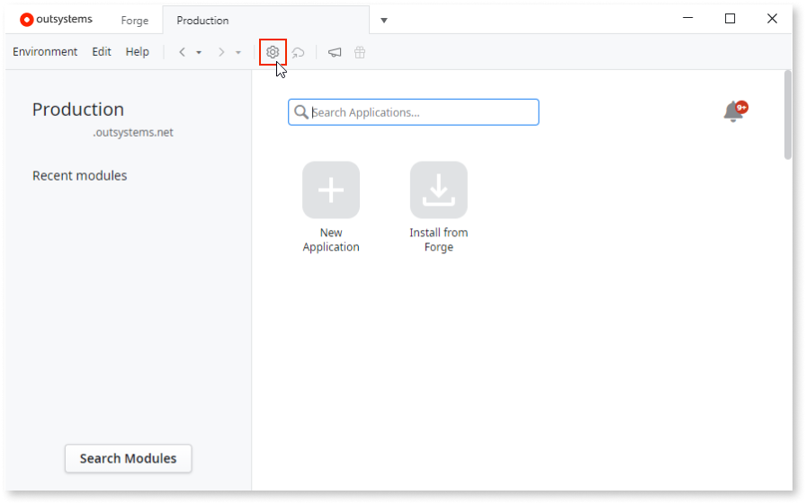
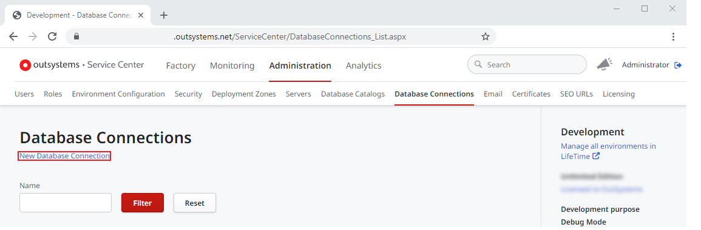
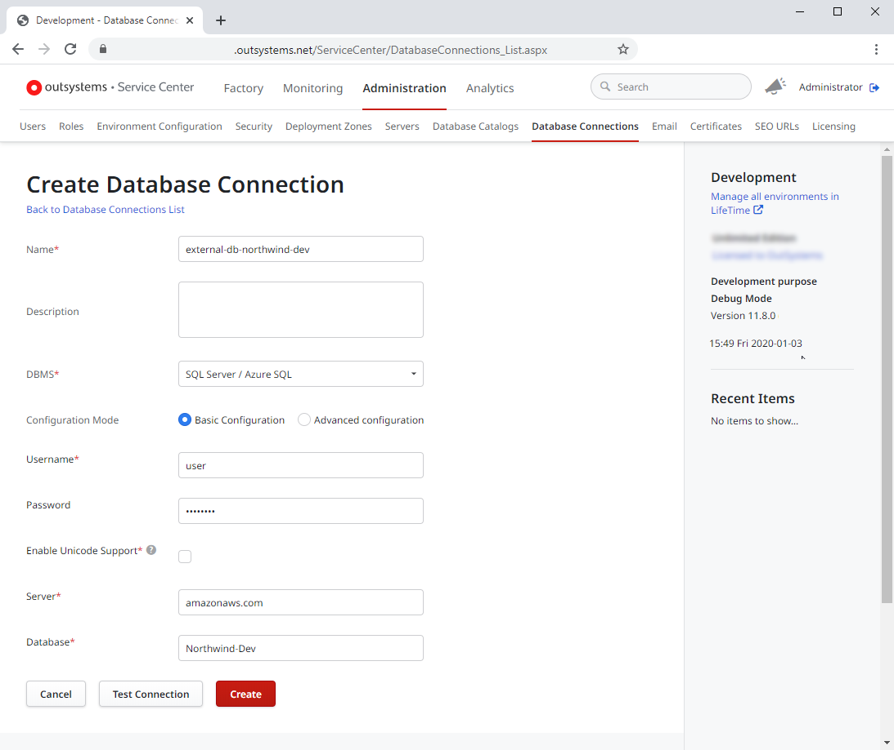
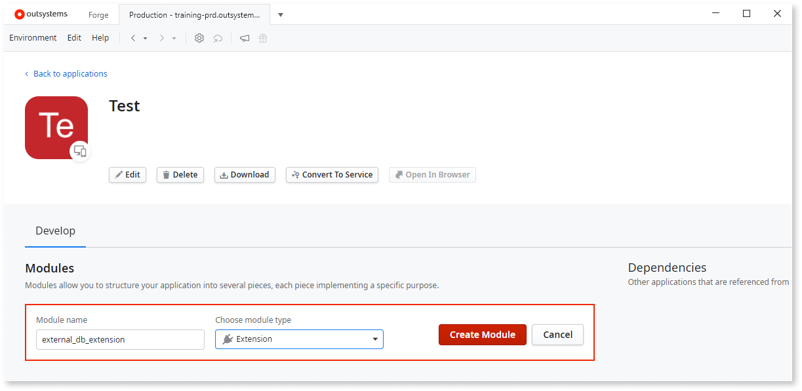
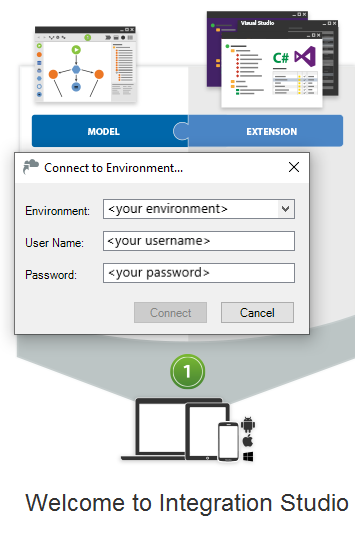
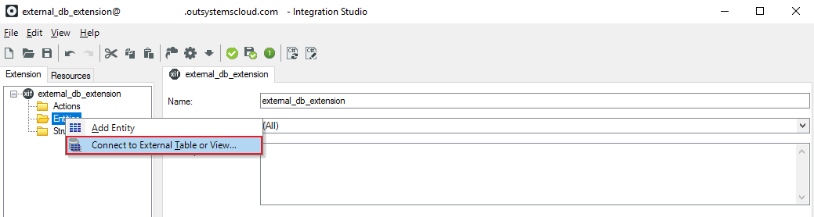
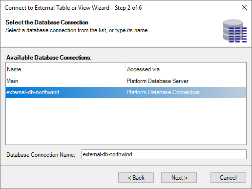
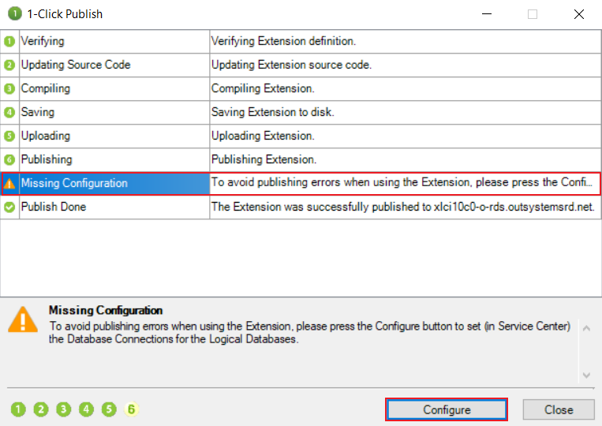
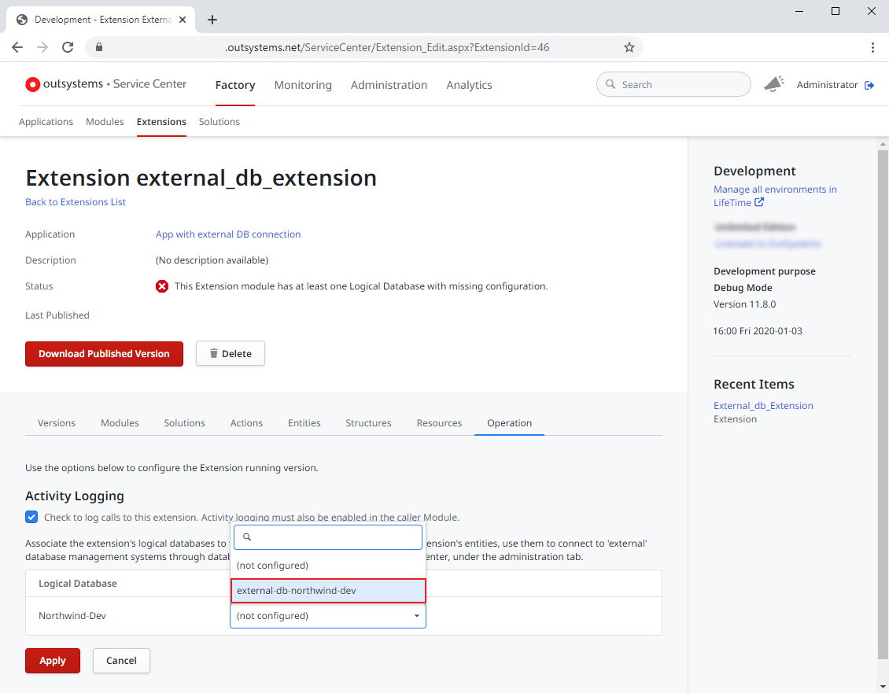
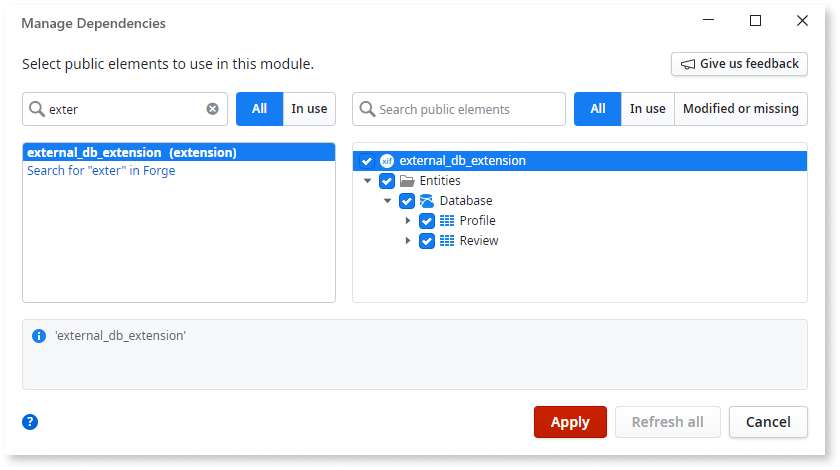

# Integrate with an external database using Integration Studio

OutSystems integrates with your existing databases. This allows you to develop apps that access data on external databases using OutSystems entities in Service Studio and without having to worry about data migration. For a list of supported external database engines and their supported versions check the [System Requirements](../../setup-maintain/setup/system-requirements.md#integration-with-external-systems).

When you're done developing your integration with an external database and you want to deploy the app to another Environment (for example, the quality assurance environment) check out [this step by step guide](../../managing-the-applications-lifecycle/deploy-applications/deploy-an-app-externaldb.md).

The creation of an integration with an external database involves the following general steps:

1. In Service Center, define a connection to the external database.
1. In Integration Studio, create an extension module to map tables or views in the external database to OutSystems entities.
1. In Service Center, configure the extension to use a database connection.
1. In Service Studio, reference and use the extension in your app.

The following sections go throught each one of these general steps in detail.

## Define a connection to the external database { #define-connection }

To use tables and views from external databases, create a database connection: 

1. Open the **Service Center** management console of your OutSystems environment.

    

    Tip: Open Service Center directly from Service Studio by clicking **Environment Management...**.

1. On the **Administration** tab, select **Database Connections**.

    

1. Click **New Database Connection** and fill in the fields to set up the connection to the external database.

    

    If you need to fine-tune the database connection, choose the option **Advanced configuration**. This allows you to define your own connection string.

    

    If you are defining a connection to an external Oracle database which NLS_LANGUAGE parameter is different from `AMERICAN`, make sure you set the **NLS_LANGUAGE** field to the same value set in the database. This will prevent runtime issues related to date and number formats.

    To get the value of the NLS_LANGUAGE parameter set in your external Oracle database you can run the following script:
        `select value from nls_database_parameters where parameter = 'NLS_LANGUAGE';`

    

1. Click **Test Connection** to check if the connection is working correctly.

    

    The database user must have permissions to:

    * List the necessary tables and views on the external database.
    * Perform the operations Create, Read, Update, and Delete on those tables and views.

    

1. Click **Create** to create the database connection.

If your extension to an external database includes the fully qualified table name, such as database.schema.table, changing the database connection in Service Center does not impact your extension. 

If the extension entities display `Northwind.dbo.customers` using the logical database Integration1, and you change the logical database to `Northwind_test`, your extension still points to `Northwind` unless you change every entity in the Effective Physical Table name field. 

## Map tables or views to Entities in an extension module

After configuring a database connection in Service Center, use Integration Studio to create an extension that maps the tables or views in the external database to OutSystems entities:

1. Go back to **Service Studio**, open your app, select **New Module** and create a new **Extension** Module.

    

1. In **Integration Studio**, **Connect** to your environment.

    

1. Right-click the **Entities** folder in the Extension Tree and select **Connect to External Table or View...**.

    

1. Follow the steps of the wizard.

    
    
    

    Make sure that you: 
    
    * Select the database connection configured previously.
    * Select the necessary tables and views.
    * Define a logical database name that you will use to connect the extension to a physical database connection in the next section.

    

1. After closing the wizard, review the imported entity names, descriptions and data types for each attribute.

1. Select **1-Click Publish** to publish the Extension Module.

    After publishing the extension, OutSystems warns you that you still need to configure which database connection the extension will use.

1. In the **1-Click Publish** summary window, select the **Missing Configuration** warning and then select **Configure**.

      

## Configure the extension to use a database connection

After mapping the tables or views, use Service Center to configure which database connection the extension will use:

1. In **Service Center**, make sure you are in the **Operation** tab of **Factory** > **Extensions** > **&lt;your extension name&gt;**.

1. Associate the logical database name of the extension to the database connection that the extension will use in runtime.

    

In some cases you need to select the database based on runtime data. Typically, the applicable databases share the same schema but they contain different data.

In these scenarios, you can use the action [DatabaseConnection_SetConnectionStringForSession](<../../ref/apis/auto/platformruntime-api.final.md#DatabaseConnection_SetConnectionStringForSession>) of the [PlatformRuntime API](<../../ref/apis/auto/platformruntime-api.final.md>).

## Use the extension in your app

The Extension is now ready to be used in OutSystems apps:

1. In your app, click **Manage Dependencies...**.

1. Add a dependency to the Extension and select the Entities that you will use in your app.  

    

You can now use the entities of the extension to manipulate data on the external databases just like you do with the standard OutSystems entities.
