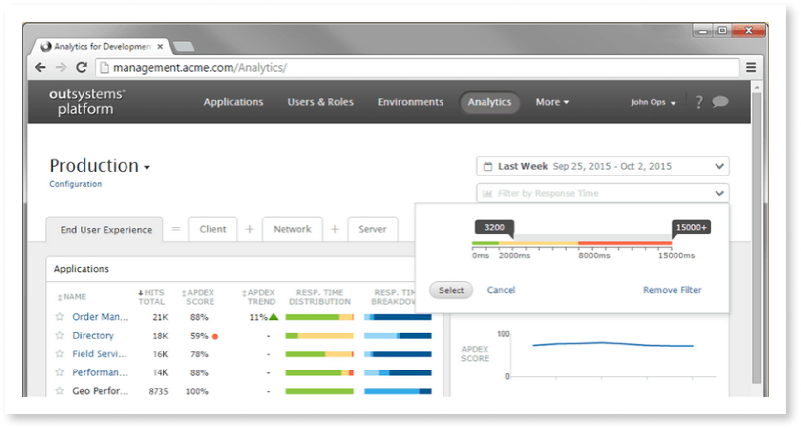
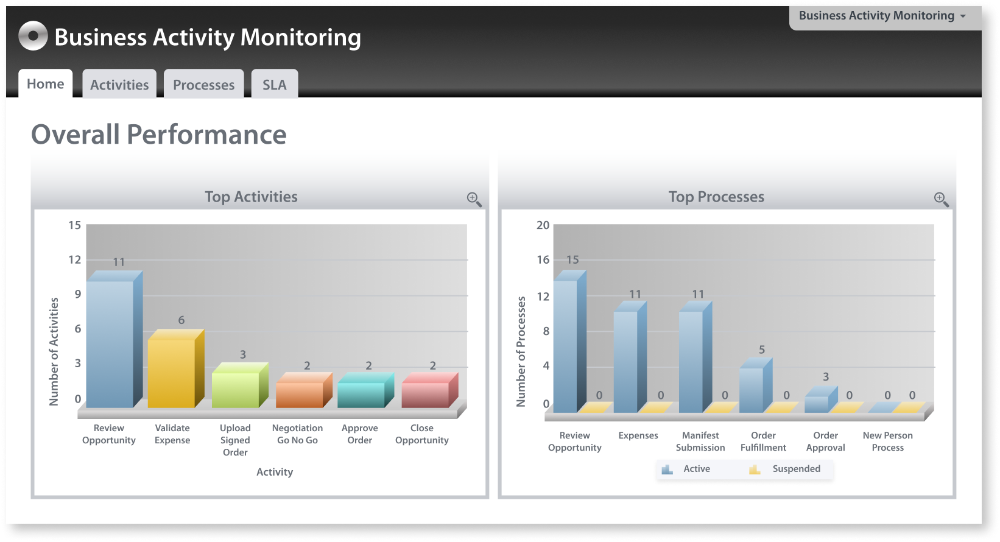
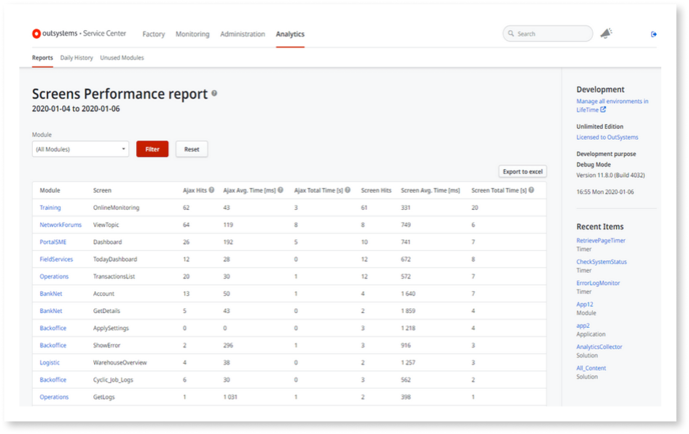
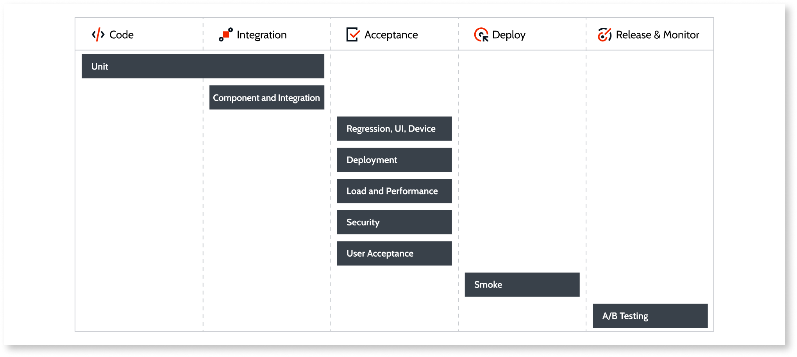
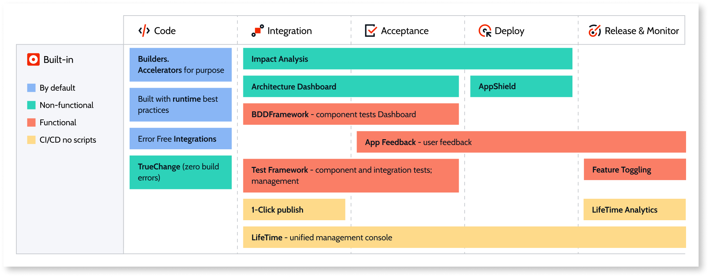
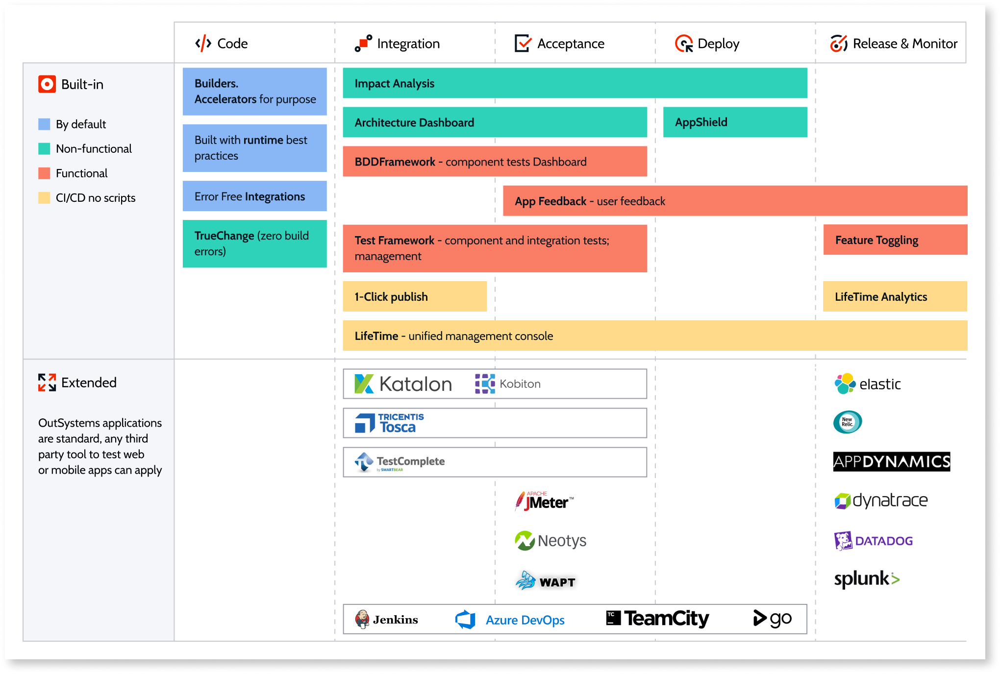
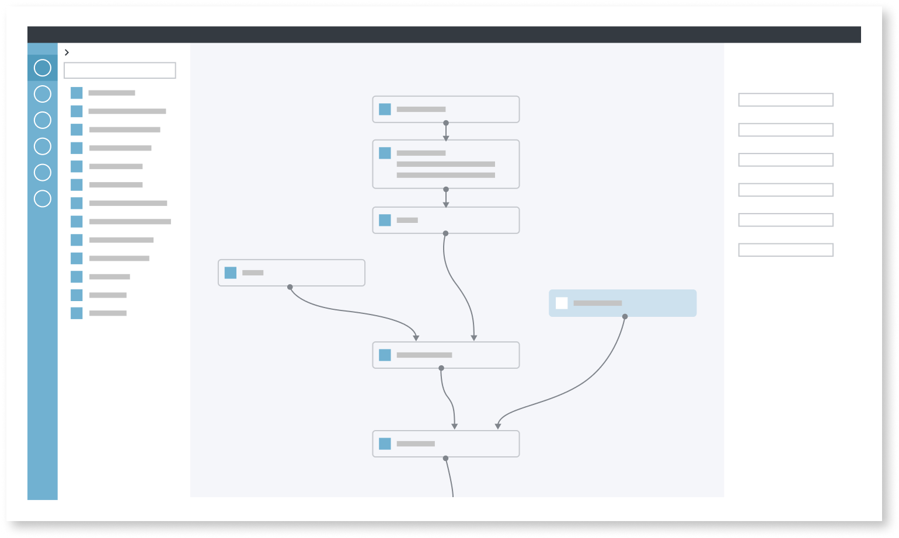

# Integrating OutSystems with your ecosystem

Download the whitepaper version of this document [here](https://www.outsystems.com/1/integrating-outsystems-ecosystem/).

Developers need the ability to create seamless integration with the full range and scope of the business process management tools, including data sources and core business systems, that your enterprise has developed over the years—as well as keep pace with future developments.

OutSystems provides out-of-the-box capabilities to integrate with external databases such as SQL Server, Oracle, MySQL, PostgreSQL and iDB2, as well as a myriad of enterprise systems of record (SoR), including SAP, Salesforce, Microsoft Dynamics 365, Microsoft Dataverse, and Sharepoint Online. In addition, [OutSystems-supported](https://success.outsystems.com/Support/Forge_Components/Forge_FAQs/Curating_Projects#What_is_a_supported_project.3F) modules, connectors, UI components, and business solutions, are available from the OutSystems [Forge](https://www.outsystems.com/forge/), a repository of reusable, open code.

The Forge is also an integral part of our thriving community. There, many have shared thousands of fully working, [community-supported connectors](https://success.outsystems.com/Support/Forge_Components/Forge_FAQs/Curating_Projects#What_is_a_Trusted_project.3F) to well known external systems, such as Google Drive, Dropbox, Slack, and Zendesk, to name just a few.

If your enterprise requires integrations to third-party [libraries](https://success.outsystems.com/Documentation/11/Extensibility_and_Integration/Extend_Logic_with_Your_Own_Code/Extension_Source_Files) or non-native technologies, developers can use [Integration Studio](https://success.outsystems.com/Documentation/11/Reference/Integration_Studio), an OutSystems desktop tool, to write custom [C# and .NET code](https://success.outsystems.com/Documentation/11/Extensibility_and_Integration/Extend_Logic_with_Your_Own_Code) to create an [extension](https://success.outsystems.com/Documentation/11/Extensibility_and_Integration/Extend_Logic_with_Your_Own_Code/Extension_Life_Cycle/Create_an_Extension), making its actions, entities, and structures available in Service Studio.

In all cases, once an integration has been created and added to your environment, it can be  used, and reused, by every developer for every app—as if they belong to OutSystems itself.

The available integrations include:

* Enterprise SoR (System of Record) for managing sales and collaboration, including SAP, Salesforce, Microsoft Dynamics, Microsoft Dataverse, and Sharepoint Online
* Web services to both consume and expose [REST](https://success.outsystems.com/Documentation/11/Extensibility_and_Integration/REST/Consume_REST_APIs) and [SOAP](https://success.outsystems.com/Documentation/11/Extensibility_and_Integration/SOAP/Consuming_SOAP_Web_Services)
* External databases
* End-user authentication
* DevOps and CI/CD processes and tools for building, deploying, automating, testing, monitoring, and logging
* AI and chatbots

There are many other integrations that don’t exactly fit into any particular category, including

* Augmented reality frameworks
* Messaging formats and protocols
* IoT gateways

This document discusses the wide range of integrations made possible by OutSystems.

## Integration Builder {#ib}

[Integration Builder](https://www.outsystems.com/platform/integration-builder/) is a wizard-style tool for developers to quickly connect apps to major enterprise SoR platforms, including SAP, Salesforce, Microsoft Dynamics, Microsoft Dataverse, and Sharepoint Online. With a few clicks, developers can generate secure and scalable integrations of service modules with all of the code required to call an external system: authentication flow, encoding, and parsing.

Some of the key features and capabilities of the Integration Builder include:

* Connectors that ensure resilient integration between systems of record and OutSystems applications
* Inspection of available APIs of external systems to select only the right ones for OutSystems applications
* OutSystems-supported connectors designed to promote reusability, maintenance, and application independence
* Limitless customization of generated connectors to extend connector logic to fulfill IT requirements
* Easy configuration modifications to add fields, remove fields, or swap out existing connections

To learn more about the capabilities of Integration Builder explore the [documentation here](https://www.outsystems.com/platform/integration-builder/).

## Web Service integration

OutSystems has out-of-the-box capabilities to simplify the task of consuming and exposing functionality as standard SOAP web services and REST APIs without any hand-coding. Once OutSystems has generated the methods and data structures to integrate with the external system, developers can use them visually in the application logic of Service Studio. From a developer’s perspective, there is no difference between invoking an OutSystems method, a SOAP web service, or a REST API.

### Integrating to existing systems using SOAP web services

OutSystems supports consuming SOAP web services with WSDL 1.1 and SOAP 1.1/1.2.

Developers provide the location of the Web Services Description Language (WSDL) or import directly from an WSDL file. The OutSystems IDE inspects the WSDL and generates everything needed to invoke the web service methods.

When you consume a SOAP Web Service, OutSystems does the following:

* Connects to the web service and analyses the methods and structures
* Creates the OutSystems actions matching the consumed Web Service methods with the corresponding input and output parameters
* Creates the data structures to hold the complex types defined in the WSDL
* Maps the XML data types into OutSystems data types

OutSystems translates the methods exposed by a SOAP Web Service into OutSystems actions, with the same semantics as any action created in Service Studio. From a developer’s perspective, there is no difference between invoking a OutSystem action or a method exposed by an external service.

Authentication options are provided without the need of complex extensibility such as basic authentication (a static username and password) or dynamic login for credentials specific to each method that can be specified at runtime.

Once a SOAP web service has been integrated into your app, it can be [exposed](https://success.outsystems.com/Documentation/11/Extensibility_and_Integration/SOAP/Exposing_SOAP_Web_Services/Expose_a_SOAP_Web_Service) to make it available to other apps in your OutSystems environment or external web applications.

### Integration extensions for SOAP Web Services

When developers want customized behavior, such as access to Windows Communication Foundation (WCF) for consumed SOAP Web Services, they can create an extension by using the [SOAP Extensibility API](https://success.outsystems.com/Documentation/11/Reference/OutSystems_APIs/SOAP_Extensibility_API), which enables you to modify the SOAP connection, request and/or response message using .NET code.

[SOAP Extensibility Samples](https://www.outsystems.com/forge/component-overview/5322/soap-extensibility-samples), a community-supported extension available from the Forge, can be used by developers as is, or adapted as required, to implement common extensibility use cases using the SOAP Extensibility API.

### Integrating to existing systems using REST APIs

You can integrate your OutSystems applications with REST APIs provided by other systems, or even by other OutSystems applications. Use this functionality either to obtain data from those systems or to request them to perform some action.

When importing the REST API, Service Studio does the following:

* Connects to the web service and analyzes the methods and structures
* Creates REST API methods with the corresponding input and output parameters
* Creates the structures to hold the corresponding input and output parameters under a new tree element with the REST API name
* Maps the REST data types into OutSystems data types

OutSystems translates the methods exposed by a REST API into OutSystems actions, with the same semantics as any action created in Service Studio. From a developer’s perspective, there is no difference between invoking an OutSystems method or a method exposed by an external service.

When consuming a REST API, you can add logic to customize the information that is sent in the requests or received in the responses. [Simple customizations](https://success.outsystems.com/Documentation/11/Extensibility_and_Integration/REST/Consume_REST_APIs/Simple_Customizations) are readily available in Service Studio to modify both the information of the original request (such as the URL, the request text or the headers) or the information of the original response (such as the status code or the response text).

Once a REST API  has been integrated into your app, the consumed API can be used across OutSystems applications within the same environment to retrieve or manipulate information.

### Integration extensions for REST APIs

When developers want customized behavior, they can create an extension using the [REST Extensibility API](https://success.outsystems.com/Documentation/11/Reference/OutSystems_APIs/REST_Extensibility_API). These advanced customizations then can be reused in Service Studio. These advanced customizations allow, for example, using a specific algorithm to encode part of the request content, adding support for client-certificate authentication, or handling a complex response.

The OutSystems REST Extensibility API enables you to access the content of requests and responses used by methods consumed from other REST APIs.

The [OutSystems Forge](https://www.outsystems.com/forge/list?q=REST%20API&t=&o=&tr=False&oss=False&c=&a=&v=11&hd=False&tn=&scat=forge) contains hundreds of components, free for your use, that package the REST Extensibility API and which can make it quick and easy for your developers to integrate with many applications.

## Integration with external databases

OutSystems connects, out-of-the-box, to SQL Server, Azure SQL, Oracle, MySQL, PostgreSQL and DB2 iSeries. Developers can [create a connector](https://success.outsystems.com/Documentation/11/Extensibility_and_Integration/Integrate_with_an_External_Database) to integrate these external data sources in minutes. Using the OutSystems visual editor, developers with any skill set can [query and aggregate data](https://success.outsystems.com/Documentation/11/Developing_an_Application/Use_Data/Query_Data/Fetch_and_Display_Data_from_the_Database) to extract, load, transform and update data needed for any application.

However, developers aren’t limited to manipulating data visually using aggregates. More experienced developers can also use an [SQL Node](https://success.outsystems.com/Documentation/11/Developing_an_Application/Use_Data/Query_Data/SQL_Queries) to build complex queries or to run stored procedures.

OutSystems continually tracks all of the dependencies to the underlying database. If something changes, your SQL code is automatically refactored, or you’re warned if it is no longer compatible with the changes. This extensibility feature accelerates the change process, as well as makes the application itself resilient to change.

### Integration extensions for external databases

Many pre-built connectors and utilities that can be used, as is, or modified as needed, can be found on the [OutSystems Forge](http://www.outsystems.com/Forge/), including connectors for on-premises databases that aren’t natively supported by OutSystems, such as MongoDB. Big data repositories, including CouchDB and Hadoop, can be integrated using their REST APIs. For other database types, developers can create a connector in [Integration Studio](https://success.outsystems.com/Documentation/11/Reference/Integration_Studio) using [standard code](https://success.outsystems.com/Documentation/11/Extensibility_and_Integration/Extend_Logic_with_Your_Own_Code) with ODBC/JDBC drivers.

## SAP Integration

OutSystems provides native support to consume SAP functions to create mobile and web applications by leveraging data and processes from any SAP instance by using RFC calls (BAPI or ZBAPI). Even developers with limited or no knowledge of SAP Integration can easily integrate both SAP ECC and SAP S/4HANA.

Use [Integration Builder](#ib) to import SAP OData services from the [SAP Business Hub](https://api.sap.com/) and Service Catalog.

Once a connection has been made, and remote functions have been imported, they can be used in your application the same way you use any other action.

### Integration extensions for SAP

If developers need to customize a SAP connection, calls to SAP remote functions, or implement different SAP authentication methods, they can create an extension using the [SAP Extensibility API](https://success.outsystems.com/Documentation/11/Reference/OutSystems_APIs/SAP_Extensibility_API).

[SAP Utilities](https://www.outsystems.com/forge/component-overview/1012/sap-utilities), an OutSystems-supported extension available from the Forge, includes ready-to-use actions to perform customization of calls to SAP remote functions. Developers can use it, as is, to add advanced functionality to SAP remote functions. or adapt it, as required, to implement common extensibility use cases.

Other extensions that use the SAP Extensibility API are also available for download from OutSystems Forge.

## End-user authentication integration

OutSystems automatically includes built-in logic for the following [end-user authentication](https://success.outsystems.com/Documentation/11/Developing_an_Application/Secure_the_Application/End_User_Management/End_Users_Authentication) methods:

* **Internal** authentication, the default method, stores end user information in the OutSystems database, but not the credentials. Instead, a cryptographic hash function is computed using the credentials—and only its result is stored. When the end user attempts to log in, the hash function is computed again and its result is compared with the database.
* **[Active Directory](https://success.outsystems.com/Documentation/11/Developing_an_Application/Secure_the_Application/End_User_Management/End_Users_Authentication/Configure_Active_Directory_authentication)** uses your Active Directory to authenticate end users, is available only in self-managed installations.
* **[LDAP](https://success.outsystems.com/Documentation/11/Developing_an_Application/Secure_the_Application/End_User_Management/End_Users_Authentication/Configure_LDAP_Authentication)**, the Lightweight Directory Access Protocol method, authenticates the end user against your LDAP server, using either LDAP configured for Active Directory or standard LDAP.
* **[SAML 2.0](https://success.outsystems.com/Documentation/11/Developing_an_Application/Secure_the_Application/End_User_Management/End_Users_Authentication/Configure_SAML_2.0_Authentication)**, Security Assertion Markup Language, is used in both traditional web apps and reactive web apps to authenticate end users with Single Sign-On (SSO) provided by commercial identity provider companies, such as OneLogin and PingFederated.
* **[Azure AD](https://success.outsystems.com/Documentation/11/Developing_an_Application/Secure_the_Application/End_User_Management/End_Users_Authentication/Configure_Azure_AD_Authentication)** uses SAML-based authentication to authenticate end users with Single Sign-On (SSO) provided by the Azure AD Identity Provider.
* **[Okta](https://success.outsystems.com/Documentation/11/Developing_an_Application/Secure_the_Application/End_User_Management/End_Users_Authentication/Configure_Okta_Authentication)** uses SAML-based authentication to authenticate the end users with Single Sign-On (SSO) provided by Okta.
* **[IdP Connector](https://www.outsystems.com/forge/component-overview/599/idp)** and[IdP Mobile](https://www.outsystems.com/forge/component-overview/2044/idp-mobile), community-supported connectors available from the Forge, can be downloaded and modified for use in mobile applications.

### Integration extensions for authentication and identity management

The OutSystems Forge includes community-supported connectors for integration with other authentication services, such as [OAuth2](https://www.outsystems.com/forge/component-overview/2647/google-services-oauth2) and [JWT tokens](https://www.outsystems.com/forge/component-overview/9043/jwt-token). External IdPs for identity management and access control for providers such as, [IAM OAuth](https://www.outsystems.com/forge/component-overview/5075/auth0-web-connector)/[SAML](https://www.outsystems.com/forge/component-overview/4312/saml-platform-authentication-plugin), and [OpenID Connect](https://www.outsystems.com/forge/component-overview/5823/okta-sso-with-openid-connect) can also be found on the Forge.

## DevOps and CI/CD integration

OutSystems includes built-in tools that unify software development and operations with automation and monitoring to facilitate the implementation of continuous integration and deployment. This allows for shorter development cycles, increased deployment frequency, more dependable releases—all in close alignment with business objectives.

### DevOps

OutSystems supports the continuous process of managing applications throughout the entire lifecycle: from development to maintenance.

[LifeTime](https://success.outsystems.com/Documentation/11/Managing_the_Applications_Lifecycle), the OutSystems unified console, provides visibility of all environments in your infrastructure, allowing increased control in the following areas:

* [IT user and team management](https://success.outsystems.com/Documentation/11/Managing_the_Applications_Lifecycle/Manage_IT_Users)
* [Security](https://success.outsystems.com/Documentation/11/Managing_the_Applications_Lifecycle/Secure_the_Applications)
* [Application deployment and configuration](https://success.outsystems.com/Documentation/11/Managing_the_Applications_Lifecycle/Deploy_Applications)
* [Performance monitoring](https://success.outsystems.com/Documentation/11/Managing_the_Applications_Lifecycle/Monitor_and_Troubleshoot)
* [Hotfix development and deployment](https://success.outsystems.com/Documentation/11/Managing_the_Applications_Lifecycle/Deploy_Applications/Apply_a_Hotfix)

#### Performance monitoring

Comprehensive analytics and monitoring tools, built into OutSystems, enable proactive management of application performance to make it easier to detect problems by allowing the identification of performance issues in real-time.

The analytics dashboard in LifeTime covers all aspects of the [end-user experience](https://www.outsystems.com/evaluation-guide/what-kind-of-monitoring-and-analytics-does-outsystems-offer/#End-user_experience_analytics), based on industry standard indicators of user satisfaction. Developers can detect, troubleshoot, and solve performance issues even before end users report them.

The **End User Experience** dashboard displays the execution times of all queries, web service invocations, screen renderings, schedulers and invocations to adapters, external systems and custom APIs, which are all tracked asynchronously. Performance reports provide valuable tuning and optimization information for applications.

This dashboard automatically surfaces issues that a team may not be aware of, such as slow screens or extensions. This reduces the time it takes to resolve them, so teams can focus on creating new applications, not troubleshooting them.

The **Client** dashboard gives developers the ability to pinpoint performance issues per web page, and even per screen action.

The **Network** dashboard enables teams to quickly drill down on network problems. This is useful for identifying performance issues that only manifest themselves with certain network conditions, so developers can optimize the application accordingly.

The **Server** dashboard enables investigation into server response times by logging and reporting things such as slow queries, integration responsiveness, or custom code invocation time.

#### Business activity monitoring

OutSystems supports business process modeling so teams can quickly create a process on top of an existing application or set of applications. This is often used to guide users throughout existing business processes, such as order approvals, claims handling and other actions.

The [Business Activity Monitoring](http://www.outsystems.com/forge/component/132/business-activity-monitoring/) dashboard, an Outsystems-supported extension from the Forge, enables developers to start monitoring and optimizing their processes right after deploying them for the first time without the need for any development effort. Reports can be easily modified and extended to align with the business language of the organization using them.

#### Logging

OutSystems logs everything. Applications are automatically instrumented to create over a dozen types of error logs. LifeTime uses this data for its analytics dashboards, and developers have access to all of these logs, in Service Center, without having to write a single line of code.

These metrics are captured asynchronously at run time, so application performance isn't compromised while creating a constant stream of metrics. Events captured include:

* Errors in all application layers
* Batch processing executions
* Web services invocations, both inbound and outbound
* Adapters, integration and custom API invocations
* Page accesses
* Database accesses
* External database accesses
* Client side screen access times

These logs are stored in a standard database that users can access to build their own dashboards.

#### Analytics APIs

All the insights from the analytics capability of OutSystems are publicly exposed in a flexible, easy-to-use, REST API that allows access to all registered events in real-time for seamless integration with other enterprise management solutions, and it also enables applications to register custom events.

For instance, the API can be used to extend the dashboard with business data, such as adoption monitoring per department. It's also possible to add a device’s GPS information to the events sent by applications to OutSystems for an exact understanding of where customers or employees were when they performed a specific action.

#### Deployment

LifeTime provides [automated deployment](https://success.outsystems.com/Documentation/11/Managing_the_Applications_Lifecycle/Deploy_Applications) processes across all environments, from development to production, which simplifies processes and increases overall IT efficiency.

If a problem pops up in a deployed app, it can be debugged in a pre-production environment. When the [hotfix](https://success.outsystems.com/Documentation/11/Managing_the_Applications_Lifecycle/Deploy_Applications/Apply_a_Hotfix) has been tested it can then then be deployed to production, with no downtime, and then propagated backwards to previous environments.

#### DevOps extensions

OutSystems built-in monitoring and logging features can be complimented by such third party platforms as Zabbix and HP OpenView.

### CI/CD

Thorough testing is key for any type of software development, and reliable automated testing is crucial for the continual integration/continual deployment paradigm, which requires many tests, frequently performed, all along the CI/CD pipeline.

Every enterprise must find a testing solution for each stage of development, as seen in the figure below.

Typical stages and testing types

OutSystems supports a modern development approach that automatically performs validations regarding factor analysis and impact analysis, alerting developers about conflicts with existing code before new features can be merged. When staging an application to the next environment OutSystems provides feedback about missing dependencies that might cause runtime issues after deployment.

All this is provided automatically, with no need for any scripting.

Aside from handling many aspects of automatic testing that are required for building a continuous development pipeline, OutSystems’s built-in tools and technologies facilitate easy integration with major third-party testing platforms so you can continue to work the way you are used to, or choose a tool that answers your needs, all orchestrated within the OutSystems environment.

#### OutSystems automated code testing

In traditional development, problematic code can only be detected during the build and compile stage. OutSystems TrueChange technology, which combines automation, AI, and analytics, provides developers with real-time feedback about every change made to the application. If errors are found in architecture, logic, or dependencies, the developer is presented with a list of bugs, each with a suggested fix and a clickable link to open the problematic component. The app can be built and published only after the correction has been made.

#### OutSystems automated integration testing

While traditional development models tend to test code and integration separately, they are closely linked, so OutSystems tests code and integration as a unit, checking both the validity of component functionality and its correct integration with the rest of the app. This ensures that new features do what they are supposed to do and integrate as expected. And all this is done automatically, in the background.

For example, once a database has been integrated into your app there is no further need to check if the code is working correctly. OutSystems developers can concentrate on the functional level of the app, making sure that it represents the business logic, rather than have to dig into technical details of the code.

The most powerful integration test is **1-Click Publish**, which validates all of the code, does factor analysis, merges the code, and starts the deployment of your module in your environment. However, if any errors are detected, this operation is unavailable. Instead, errors are listed in the TrueChange window, and only once they are corrected can the app be built.

Built-in impact analysis is done for integration, acceptance, and deployment,  simplifying the process of deploying complex application portfolios across environments.  

The **[AI Mentor Studio](../monitor-and-troubleshoot/manage-tech-debt/intro.md)** monitors technical debt from integration through acceptance, visualizing complex cross-portfolio architectures to identify problems while also helping developers follow best practices and avoid common pitfalls.

**[LifeTime](https://success.outsystems.com/Documentation/11/Managing_the_Applications_Lifecycle)**, the OutSystems centralized management console, manages application environments, development, quality, production environments and version management from integration all the way through deployment and release.

**Test Framework**, for component and integration tests and management.

The **[BDD Testing Framework](https://www.outsystems.com/forge/component-overview/1201/bddframework)**, an OutSystems-supported component available through the Forge, facilitates test automation using [Gherkin](https://www.guru99.com/gherkin-test-cucumber.html) syntax, a human-readable language for structuring and describing an app's expected behaviors in order to perform component tests, including:

* Unit level tests to map lower-level actions, like core concepts for your application
* Service level tests to map higher level actions, where the action itself can either represent or use an API call within your application
* End-to-end level tests to map higher-level end-to-end actions, where the action itself can have a tree of dependencies, like a complex business action of your application

<!-- #### OutSystems automated acceptance testing

As an app moves from integration to acceptance, OutSystems performs:

*   Regression testing
*   UI testing
*   Device testing
*   Deployment testing
*   Load and performance testing
*   Security testing
*   User acceptance testing

These test are handled within the AI Mentor Studio, the BDD framework.
 -->
<!-- You can also configure [App Feedback](https://success.outsystems.com/Documentation/11/Managing_the_Applications_Lifecycle/Gather_user_feedback/Enable_user_feedback_for_apps?origin=d) in LifeTime so key users can send suggestions or report problems in an app, during the acceptance stage, deployment, and after release.  -->

#### Automated deployment

OutSystems provides deployment without any need for scripting. Every time an application is staged to another environment an impact analysis gives feedback about problems that might lead to runtime issues when the app is deployed, such as missing dependencies.

OutSystems [AppShield](https://www.outsystems.com/forge/component-overview/9379/outsystems-appshield), an additional cost add-on, automatically adds additional layers of security during deployment to make mobile applications more resistant to intrusion, tampering, and reverse engineering. AppShield makes it more difficult for attackers to spoof your app, meddle with its security controls, inject malicious code, and run in an insecure environment.

#### CI/CD Extensions

The figure below shows the built-in test automation provided by OutSystems and the many third-party tools that can be integrated into the CI/CD workflow.

Popular third-party automation tools can be integrated into your OutSystems CI/CD workflow, including:

* [Jenkins](https://www.jenkins.io/), a CI/CD automation tool for monitoring the execution of repeated tasks. It is an open-source software that you can use to run with any operating system, and it offers several built-in plugins for building CI/CD pipelines. With Jenkins CI/CD server, you can automate the various stages of your delivery pipeline.
* [Azure DevOps](https://azure.microsoft.com/en-us/services/devops/), a CI/CD automation tool that covers the entire application lifecycle, providing version control, reporting, requirements management, project management, automated builds, testing, and release management capabilities.
* [Selenium](https://www.selenium.dev/), a portable software testing framework for web applications that provides a record/playback tool for authoring tests without learning a test scripting language. It also provides a test domain-specific language (Selenese) to write tests in many popular programming languages, including Java, C#, Groovy, Perl, PHP, Python, and Ruby.
* [Applitools](https://applitools.com/), software designed to test and monitor your app's UI as part of your CI/CD process. It monitors critical functional and visual aspects of any web, mobile, and native app in a fully automated way.
* [Browserstack](https://www.browserstack.com/), a cloud web and mobile testing platform that enables developers to test their websites and mobile applications across on-demand browsers, operating systems and real mobile devices, without requiring users to install or maintain an internal lab of virtual machines, devices or emulators.
* [Appium](http://appium.io/), an open-source automation tool, where you can run scripts and test native, mobile, web, and hybrid applications on Android or iOS using a web driver.
* [Tricentis Tosca](https://www.tricentis.com/) used to automate end-to-end testing for applications. It combines multiple aspects of software testing, such as test case design, test automation, test data design and generation, and analytics to test GUIs and APIs.
* [SauceLabs](https://saucelabs.com/), allows users to run tests in the cloud, providing a comprehensive test infrastructure for automated and manual testing of desktop and mobile applications using Selenium, Appium, and JavaScript unit testing frameworks. It also provides a secure testing protocol, Sauce Connect, for testing applications behind customer firewalls.
* [ElasticSearch](https://www.elastic.co/pt/), for monitoring and analytics, ElasticSearch is the most popular enterprise search engine that provides a distributed, multitenant-capable full-text search engine with an HTTP web interface and schema-free JSON documents.

### OutSystems CI/CD pipeline accelerator

With the [outsystems-pipeline](https://github.com/OutSystems/outsystems-pipeline), an open-source accelerator developed on top of real world experience, your developers can extend the built-in capabilities of LifeTime, with such features as governance over which applications and environments you are authorized to manipulate or the built-in impact analysis that simplifies correctly deploying complex application portfolios across environments.

This accelerator includes Python scripts built on top of the LifeTime APIs, pipeline templates, and documentation to simplify integration with any CI/CD platform, including [Jenkins](https://github.com/OutSystems/outsystems-pipeline/wiki/Building-an-OutSystems-pipeline-with-Jenkins) and [Azure DevOps](https://github.com/OutSystems/outsystems-pipeline/wiki/Building-an-OutSystems-pipeline-with-Azure-DevOps), to build an OutSystems pipeline.

Your developers can also view and modify [example scripts](https://github.com/OutSystems/outsystems-pipeline/tree/master/examples/other_pipelines) to help bootstrap custom pipelines.

## AI integration

Developers and architects can use OutSystems to create new products and services enabled by AI to help reduce costs, increase efficiency, and even find new sources of revenue.

OutSystems users and developers can enhance applications with three main aspects of AI:

* **[Conversational experiences](https://www.outsystems.com/evaluation-guide/how-do-i-create-chat-and-voice-enabled-apps/)** to improve engagement in applications by allowing users to interact in their own natural language. These experiences are part of multi-channel chat and voice interfaces and in-device voice assistant integration.
* **[Cognitive services](https://www.outsystems.com/evaluation-guide/how-do-i-use-cognitive-services-to-create-ai-enabled-apps/)** to use intelligent algorithms that see, hear, speak, understand, and interpret language and voice. These cognitive services operate on unstructured data to provide a solution to business problems that regular development algorithms can’t solve.
* **[Custom machine learning](https://www.outsystems.com/evaluation-guide/how-do-i-add-predictive-capabilities-powered-by-custom-machine-learning-models/)** use existing data to provide predictive capabilities, automating decisions in business processes, or improving application logic. Unlike cognitive services, which rely on prebuilt models for predefined use cases, custom machine learning models need to be trained and tested with business data.

With pre-built AI components for common use cases and connectors available from the Forge, OutSystems makes it easy for developers to add AI to their apps.

### AI service connectors

Through OutSystems Forge, you can access connectors to multiple cognitive  services that reduce the time and effort required to build chatbots, add  language analysis to apps, and weave decision optimization, predictive intelligence, and machine learning and AI models throughout your final products. Among the available OutSystems-supported connectors are:

* **[Azure QnA Maker Connector](https://www.outsystems.com/forge/component-overview/6181/azure-qna-maker-connector)** to a cloud-based API service that answers natural language questions by matching them with the best possible answer from an organization’s knowledge base for a virtual assistant or a chatbot, among others
* **[Azure LUIS Connector](https://www.outsystems.com/forge/component-overview/5737/azure-luis-connector)** to a cloud-based API service using the cloud-based Azure Language Understanding (LUIS) to apply custom machine-learning intelligence to a user's conversational, natural language text to predict overall meaning and pull out relevant, detailed information
* **[Azure Cognitive Services Connector](https://www.outsystems.com/forge/component-overview/1428/azure-cognitive-services-connector)** to enable users to have natural and contextual interactions with applications using Azure Cognitive Services
* **[Azure Bot Framework Connector](https://www.outsystems.com/forge/component-overview/5570/azure-bot-framework-connector)** to build bots that interact with users on websites, apps, Cortana, Microsoft Teams, Skype, Slack, and Facebook Messenger
* **[Dialogflow Connector](https://www.outsystems.com/forge/component-overview/2306/dialogflow-connector)** to the Google Cloud platform to build voice and text-based conversational apps for user interaction for chatbots and IoT devices, among others
* **[Azure ML Connector](https://www.outsystems.com/forge/component-overview/5657/azure-ml-connector)** to enables communication with an Azure Machine Learning Score Model in real time to return prediction results obtained from predictive experiments created with the tools provided by Microsoft Azure Machine Learning.

### Chatbots and voice-enabled apps

OutSystems offers chatbot components and language analysis for building and adding conversational experiences to applications so they not only interact with users naturally.

#### Chatbots

* **[OutSystems.AI Chatbot](https://www.outsystems.com/forge/component-overview/5886/chatbot-web)**, an OutSystems-supported component available from the Forge, can be used by developers to build, connect, deploy, and manage intelligent bots that interact naturally with users, making it much easier to implement rich conversational experiences in an app. OutSystems.AI uses Azure services to implement common patterns for chatbots, and includes a chatbot interface, a webhook template that allows quicker customization of the bot response logic, interactive cards for adding clickable thumbnail images, attachments, and buttons to automatic responses, and integration with text and speech analysis.
* **[Azure Bot Framework Connector](https://www.outsystems.com/forge/component-overview/5570/azure-bot-framework-connector)**, an OutSystems-supported connector available from the Forge, enables easy connections to the Microsoft LUIS Connector, Azure QnA Maker, and the [Azure Bot Framework](https://www.outsystems.com/forge/component-overview/5570/azure-bot-framework-connector), allowing developers to use these capabilities in the OutSystems IDE and using the OutSystems visual language.  
* **[Dialogflow](https://www.outsystems.com/forge/component-overview/2306/api-ai-connector)**,  an OutSystems-supported connector available from the Forge, is used to build engaging voice and text-based conversational interfaces, such as voice apps and chatbots. It can be integrated with multiple channels to increase interactions and reach more customers. Some of the available channels are Google Assistant, Amazon Alexa, Facebook Messenger, and other popular platforms and devices.

### Virtual private assistants

OutSystems provides developers with tools to integrate the following VPAs into their applications:

* **Siri**, Apple’s virtual assistant, can be integrated into OutSystems apps using the community-supported [Siri Shortcuts](https://www.outsystems.com/evaluation-guide/how-do-i-create-chat-and-voice-enabled-apps/#5) plug-in, available from the Forge, to develop seamless interaction with Apple devices and their built-in applications.
* **Google Assistant** uses a user's voice to trigger and complete activities. [Dialogflow](https://www.outsystems.com/forge/component-overview/2306/api-ai-connector), an OutSystems-supported connector available from the Forge, can be used to build Google-based voice interaction.
* **Alexa**, Amazon’s cloud-based voice service, can be integrated into OutSystems apps using the community-supported [Alexa](https://www.outsystems.com/forge/component-overview/2203/alexa) component, available from the Forge, to build natural voice experiences and intuitive interactions with the Alexa-equipped devices.
* **Cortana,** Microsoft’s digital assistant, can be integrated into OutSystems apps using the OutSystems-supported [Azure Bot Framework](https://www.outsystems.com/forge/component-overview/5570/azure-bot-framework-connector), available from the Forge, to build a speech bot, register it, and define your Cortana channel.

### Cognitive services to create AI-enabled apps

Connectors from the OutSystems Forge enable developers and users access to cognitive services that they can add to their applications to solve business problems from unstructured data.

#### Language Services

Language services are used for speech recognition, intent recognition, transcription, synthesization, and content and sentiment analysis. These connectors and components are available from OutSystems Forge for accessing language analysis:

* **[OutSystems.AI Language Analysis](https://www.outsystems.com/forge/component-overview/5877/outsystems-ai-language-analysis)**, an OutSystems-supported connector available from the Forge, is a set of pre-built services that developers can add to applications to determine customer sentiment, needs, and issues, and to accelerate business processes by receiving text as an input parameter for sentiment analysis, key phrase extraction, entities detection, translation, language detection, spell check, and speech-to-text conversion.
* **[Azure Cognitive Services Connector](https://www.outsystems.com/forge/component-overview/1428/azure-cognitive-services-connector)**, an OutSystems-supported connector available from the Forge, is used to access services for speech and text from the OutSystems IDE and add them to their apps, including speech transcription, custom speech service, speaker verification, speaker identification, and text to speech conversion.
* **[IBM Watson Services](https://www.outsystems.com/forge/component-overview/2300/ibm-watson-services)**, an OutSystems-supported connector available from the Forge, converts spoken audio into text or written text into natural sounding audio, enabling the use of voice for verification, or adding speaker recognition to an app, all in a variety of languages and voices.
* **[OutSystems.AI Document Processor](https://www.outsystems.com/forge/component-overview/8615/outsystems-ai-document-processor-reactive)**, a community-supported component available from the Forge, is used to quickly capture and qualify document data, identify and classify important account-related documents, and transform forms into usable data, including form recognition to identify and extract text, key/value pairs and table data from form documents, receipt analyzer to identify and extract key information from sales receipts (using the [Azure Cognitive Services Connector](https://www.outsystems.com/forge/component-overview/1428/azure-cognitive-services-connector)), and layout analysis, (using [this service](https://azure.microsoft.com/en-us/pricing/details/cognitive-services/form-recognizer/)) to extract text and table structure using high-definition optical character recognition (OCR).

#### Vision Services

Vision services include image-processing algorithms that intelligently identify, caption, index, and moderate pictures and videos. With the help of the following Forge components and connectors, developers can make it possible to understand the content of an image, classify it, detect individual objects and faces within images, and read printed words within the images (OCR):

* **[Azure Cognitive Services Connector](https://www.outsystems.com/forge/component-overview/1428/azure-cognitive-services-connector)**, an OutSystems-supported component available from the Forge, can be used to add Microsoft Azure Vision Services into the OutSystems IDE for image analysis, recognition of handwritten or printed text in image, recognition of celebrities and landmarks, thumbnail generation, face verification, face detection, emotion recognition, and custom model for image recognition.
* **[Google Cloud Vision OCR](https://www.outsystems.com/forge/component-overview/1572/googlecloudvisionocr)**, a community-supported component available from the Forge, enables developers to use Google Cloud Vision in the OutSystems IDE to extract text, identify text in an image, and get specific data types in image.
* **[IBM Watson Services](https://www.outsystems.com/forge/component-overview/2300/ibm-watson-services)**, a community-supported component available from the Forge, enables developers to use IBM Watson Visual Recognition Services for facial analysis and image recognition.
* **[Amazon Rekognition Face Matching](https://www.outsystems.com/forge/component-overview/4113/amazon-rekognition-face-matching)**, a community-supported component available from the Forge, enables developers to use AWS Recognition capabilities in the OutSystems IDE for face matching and adding faces to collections.

### Custom machine learning

Custom machine learning automates decisions in businesses process by providing predictive capabilities or improving an application’s logic on data that already exists in your system. Unlike the cognitive services that are more oriented towards pre-built models for predefined use cases, custom machine learning models must be trained and tested with actual specific business data. So, it is necessary to label and prepare your data, choose an algorithm, train the algorithm, tune it, and optimize it for deployment. Currently, there are solutions for creating machine learning models that require a minimum data science skills with a visual development language. One of these solutions is Azure ML. You can use OutSystems to integrate and leverage the application with Azure ML technology.

**[Azure ML](https://www.outsystems.com/forge/component-overview/5657/azure-ml-connector),** an OutSystems-supported connector available from the Forge, can be used to create an interactive, visual workspace easily and quickly build, test, and deploy models using pre-built machine learning algorithms. No programming is required; the machine learning model is constructed by connecting datasets and analysis modules on an interactive canvas, and then deploying it.

Azure Machine Learning Studio publishes models as web services that can easily be consumed by OutSystems applications.
