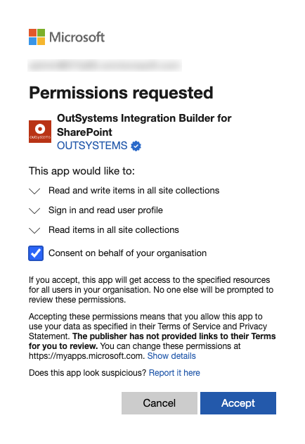
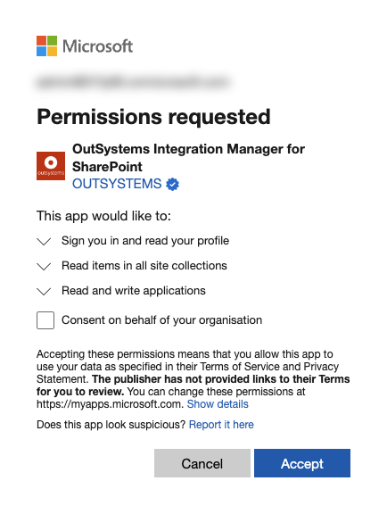

# SharePoint Online integration

The SharePoint Online integration allows you to perform operations on entities available in SharePoint Online from your OutSystems applications.

## Prerequisites

Verify the following:

* You meet the general [Integration Builder prerequisites](../set-up.md#prerequisites).

* The SharePoint Online integration deployed in your OutSystems development environment can make HTTPS outbound requests (port 443) to your SharePoint Online service.

* The number of items or documents in your SharePoint List View don't exceed the 5000 limit. Otherwise, SharePoint displays an error message. To learn more about this error, see [Living Large with Large Lists and Large Libraries](https://docs.microsoft.com/en-us/microsoft-365/community/large-lists-large-libraries-in-sharepoint#what-is-the-list-view-threshold).

## Authorizing Integration Builder in your Microsoft account

Follow the instructions provided in [Creating and using an integration](../use.md#create-use). You must authorize Integration Builder to access your data in SharePoint Online through your Microsoft account.

Integration Builder uses this authorization to retrieve the metadata from the SharePoint Online server (Sites, Lists, and respective columns) and enable you to test a newly created integration in the development environment.

## Authorizing a SharePoint Online connection { #authorize-integration }

SharePoint Online integrations generated with Integration Builder use a certificate to authenticate requests done at runtime, using the connection you configured.

Request authentication is handled transparently when you call Server Actions exposed by the service module (the module with a "_IS" suffix, by default). The Server Actions obtain the certificate info from the connection that you previously associated with the integration in Integration Manager. Therefore, you don't need to provide any authentication information as input parameters.

### If you have administrator permissions in Microsoft Entra

You can select the `Create automatically` option to have the Integration Manager create the connection on your behalf.
Integration Manager generates a certificate and connects to Integration Builder, which requests the creation of an Microsoft Entra app that uses the certificate for authentication and authorization.

### If you don't have administrator permissions in Microsoft Entra

If you don't have administrator permission in Microsoft Entra or prefer not to grant Integration Builder permission to create apps in Microsoft Entra, then you should select the "Create manually" option.

Creating a connection without administrator credentials requires parameters from the Microsoft Entra platform. The Microsoft Entra account administrator needs to create a new Microsoft Entra app to obtain these parameters.

Integration Builder can send an email to the administrator requesting the information you need. The email includes a unique authorization certificate, and [instructions on how the administrator proceeds](how-register-ib-ms-sp-dv-d360.md).

Once you receive the information, enter it into Integration Builder, and select **Create connection**.

### Editing a connection in Integration Manager

Each connection to SharePoint Online you create in Integration Manager is tied to an application registered in Microsoft Entra. To edit the connection, you must use a Microsoft account that has access to Microsoft Entra and must authorize Integration Builder to connect on this user's behalf.

This authorization is only valid for a specific user. If another user wants to edit a connection or integration, they also need to authorize Integration Builder.

### Use the integration in Service Studio

For more information, see [how to use the integration in Service Studio](../use.md#use).
