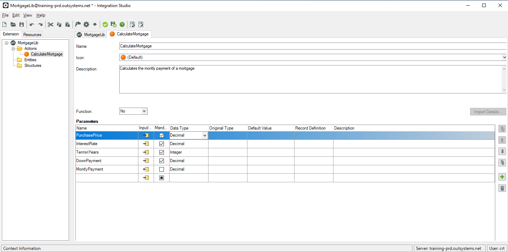
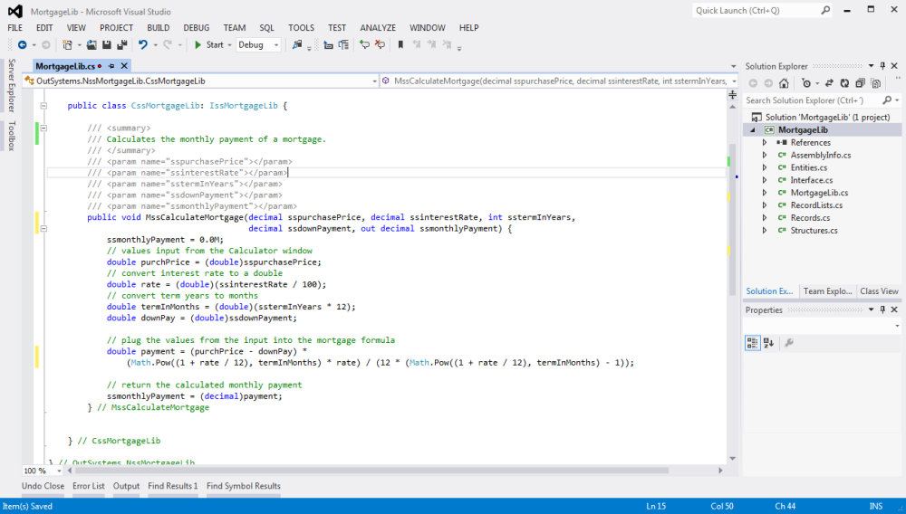
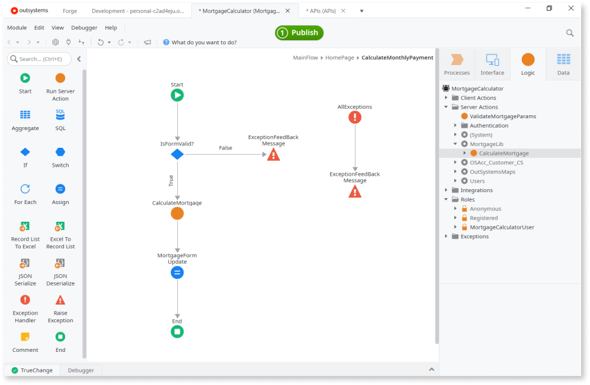

# Extend Logic with Your Own Code

Integration Studio provides proficient software developers with an environment that empowers their ability to integrate with enterprise systems and to extend the existing functionality and data model of OutSystems. In OutSystems, advanced integration is accomplished through [**extensions**](<extension.md>).

Using extensions you can, for example:

* Use custom built .NET components to extend the functionality of your modules
* Integrate with external systems to extend the functionality of your modules
* Integrate with an external relational database to extend your module's data model

Integration Studio environment provides several features that accelerate and automate the development of integration components and add-ons:

* A fully **integrated visual environment** that allows you to rapidly and efficiently [create extensions](<../extension-life-cycle/extension-create.md>) to integrate with core or legacy systems.

* **Automatic wizards** that [reverse engineer external databases](<../managing-extensions/entity-import-from-database.md>) (also called introspection) and [translate .NET assemblies](<../managing-extensions/net-assembly-import-action.md>) into extension Actions, Entities and Structures.

* The [1-Click Publish](<../extension-life-cycle/extension-1-cp.md>) feature, which enables the immediate remote deployment of extensions, including all their dependencies, in any Platform Server. Once published, simply [use the extension](<../extension-life-cycle/extension-use.md>) in your module.

* A highly **specialized environment** that extends the extension life cycle by automating integration with enterprise and external systems. Integration Studio leverages expert IT developers with a tool that eases the packaging of components built to integrate OutSystems applications with other systems.

Features related to extension administration are available through Service Center, a centralized management console that supports the administration, versions, operation, and deployment of extensions.

The target users of Integration Studio are **developers** with programming skills in native technologies supported by OutSystems, such as Microsoft .NET, Microsoft SQL Server, and Oracle Database.

## Example Scenario

In the following example, we had a method in .NET to calculate the monthly payments for a mortgage. Instead of implementing the same method from scratch using OutSystems logic, we encapsulated that method into an extension module as follows:

1. Added a new module to the application, choosing the **Extension** module type and named it `MortgageLib`.

1. In Integration Studio we created a new `CalculateMortage` action in the **Actions** folder and defined the `CalculateMortage` action signature as displayed in the image below:

    

1. Clicked **Edit Source Code** to automatically generate the stubs for the actions and launch the IDE, where we implemented and tested the code.

    

1. Once we finished coding, we went back to Integration Studio and clicked **1-Click Publish** to deploy the extension.

To use the new extension in an application we proceeded as follows:

1. In Service Studio, we picked the `CalculateMortgage` action from the **Manage Dependencies** window, adding it as a dependency to the application.

1. Called the extension action in the application logic, after validating the end user input:

    
