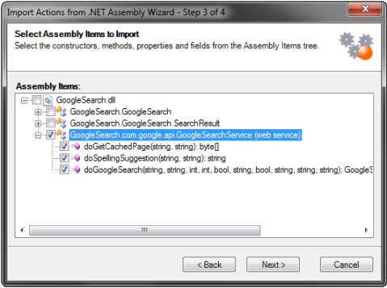
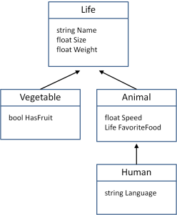
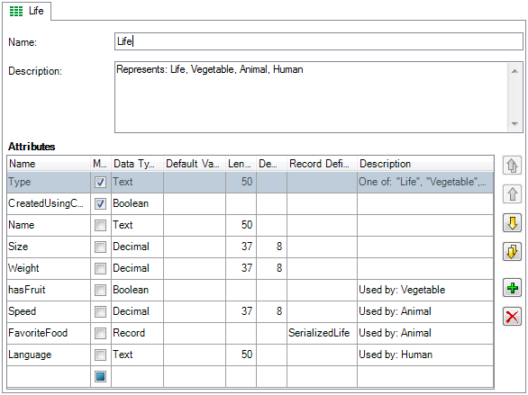
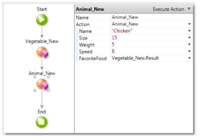
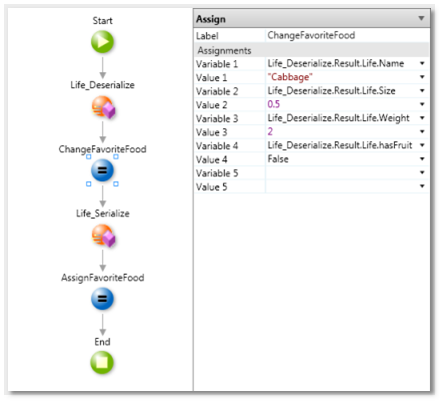

# Import Web Services from a .NET Assembly

To provide support for a wider range of Web Services, Integration Studio allows you to import the definition of Web Service clients, known as Web References in OutSystems terminology. The Web Reference is encapsulated within an extension which you can then use in Service Studio.

Learn more on how to [Consume a SOAP Web Service](<../../soap/consume/consume-web-service.md>) in Service Studio.

## Creating a .NET Assembly proxy using Visual Studio

Do the following:

1. Get the WSDL address.

1. Create a new **Visual C# Class Library** project, and set it with the **.NET Framework 3.5** or higher.

1. In the Solution Explorer, right-click the new project and select **Add Service Reference...**.

1. On the **Add Service Reference** window, click **Advanced...** button and then click **Add Web Reference...**.

1. Type the WSDL address of the Web Service on the **URL** field.

1. After Visual Studio detects the methods exposed by the Web Service, press **Add Reference**.

1. Build the project by pressing **F6** or by right-clicking on the project and choosing **Build**.

## Creating a .NET Assembly proxy using the command line

Visual Studio only lets you generate one proxy at a time. In scenarios where you need to import multiple services that use the same structures (**shared data types**), you end up with multiple representations of the same structure, for example, `Employee1`, `Employee2`, and `Employee3`.

It's possible to overcome this issue using the [`Disco.exe`](<https://msdn.microsoft.com/en-us/library/cy2a3ybs(v=vs.90)>) and [`Wsdl.exe`](<https://msdn.microsoft.com/en-us/library/7h3ystb6(v=vs.90)>) tools available in the .NET Framework SDK:

1. Launch a **Visual Studio Command Prompt** from the **Visual Studio Tools** folder.

1. Run `disco.exe <first_wsdl_path>` to generate the file `results.discomap`.

1. Rename the file to `wsdl1.discomap`. If the two Web Services have the same endpoint, you must save the generated files into separate folders, otherwise the next step will erase the generated files for the first Web Service.

1. Run `disco.exe <second_wsdl_path>`. Again rename the generated file to `wsdl2.discomap`.

1. Run `wsdl.exe /shareTypes /out:proxy.cs wsdl1.discomap wsdl2.discomap` to generate the C# proxy.

1. Run `csc.exe /target:library proxy.cs` to compile the proxy into a DLL. Make sure you are using the C# compiler from .NET Framework 3.5 (or higher).

## Importing the .NET Assembly

1. In Integration Studio, click **File** > **Import**.

1. Choose **Import Actions from .NET Assembly...** to import the DLL you just created. Learn more on how to [Import Actions from .NET Assembly](<net-assembly-import-action.md>).

    Integration Studio introspects the DLL and asks you to select the Web Service methods to import.

    

1. Finally, select which methods to import.

After the wizard is finished, Integration Studio generates Service Studio actions and structures. Now you can develop any custom logic as in any other extension.

## Using the Web Services

After importing, notice that several constructors (`<Structure_Name>_New`) have been automatically created. Use these constructors to instantiate the structures when invoking the Web Services.

As any other extension, publish it to the server by clicking **1-Click Publish**". When the operation is finished, the extension encapsulating the Web Service can then be used on any module through as a dependency.

When the Web Reference definition changes, you must create a new extension to encapsulate the new Web Reference, and set all the modules to reference this new extension.

## Supported Web Service constructs

Due to the OutSystems language expressiveness, there are certain constructs that aren't directly supported in Service Studio, but are supported by importing the .NET assembly of a Web Service client definition:

* Web Services using inheritance in their data types
* Web Services with recursive data types
* Web Services with multi-dimensional Arrays

## Generated Structures

As an example, consider the classes below.

When introspecting the .NET assembly, Integration Studio creates a single structure with the same name as the base class. The **Type** attribute specifies which class the structure represents once instantiated.

Notice also that the fields from all classes in the inheritance chain, are present in the **Life** structure as attributes, and their description states the class they belong to. Despite having the same structure to represent the whole inheritance, you should use the constructors provided to easily instantiate the desired class.

## Using recursive data types

When using recursive data types, Integration Studio serializes the elements which cause the recursion.

In the example above, the **Animal** class is recursive because it extends the **Life** class but at the same time contains a **FavoriteFood** field of **Life** data type itself. In this case, the **FavoriteFood** field is serialized to break this recursive definition, therefore the imported **Animal** class has the **FavoriteFood** data type changed from **Life** to **SerializedLife**.

To assist you in the creation of the structures, Integration Studio provides a constructor action for each structure. The constructors receive as parameters all the fields of the class and internally convert the ones which cause recursion to their correct data type. For this reason, you should use the constructors to build the structures from the **bottom-up** and avoid dealing with serialization in the construction process.

As an example, if you need to instantiate a chicken object, you should:

1. Instantiate the corn (chicken favorite food) structure by using the `Vegetable_New` constructor action. It receives the **Name**, **Size**, **Weight**, and **HasFruit** parameters.

1. Instantiate the chicken structure, by using its constructor (`Animal_New`). It receives the **Name**, **Size**, **Weight**, **Speed**, and **FavoriteFood** parameters.

1. Pass the result of the `Vegetable_New` as the **FavoriteFood** argument for the `Animal_New` action.

After creating the chicken object, if you need to access its **FavoriteFood**, since it has **SerializedLife** data type, you need to use the `Deserialize` action provided. Call `Life_Deserialize` and pass as parameter the chicken attribute **FavoriteFood**, and this action converts it from **SerializedLife** to **Life**, so that you can read its values.

In the same way, if you need to directly assign the **FavoriteFood** to change its attributes, you need to:

1. Use the `Life_Deserialize` action to convert the **FavoriteFood** from **SerializedLife** to **Life** data type.

1. Change the **FavoriteFood** as needed.

1. Serialize the **FavoriteFood** by using the `Life_Serialize` action. This converts **FavoriteFood** from **Life** back to **SerializedLife**.

1. Assign the serialized version to the **FavoriteFood** attribute of the chicken.
