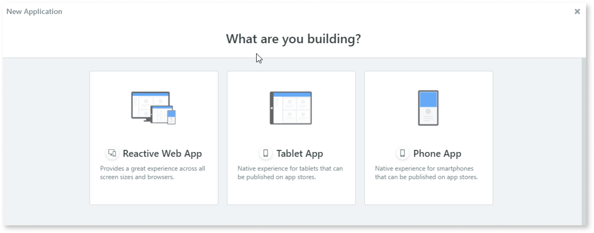
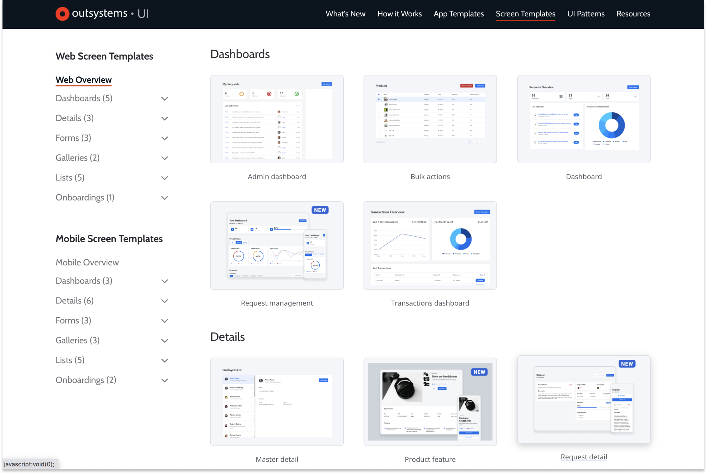
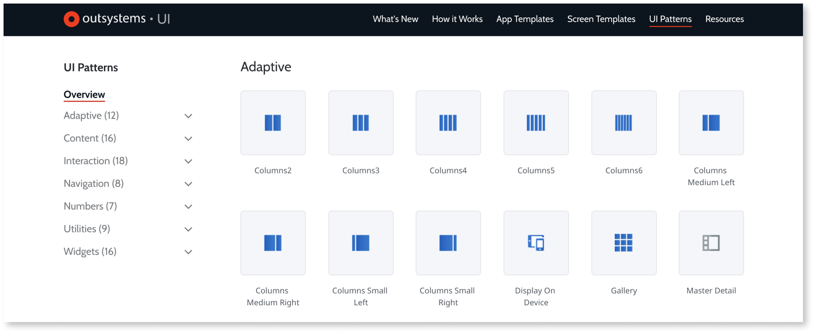
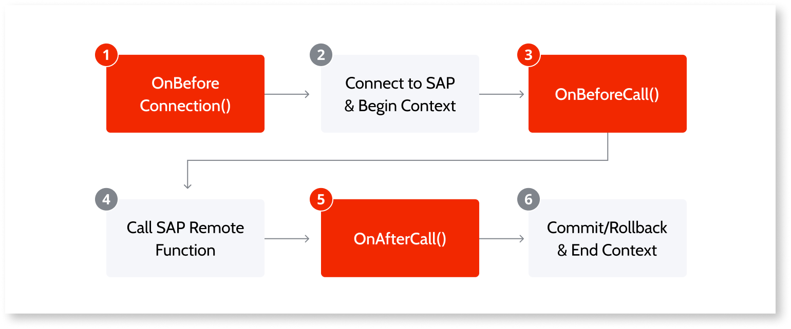
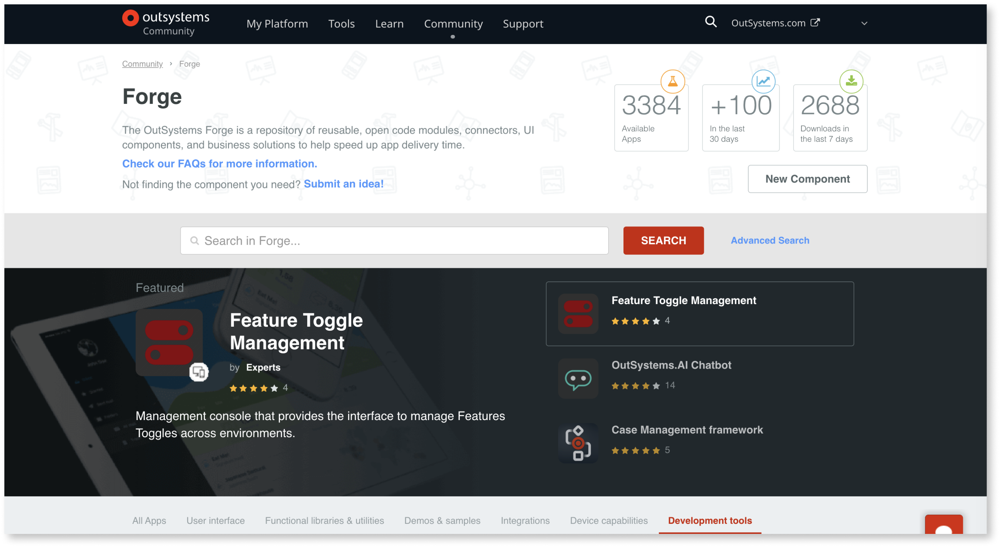

# Integration with external systems

Download the whitepaper version of this document [here](https://www.outsystems.com/1/extensibility/).

Those responsible for planning, defining, and maintaining architectures for an organization’s IT networks and services must be sure, when considering the adoption of a new development model, that it will allow easy and efficient creation of enterprise-grade applications with rich and complex mobile and web user interfaces. It must also provide seamless integration with the myriad of existing code, database structures, and systems of records, such as ERP, CRM, and HR, that the enterprise has developed over the years—as well as keep pace with future developments.

Fourth-generation language technology platforms boast a low code replacement for software development with drag-and-drop interface design and push-button database integration using pre-built components. However, [4GL](https://en.wikipedia.org/wiki/Fourth-generation_programming_language) also comes with pre-built drawbacks, not the least of which include sluggish operational performance, cybersecurity risks, and inaccessible support for third-party components.

OutSystems is based on a visual domain specific language that is built on top of standard third generation language (3GL) programming elements. 

It’s suited to develop anything from simple departmental applications to more complex enterprise applications, containing all of the necessary building blocks to implement sophisticated use cases from rich engaging UI experiences (mobile or web), headless backend services, workflows, or batch processing mechanisms. All this without the need to write a single line of code, only using drag and drop visual elements to build UI, business processes workflows, database modeling, or intricate logic to support your use case.

However, OutSystems doesn’t lock developers into a limited number of blocks, modules, and pre-built components. If needed, developers can use their coding skills to extend built-in capabilities to fulfill specific use cases.

OutSystems is open by design. All application layers—front-end, back-end, database, and integration—can be extended with customized code. In fact, [OutSystems Forge](http://www.outsystems.com/Forge/) contains a repository of open libraries, plugins, and  pre-built extensions that can be freely used as-is, or modified to suit particular needs, and then added to the OutSystems tool pallet just like any other native OutSystems element.

## Extensions

OutSystems provides out-of-the-box capabilities to integrate with external databases such as SQL Server, Oracle, MySQL, PostgreSQL and iDB2, as well as a myriad of enterprise systems of record (SoR), including SAP, Salesforce, Microsoft Dynamics 365, Microsoft Dataverse, and Sharepoint Online.  

For other external systems OutSystems provides [Integration Studio](https://success.outsystems.com/Documentation/11/Reference/Integration_Studio), a design environment where developers with programming skills can create [extensions](https://success.outsystems.com/Documentation/11/Extensibility_and_Integration/Extend_Logic_with_Your_Own_Code/Extension_Life_Cycle/Create_an_Extension) to bridge custom C# and .NET to OutSystems, expanding and enhancing its existing functionality and data model.

An extension, as the term is used in Outsystems, is a specific set of actions, structures, entities, and resources that developers create in order to: 

* Use custom-built .NET components to extend module functionality
* Integrate with external systems to extend module functionality
* Integrate with an external relational database to extend the module data model

As an example, Integration Studio provides automatic wizards that [reverse engineer external databases](https://success.outsystems.com/Documentation/11/Extensibility_and_Integration/Extend_Logic_with_Your_Own_Code/Managing_Extensions/Define_Extension_Entities/Import_Entities_from_a_Database) using code introspection to [translate .NET assemblies](integration-studio/managing-extensions/net-assembly-import-action.md) into extension actions, entities, and structures. And by using the [1-Click Publish](https://success.outsystems.com/Documentation/11/Extensibility_and_Integration/Extend_Logic_with_Your_Own_Code/Extension_Life_Cycle/1-Click_Publish_the_Extension) feature, a newly created extension, along with all of its dependencies, can be immediately deployed to any platform server. Once published, the extension can be used by any module that has access to it and can be published in multiple installations of the platform.

## Front-end design

[OutSystems UI](https://www.outsystems.com/outsystems-ui/) enables the creation of complex mobile and reactive web user interfaces by providing a large collection of screen templates, widgets, and UI patterns that your developers drag and drop in a visual editor to create beautiful applications that work across devices without the need to write a single line of code.

A typical workflow begins by selecting an [application template](https://success.outsystems.com/Documentation/11/Developing_an_Application/Application_Templates) that contains common elements, such as screen layouts, CSS, and basic logic, which developers use to quickly build reactive web apps, phone apps, or tablet apps that conform to company style guides and business rules.

In addition to the built-in application templates, developers can choose from hundreds of [Forge application templates](https://www.outsystems.com/forge/list?q=&t=&o=&tr=False&oss=False&c=%200,5380,5392&a=&v=&hd=False&tn=&scat=forge), provided by the OutSystems community, to install and modify to create a new app, just like other application templates.

The look and feel of the app is set in the OutSystems theme, which is part of the [OutSystems UI](https://success.outsystems.com/Documentation/11/Developing_an_Application/Design_UI) framework. Using the [Theme Editor](https://success.outsystems.com/Documentation/11/Developing_an_Application/Design_UI/Look_and_Feel/Customize_the_look_of_your_app_with_Theme_Editor), the overall style of the app can be customized in Service Studio, including default colors of screens and UI elements, default font and size, spacing and borders.

<iframe src="https://player.vimeo.com/video/997661972" width="750" height="547" frameborder="0" allow="autoplay; fullscreen" allowfullscreen="">Video showing the OutSystems Theme Editor interface where users can customize application themes.</iframe>

[Screen templates](https://outsystemsui.outsystems.com/OutSystemsUIWebsite/ScreenOverview?RuntimeId=2) for both web, mobile, and reactive apps provide theme-consistent UI and for such functions as dashboards, details, forms, galleries, lists, and onboarding. Each screen is populated with widgets and containers that can be modified and rearranged as required, including sample data that developers can use for testing on a computer or mobile phone. 

Sometimes none of the built-in screen templates answer the needs of a particular function or activity. In this case, a new [custom screen template](https://success.outsystems.com/Documentation/11/Developing_an_Application/Design_UI/Creating_Screen_Templates) can be built from scratch by dragging and dropping [UI patterns](https://outsystemsui.outsystems.com/OutSystemsUIWebsite/PatternsOverview) to set the page layout, types of content and interaction, navigation and numbers, utilities and widgets—all from an extensive selection in the Service Studio toolbox. Once the new screen template has been published, it is available for use in any app in your environment.

[The look and feel of widgets](https://success.outsystems.com/Documentation/11/Developing_an_Application/Design_UI/Look_and_Feel/Change_the_look_of_widgets_with_Styles_Editor) can be customized using the Styles Editor panel for editing basic visual properties, such as font color, margins, or border thickness. The changes can be made locally to affect only the selected widget, or saved globally for all widgets of that type used in the app.

<iframe src="https://player.vimeo.com/video/997661986" width="420" height="312" frameborder="0" allow="autoplay; fullscreen" allowfullscreen="">Video showing the OutSystems Theme Editor interface where users can customize application themes.</iframe>

Once developers have customized one of the OutSystems application templates, created screens, built logic, and published the app, they can save it as a [custom application template](https://success.outsystems.com/Documentation/11/Developing_an_Application/Design_UI/Reuse_UI/Create_a_Custom_Application_Template) that can be used as a starting point to develop additional apps, to define its look and feel, and put in place common functionality and manage dependencies.

### Front-end extensibility

The OutSystems UI front-end development process, as described above, shields developers from the complexities of coding and allows for extensive customization of built-in components of everything from the default look and feel of screen templates and UI patterns to the functionality of widgets—all within a WYSIWYG development environment.

There is no way, of course, to anticipate every possible design choice or function that might be required for a complex enterprise app. OutSystems, instead, gives developers an easy way to extend built-in features and fill in the gaps by writing code.

#### HTML extensibility

All widgets can be customized by setting extended properties which are directly translated to HTML attributes. This includes HTML tags that are not currently supported in the base HTML definition, such as custom “data-” attributes or accessibility features.  An HTML widget for reactive and mobile applications can include any HTML code for specialized functions, such as a CMS that loads dynamic, database-stored HTML content in a page.

#### CSS extensibility

Developers use [OutSystems UI](https://www.outsystems.com/outsystems-ui/) to tweak the styles of individual elements or make global modifications to the theme of the chosen application template. In some cases, however, low-code customizations may not suffice to meet specifications set in an app mockup. For example, the enterprise brandbook may require a proprietary font set, or the corporate color scheme in the style guide may not be found among the 18 pallet options available in the Theme Editor.

For these situations, new styles can be created, or existing classes modified, in the [CSS editor](https://success.outsystems.com/Documentation/11/Developing_an_Application/Design_UI/Look_and_Feel/Cascading_Style_Sheets_(CSS)), which overrides the properties in the base CSS, for themes, screens, emails, blocks and widgets. The OutSystems UI makes extensive use of CSS variables for [color](https://outsystemsui.outsystems.com/StyleGuidePreview/Color), [typography](https://outsystemsui.outsystems.com/StyleGuidePreview/Typography), [borders](https://outsystemsui.outsystems.com/StyleGuidePreview/Border), [spacing](https://outsystemsui.outsystems.com/StyleGuidePreview/Spacing), and [shadows](https://outsystemsui.outsystems.com/StyleGuidePreview/Shadow), and these can be modified within the CSS editor.

<iframe src="https://player.vimeo.com/video/997662001" width="700" height="564" frameborder="0" allow="autoplay; fullscreen" allowfullscreen="">Video illustrating the process of customizing CSS styles within the OutSystems platform.</iframe>

In some cases developers may decide to use an external CSS that is compliant with OutSystems UI by using the @import rule in the OutSystems UI CSS.

#### JavaScript extensibility

All modern web design is built on a foundation of JavaScript, the engine that makes user interaction possible—and OutSystems UI is no exception. In most cases developers have no need to know how JavaScript functions within a widget or Web Block; it just works.

For customized work flows many additional JavaScript-based widgets have been packaged into easy-to-reuse Web Blocks by OutSystems, and the Outsystems community, and published to [OutSystems Forge](https://www.outsystems.com/forge/). Examples include [Drag and Drop lists](http://www.outsystems.com/forge/component/294/drag-n-drop-sortable-list/), [Touch Drag and Drop](http://www.outsystems.com/forge/component/385/tablet-drag-and-drop/), [intro.js](http://www.outsystems.com/forge/component/390/intro-js/), and the well known [Google Maps](http://www.outsystems.com/forge/component/680/google-maps/).

Developers are also free to create extensions by writing JavaScript to customize how users interact with their applications, create client side custom validations and dynamic behaviors, or even develop custom, very specific, AJAX interactions. OutSystems includes React by default in all applications, but developers can wrap their own JavaScript frameworks, including prototype, jQuery, jQueryUI, dojo, Angular, and Vue, among others. Once published, it becomes available in the visual interface and can be used by the entire development team, throughout all applications, just as they would in any HTML page design.

By [importing a library into an application](https://success.outsystems.com/Documentation/11/Extensibility_and_Integration/JavaScript/Extend_Your_Mobile_and_Reactive_Apps_Using_JavaScript/Use_JavaScript_Code_from_an_External_Library) and adding it to the screen in [Service Studio](https://success.outsystems.com/Documentation/11/Getting_started/Service_Studio_Overview), all of the library's functionality becomes available in every OutSystems application, making a custom JavaScript as easy to use and reuse as any other component in the OutSystems model-driven development.

## Extending the back-end

OutSystems provides out-of-the-box capabilities to integrate with SQL Server, SQL Azure, Oracle, MySQL, PostgreSQL, Aurora PostgreSQL and DB2 iSeries so developers can combine local and external data sources in minutes. And, by invoking [Integration Builder](https://www.outsystems.com/platform/integration-builder/) from Service Studio, developers click through a configuration process to connect with external systems of reccord such as SAP, Salesforce, Microsoft Dynamics, Microsoft Dataverse, and Sharepoint Online. 

OutSystems simplifies the task of consuming and exposing functionality as standard SOAP web services and REST APIs without any hand-coding. More complex enterprise integration scenarios that require MQSeries, TIBCO, BizTalk, and other middleware ESBs, can be accomplished using web services.

In addition, [Integration Studio](https://success.outsystems.com/Documentation/11/Reference/Integration_Studio), a visual IDE in OutSystems, allows rapid and efficient creation of extensions to integrate with core or legacy systems. When using the OutSystems environment, developers can click a link to open a source code editor, and, after editing the code, the developer can deploy it in the integration IDE.

Once OutSystems has generated methods and data structures to integrate with the external system, developers can use them visually in the application logic of Service Studio. From a developer’s perspective, invoking a SOAP web service, a REST API, SAP, Salesforce, Microsoft Dynamics, Microsoft Dataverse, or Sharepoint provides the same experience as any native OutSystems method.

### Integration Builder {#ib}

[Integration Builder](https://www.outsystems.com/platform/integration-builder/) is a wizard-style tool for developers to quickly connect apps to major SoR systems, including SAP, Salesforce, Microsoft Dynamics 365, Microsoft Dataverse, and Sharepoint Online. With a few clicks, service modules can be generated with all of the code required to call an external system, including authentication flow, encoding, and parsing, so they can be easily integrated into the development environment.

Some of the key features and capabilities of the Integration Builder include:

* Connectors to the most commonly used SAP, Salesforce, Microsoft Dynamics 365, Microsoft Dataverse, Sharepoint Online sources to ensure that integrations between systems of record and OutSystems applications are resilient and perform as expected
* Review and inspection of available APIs of external systems and to select only the right ones for OutSystems applications
* OutSystems-suported connectors designed to promote reusability, maintenance, application independence, security, and scalability
* Limitless customization of generated connectors to extend connector logic to fulfill IT requirements, to add fields, to remove fields, or swap out existing connections

To learn more about the capabilities of Integration Builder explore the [documentation here](https://www.outsystems.com/platform/integration-builder/).

### Integrating to existing systems using SOAP web services

OutSystems provides out of the box support for consuming SOAP web services with WSDL 1.1 and SOAP 1.1/1.2.

Developers provide the location of the Web Services Description Language (WSDL). The OutSystems IDE inspects the WSDL and generates everything needed to invoke the web service methods.

When you consume a SOAP Web Service, OutSystems does the following:

* Connects to the web service and analyses the methods and structures
* Creates the exposed Web Service methods with the corresponding input and output parameters
* Creates the structures and static entities to hold the complex types defined in the WSDL
* Maps the XML data types into OutSystems data types

OutSystems translates the methods exposed by a SOAP Web Service into OutSystems actions, with the same semantics as any action created in Service Studio. From a developer’s perspective, there is no difference between invoking a system method or a method exposed by an external service.

Authentication options are provided without the need of complex extensibility such as basic authentication (a static username and password) or dynamic login for credentials specific to each method that can be specified at runtime.

When developers want customized behavior, such as access to Windows Communication Foundation (WCF), or need to customize the behavior of consumed SOAP Web Services, they can create an extension by using the [SOAP Extensibility API](https://success.outsystems.com/Documentation/11/Reference/OutSystems_APIs/SOAP_Extensibility_API).

You can see a number of SOAP extensibility examples, such as authentication using a client certificate or using a different character encoding, on [this page](https://success.outsystems.com/Documentation/11/Extensibility_and_Integration/SOAP/Consuming_SOAP_Web_Services/Use_Advanced_Extensibility).

OutSystems has created the [SOAP Extensibility Samples](https://www.outsystems.com/forge/component-overview/5322/soap-extensibility-samples) extension, available for download from OutSystems Forge, that developers can use as is, or adapt as required, to implement common extensibility use cases using the SOAP Extensibility API.

Extensions may be used for any other use case that is not provided out of the box.

### Integrating to existing systems using REST APIs

You can integrate your OutSystems applications with REST APIs provided by other systems, or even by other OutSystems applications. Use this functionality either to obtain data from those systems or to request them to perform some action.

Check our video about [consuming a REST API in 10 minutes with OutSystems](https://youtu.be/gNyWIeJYfG0).

When importing the REST API, Service Studio does the following:

* Creates the REST API
* Creates REST API Methods with the corresponding input and output parameters
* Creates the Structures to hold the corresponding input and output parameters under a new tree element with the REST API name
* Maps the REST data types into OutSystems data types

OutSystems translates the methods exposed by a REST API into OutSystems actions, with the same semantics as any action created in Service Studio. From a developer’s perspective, there is no difference between invoking a system method or a method exposed by an external service.

When consuming a REST API, you can add logic to customize the information that is sent in the requests or received in the responses. [Simple customizations](https://success.outsystems.com/Documentation/11/Extensibility_and_Integration/REST/Consume_REST_APIs/Simple_Customizations) are readily available in Service Studio to modify both the information of the original request (such as the URL, the request text or the headers) or the information of the original response (such as the status code or the response text).

When developers need to further customize the REST API they can create an extension using the [REST Extensibility API](https://success.outsystems.com/Documentation/11/Reference/OutSystems_APIs/REST_Extensibility_API) and their own .NET code. These advanced customizations then become available to be reused in Service Studio. These advanced customizations allow, for example, using a specific algorithm to encode part of the request content, adding support for client-certificate authentication, or handling a complex response.

There are hundreds of extensions that use the REST Extensibility API that you can browse [in OutSystems Forge](https://www.outsystems.com/forge/list?q=REST%20API&t=&o=&tr=False&oss=False&c=&a=&v=11&hd=False&tn=&scat=forge).

### Integrating OutSystems applications with SAP

With OutSystems, developers can create mobile and web applications that integrate with SAP by browsing available SAP functions. Finding the BAPI or ZBAPI for a specific function is simple, even with limited or no knowledge of SAP. Integration through SAP BAPIs is available for SAP ECC and SAP S/4HANA.

Import SAP OData services from the [SAP Business Hub](https://api.sap.com/) and Service Catalog using [Integration Builder](#ib).

Once a connection has been made and remote functions have been imported OutSystems does the following:

* creates the SAP connection you have configured
* creates the actions for the remote functions you have selected
* creates the structures to hold the parameters

These newly created actions can be used in your application the same way you use any other server actions.

The flow when calling a SAP remote function allows you to:

* implement different SAP authentication methods (OnBeforeConnection)
* customize the values to be sent to SAP (OnBeforeCall)
* customize the values returned by SAP (OnAfterCall)

When integrating with SAP, OutSystems uses, by default, the credentials provided when the connection to the SAP system was created. You can also use different credentials by configuring a different connection by environment or using a dynamic login.

If developers need to customize a SAP connection, calls to SAP remote functions, or implement different SAP authentication methods, they can create an extension using the [SAP Extensibility API](https://success.outsystems.com/Documentation/11/Reference/OutSystems_APIs/SAP_Extensibility_API) and their own .NET code.

OutSystems has created the [SAP Utilities](https://www.outsystems.com/forge/component-overview/1012/sap-utilities) extension, with ready-to-use actions to perform customization of calls to SAP remote functions. Developers can use it as is to add advanced functionality to SAP remote functions. or adapt it, as required, to implement common extensibility use cases using the SAP Extensibility API.

There are numerous extensions that use the SAP Extensibility API that you can browse in OutSystems Forge.

### Integrating external data

OutSystems connects, out-of-the-box, to SQL Server, SQL Azure, Oracle, MySQL, PostgreSQL, Aurora PostgreSQL and DB2 iSeries so developers can combine local and external data sources in minutes on complex integration projects.

The OutSystems visual editor allows development teams to [query and aggregate data visually](https://success.outsystems.com/Documentation/11/Developing_an_Application/Use_Data/Query_Data/Fetch_and_Display_Data_from_the_Database) so developers with any skill set can work with the complex data needed for any application.

#### Using SQL

The OutSystems language provides actions for extracting, loading, transforming and updating data, but developers are not limited to manipulating data visually using aggregates. More experienced developers can also use an [SQL Node](https://success.outsystems.com/Documentation/11/Developing_an_Application/Use_Data/Query_Data/SQL_Queries) to build complex queries or to run stored procedures.

OutSystems continually tracks all of the dependencies to the underlying database. If something changes, your SQL code is automatically refactored, or you’re warned if it is no longer compatible with the changes. This extensibility feature accelerates the change process, as well as makes the application itself resilient to change.

#### Integration with external databases

If an external database is natively supported by OutSystems (SQL Server, SQL Azure, Oracle, MySQL, PostgreSQL, Aurora PostgreSQL and DB2 iSeries), a developer can [create a connector](https://success.outsystems.com/Documentation/11/Extensibility_and_Integration/Integrate_with_an_External_Database) to integrate with it. Connectors enable teams to manipulate data in the visual editor.

An on-premises database that isn't natively supported can be accessed, using [standard code](https://success.outsystems.com/Documentation/11/Extensibility_and_Integration/Extend_Logic_with_Your_Own_Code), with ODBC/JDBC drivers, or with native APIs. Developers can access big data repositories, such as CouchDB, MongoDB, or Hadoop, using their REST APIs.

Take a look at how you can [build your first app using MongoDB as the back-end](https://www.youtube.com/watch?v=QSO4vIePxqs).

By developing a custom connector, designers can extend the OutSystems platform to add native support for databases. Many such connectors have already been built by OutSystems users and shared, for your use, in OutSystems Forge.

### Importing and exporting XML and CSV content

Developers can easily import and export data from Excel or JSON directly from the toolbox, and can use these integration components in OutSystems Forge to import and export content in XML or CSV format.

If developers need tighter control of an Excel export, they can use [Advanced Microsoft Excel](http://www.outsystems.com/forge/component/355/advanced-excel/), available in the Forge. This extension supports data formatting, the creation of Excel charts, and ability to fill in specific cells by providing row and column numbers.

## Using OutSystems Forge to extend applications

The [OutSystems Forge](http://www.outsystems.com/Forge/) is a repository of reusable, open code connectors, widgets, libraries, themes and templates, mobile plugins, applications, reporting, and developer tools that help speed up app delivery time that can be installed and reused as if they belong to OutSystems itself.

Among the more that 3000 currently available extensions developers can find the following:

* **Connectors** to integrate with external systems. They allow information to be fetched from or stored in external systems and can provide additional functionality like caching. Examples of connectors are the [Salesforce Connector](https://www.outsystems.com/forge/component/109/salesforce-connector) and the [Jira Connector](https://www.outsystems.com/forge/component/936/jira-connector).
* **Widgets** that provide functionality beyond those available in Service Studio, such as [Google Maps](https://www.outsystems.com/forge/component/680/google-maps) and [Signature Pad](https://www.outsystems.com/forge/component/1400/signature-pad).
* **Libraries** to extend the actions and built-in functions of the OutSystems platform, such as [JavaScript Utils](https://www.outsystems.com/forge/component/1392/javascript-utils) and [CryptoAPI](https://www.outsystems.com/forge/component/437/cryptoapi).
* **Themes** that include page layouts and all the visual assets necessary for your application. Examples of themes include the [OutSystems UI Web](https://www.outsystems.com/forge/component/4143/outsystems-ui-web) and the [Lisbon Template](https://www.outsystems.com/forge/component/999/lisbon-template).
* **Mobile plugins** to extend the capabilities of mobile applications by giving access to the device’s sensors and capabilities. Examples of include the [Camera Plugin](https://www.outsystems.com/forge/component/1390/camera-plugin) and the [Key Store Plugin](https://www.outsystems.com/forge/component/1550/key-store-plugin).
* **Applications** of fully working apps that you can install and start using immediately. Examples of applications include [Field Services Mobile](https://www.outsystems.com/forge/component/1404/field-services-mobile) and [Floor Plan](https://www.outsystems.com/forge/component/693/floor-plan).
* **Reporting** includes components that help build reports for end users, such as [Pivot Table](https://www.outsystems.com/forge/component/1141/pivot-table) and [HTML2PdfConverter](https://www.outsystems.com/forge/component/209/html2pdfconverter).
* **Developer Tools** to help ensure that developers are following best practices in Outsystems, such as [Discovery](https://www.outsystems.com/forge/component/409/discovery) and [DBCleaner](https://www.outsystems.com/forge/component/423/dbcleaner).

In addition, the Forge includes **How-tos** that give detailed examples for using a particular capability, explaining a component's functions, or the steps required to perform a specific task in OutSystems. Examples include [How To - Build an App with Multilingual Support](https://www.outsystems.com/forge/component-overview/695/how-to-build-an-app-with-multilingual-support) and [How to - User Sign Up](https://www.outsystems.com/forge/component-overview/903/how-to-user-sign-up).

If what you need isn’t available on OutSystems Forge, you can use [Integration Studio](https://success.outsystems.com/Documentation/11/Reference/Integration_Studio) to create your own extension, or modify an existing one, with custom C# code.

OutSystems native mobile apps are built on top of the Apache Cordova framework, which enables using any native device API through the use of plugins. Developers can [create their own plugins](https://success.outsystems.com/Documentation/11/Extensibility_and_Integration/Mobile_Plugins/Using_Cordova_Plugins) by selecting one of the available [Cordova plugins](https://cordova.apache.org/plugins/) and wrapping the code in an OutSystems API. From that moment onward the new native functionality is available in all the OutSystems apps in your environment.
