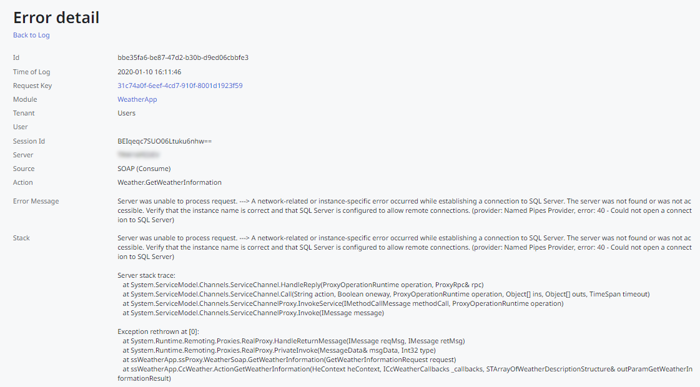
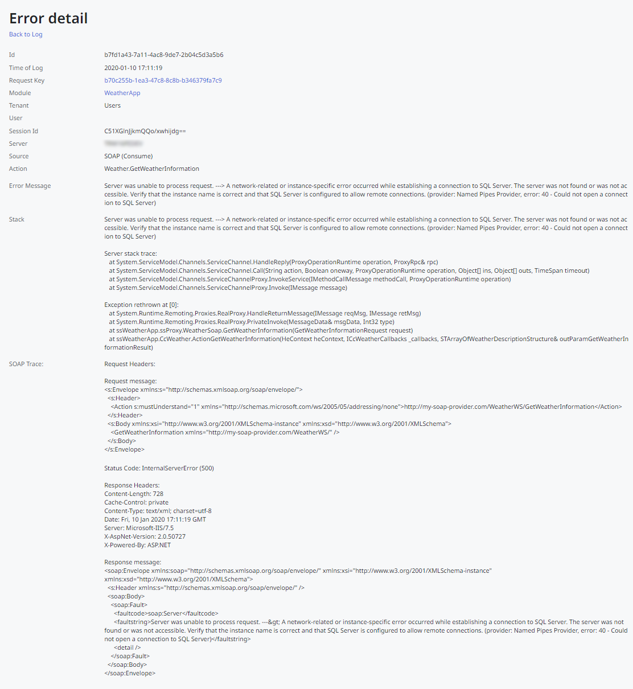
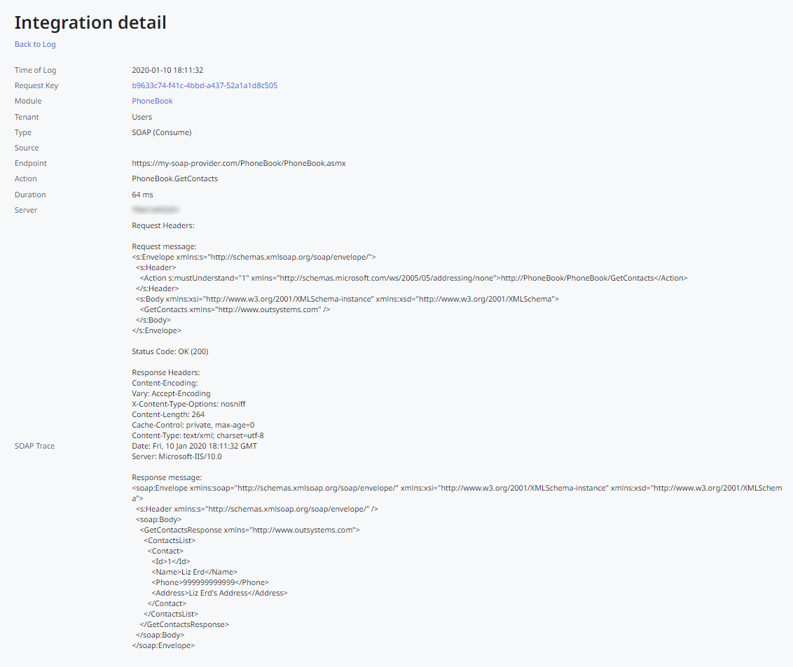

# Logging levels reference for integrations

The available logging levels for REST APIs and consumed SOAP Web Services are the following:

Default
:   Information is only logged for requests with errors.  
    Example for a consumed SOAP Web Service:

    

Troubleshoot  
:   Information is only logged for requests with errors, along with additional HTTP trace information.  
    Example for a consumed SOAP Web Service:

    

Full
:   All requests/responses are logged, including additional HTTP trace information.  
    Example for a consumed SOAP Web Service:

    

Increasing the logging level implies that:

* More information gets logged, increasing the amount of information stored in the environment's database.

* The platform logs input and output parameter values along with the request, thus making any sensitive information present in these parameters available through the environment management console.  
**Note:** For consumed REST APIs, you can [redact input parameter values from the logs](rest/consume-rest-apis/redact-info-from-logs.md).
