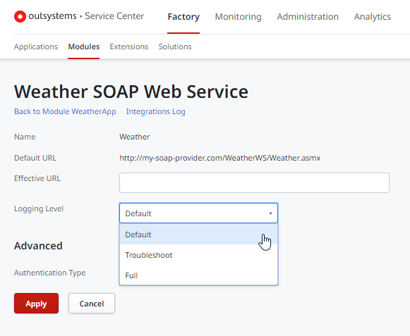

# Set the logging level of REST and SOAP integrations

You can customize the logging level for consumed/exposed REST APIs and consumed SOAP Web Services to adjust the amount of stored information about requests/responses.

For more information about the available logging levels, check [Logging levels reference for REST and SOAP](log-levels-reference.md).

To configure the logging level, do the following:

1. Go to the Service Center management console of your OutSystems environment.
1. Go to the **Factory** tab and click on the link with the name of your application.
1. In the **Modules** tab, click on the link with the module name that contains the REST API or the consumed SOAP Web Service that you want to configure.
1. In the **Integrations** tab, click on the desired REST API or SOAP Web Service link to configure it.
1. Set the **Logging Level** to the desired value: **Default**, **Troubleshoot**, or **Full**.
1. Click **Apply**.

For consumed REST APIs, you can [redact input parameter values from the logs](rest/consume-rest-apis/redact-info-from-logs.md).

