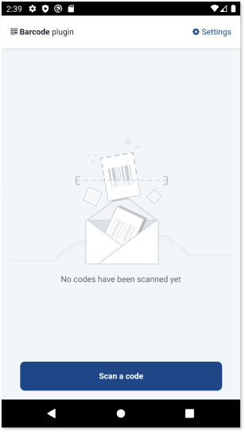
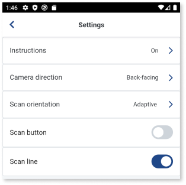
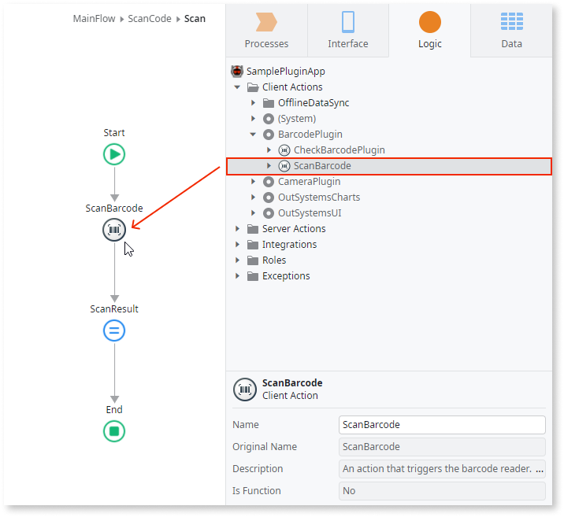

 
# Barcode Plugin

Applies only to Mobile Apps.

The Barcode Plugin works with native mobile apps and lets users of the app scan 1D and 2D barcodes. Set the options in the plugin to customize the scanner, add instructions, or change the camera direction.

To learn how to install and reference a plugin in your OutSystems apps and how to install a demo app, refer to [Adding plugins](../intro.md#adding-plugins).

## Demo app

OutSystems provides a demo app to help you learn how to use this plugin. Install the [Barcode Demo App](https://www.outsystems.com/forge/component-versions/1403) from Forge and then open the app in Service Studio. The demo app contains logic for common use cases that you can examine and create in your apps. For example, how to:

* Scan a code
* Use a predefined UI block
* Create a settings page

    

    Here is the settings screen:

    

## Creating a user interface

To set up the user interface, see an example for the [Camera plugin](../camera/intro.md#creating-a-user-interface). You can use a similar approach in your app with the Barcode plugin.

## Creating logic to scan a code

To create the logic to scan for barcodes, follow these steps in Service Studio:

1. Go to **Logic** > **Client Actions** > **BarcodePlugin**.

2. To open the camera in your app for scanning, drag the **ScanBarcode** action to the flow.

    

    In the **ScanBarcode** action, you can set scan instructions, back or front camera, or UI orientation and enable the scan button. For more information about the **ScanBarcode** action, see [Scanning options](#scanning-options).

3. Check the **ScanResult** text for the result of the scan.

To prevent errors, it's a good practice to first check if the plugin is available using the action **CheckBarcodePlugin**. To confirm the device can read the barcodes, verify that the value of **ScanBarcode.Success** is True. See the [demo app](#demo-app) for the examples.

## Reference

More information about the plugin.

### Supported barcode formats

The following list shows which barcode formats the plugin can read.

* UPC-A
* UPC-E (*)
* EAN-8
* EAN-13
* ISBN-10 (*)
* ISBN-13
* ISBN-13 Dual Barcode
* Code 39
* Code 93
* Code 128
* GS1 DataBar (**)
* ITF-14
* Codabar (*)
* QR Code
* PDF 417
* Data Matrix
* Aztec Code

(*) Not Supported in PWA.

(**) Not Supported in Android with ML Kit.

#### Important notes about Android Libraries

* ML Kit gets better results for most codes (for example, with blurred images).
* ML Kit can read codes that are rotated (for example, 90º), while ZXing can't.
* ML Kit gets better results for Aztec codes.
* ML Kit gets better results for Code 128 codes.
* ZXing has better coverage for GS1 DataBar codes.

### Scanning options

Here is the list of parameters you can use in the plugin actions.

| Action                   | Description                                   | 
| ------------------------ | --------------------------------------------- | 
| **ScanInstructions**    | Displays the scanning instructions. |
| **CameraDirection**    | Select the front or back camera as default when triggering a new scan action. |
| **ScanOrientation**    | Allows you to set the Scan UI to Adaptive, which detects your device's orientation, Landscape, or Portrait mode. |
| **ScanButton**    | If set to True, enables a scan button on the Scan UI. Pressing the button triggers the scan action instead of scanning automatically when framing the code. |
| **ScanButtonText**    | Defines the text shown on the Scan button, when it is set to True. |
| **ShowCameraSelection**    | **Only applies to PWA/Web**. If true, the scanner experience in PWA includes a UI for the end-user to switch between the device's cameras. |
| **Hint**    | **Only applies to PWA/Web**. A code format of type `<Formats Identifier>`. If set, it only scans codes of the specified format. |
| **ScannerFPS**    | **Only applies to PWA/Web**. A direct mapping to HTML5Qr-Code `fps`. This number represents the number of frames per second the scanner reads and thus scans a code. Values over (and including) 1000 are not recommended as they will break the app. |
| **AndroidScanningLibrary**    | **Only applies to Android**. Defines which Android library to use when scanning - ML Kit or ZXing. |

The Barcode Plugin uses a Cordova plugin. For more information, refer to [cordova-outsystems-barcodescanner](https://github.com/OutSystems/cordova-outsystems-barcodescanner).

## Known issues

What follows is the list of known issues and workarounds.  

### Reading a PDF147 can crash an app

**Applies to iOS only.**

Reading a PDF147 barcode can crash an iOS app. OutSystems is working on a potential fix.

### Poor scanning results with the front camera

On some devices with a low-resolution front camera, the app doesn't scan barcodes well. For best results, use the back camera. The back camera has a higher resolution and can focus better on a barcode.

### Poor scanning results when using PWA

Scanning barcodes in PWAs can be faulty in poor conditions. For example, when there's insufficient lighting or when the user is pointing the camera at a slight angle.

Also, on some devices, it's not possible to scan certain codes. The following are ways you can work around this:
* Try to change the camera using the camera selection dropdown, setting the **ShowCameraSelection** input parameter to **True**.
* Specify the code format with the **Hint** input parameter.
* Increase the number of FPS (max 1000, and this value is not recommended) passed in the **ScannerFPS** input parameter.

______________________________________________________________
_QR CODE is a registered trademark of Denso Wave Incorporated._
